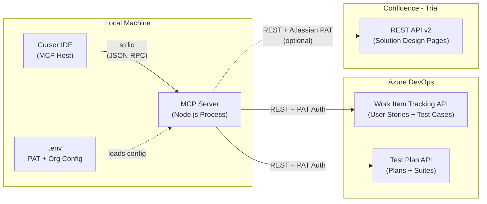
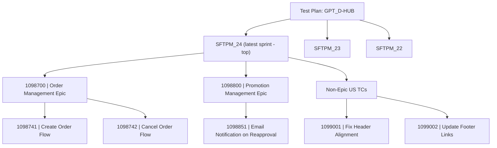
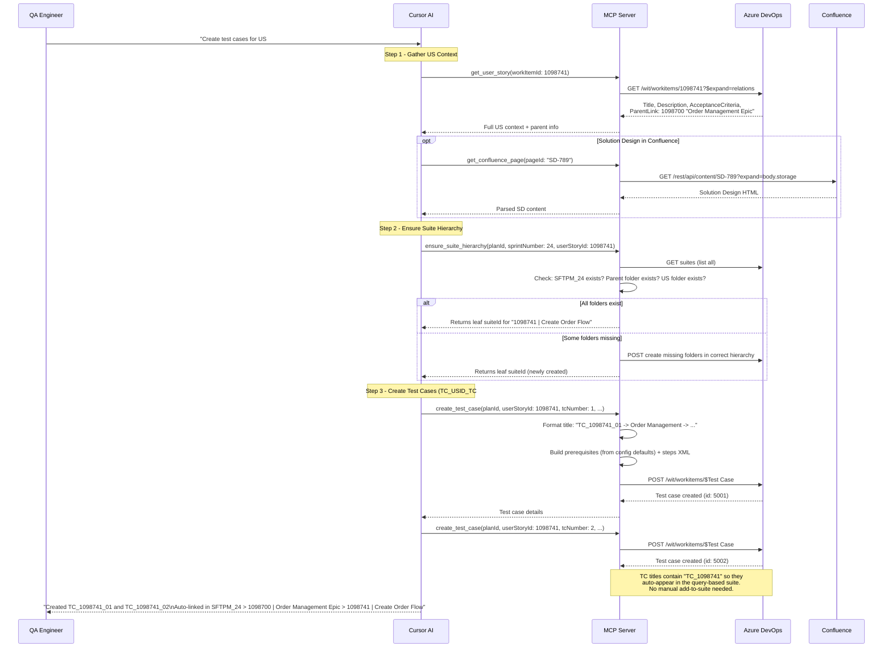
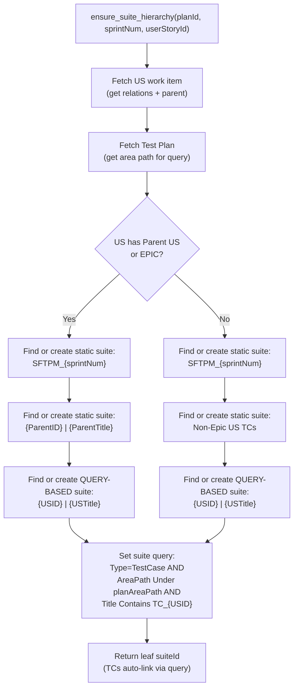

# ADO MCP Server for QA Test Case Management

## Scope: POC (Phase 1) vs Future (Phase 2+)

**POC -- what we build now:**

- Fetch User Story context (description, acceptance criteria) from ADO to inform test case creation
- Standard test case format/template enforced during creation
- Smart suite management: check if suite exists before creating a new one
- Core CRUD for test plans, suites, and test cases
- Confluence page reading (trial basis, optional -- separate auth)

**Future phases (after successful dry run):**

- Bulk test case generation from multiple User Stories
- Test run execution and result reporting
- Linking test cases back to requirements
- Shared parameters and configurations
- Deeper Confluence integration (automatic SD parsing)

---

## Architecture Overview




---

## Test Suite Folder Structure Convention

The MCP server enforces the team's ADO test suite hierarchy. Two test plans exist (e.g., `GPT_D-HUB`). Within each plan, suites are organized as:




**Naming rules:**

- Sprint folder: `SFTPM_<SprintNumber>` (static suite)
- Parent US / EPIC folder: `<ParentUS_ID> | <ParentUS_Title>` (static suite)
- US folder: `<US_ID> | <US_Title>` (**query-based suite** -- test cases auto-link via query)
- Independent US folder: `Non-Epic US TCs` (static suite, one per sprint)

**Query-based suite configuration (US-level leaf folders):**

The US-level suite is created as a query-based suite. The query automatically pulls in all test cases whose title contains `TC_<USID>`. No manual add-to-suite step is needed -- as soon as a test case is created with the correct `TC_<USID>_##` title, it appears in the matching suite.

Query definition (3 clauses, matching ADO's "Flat list of work items"):

```
Work Item Type   In Group   Microsoft.TestCaseCategory
AND Area Path    Under      <Test Plan Area Path>
AND Title        Contains   TC_<USID>
```

For example, for US 1245456 under the GPT_D-HUB plan:

```
Work Item Type   In Group   Microsoft.TestCaseCategory
AND Area Path    Under      TPM Product Ecosystem\Salesforce_TPM_Global Product\Salesforce_TPM_DHub_SF
AND Title        Contains   TC_1245456
```

**Resolution logic (built into `ensure_suite_hierarchy` tool):**

1. Fetch the User Story by ID
2. Walk its relations to find Parent US or EPIC link
3. If parent exists: resolve or create `SFTPM_X > ParentID | ParentTitle > USID | USTitle`
4. If no parent: resolve or create `SFTPM_X > Non-Epic US TCs > USID | USTitle`
5. At each level, check if the folder already exists before creating (no duplicates)
6. The leaf US folder is always a query-based suite with the `TC_<USID>` query above

---

## Primary Flow: Test Case Creation from User Story

This is the core QA workflow. The agent fetches the User Story context (description, acceptance criteria), resolves the correct suite hierarchy, then creates formatted test cases.




---

## Conventions Configuration (`conventions.config.json`)

All naming patterns, formats, and labels are externalized into a single JSON config file at the project root. This makes it easy to adjust conventions without touching code. The file is loaded at server startup and validated with a Zod schema -- any misconfiguration fails fast with a clear error.

```json
{
  "testCaseTitle": {
    "prefix": "TC",
    "separator": " -> ",
    "numberPadding": 2,
    "template": "{prefix}_{usId}_{tcNumber}{separator}{featureTags}{separator}{summary}"
  },

  "prerequisites": {
    "heading": "Prerequisites for Test:",
    "sections": [
      { "key": "personas",       "label": "Persona",           "required": true  },
      { "key": "preConditions",  "label": "Pre-requisite",     "required": true  },
      { "key": "toBeTested",     "label": "TO BE TESTED FOR",  "required": false },
      { "key": "testData",       "label": "Test Data",         "required": false }
    ]
  },

  "prerequisiteDefaults": {
    "personas": {
      "SystemAdministrator": {
        "label": "System Administrator",
        "profile": "System Admin",
        "user": "\"ADMIN User\" User",
        "tpmRoles": "ADMIN",
        "psg": "TPM Global ADMIN Users"
      },
      "KAM": {
        "label": "Key Account Manager (KAM) User",
        "profile": "TPM_User_Profile",
        "tpmRoles": "KAM",
        "psg": "TPM Global KAM Users PSG"
      }
    },
    "commonPreConditions": [
      "User.Sales Organization = 1111 / 0404",
      "PromotionTemplate.TPM_Required_Promotion_Fields__c != NULL",
      "PromotionTemplate.TPM_Required_Tactic_Fields__c != NULL",
      "PromotionTemplate.TPM_Tactic_Fund_Validation__c = TRUE",
      "PromotionTemplate.TacticTemplate.TPM_Required_Tactic_Fields__c != NULL",
      "Promotion Field Set: TPM_Required_Promotion_Fields",
      "Tactic Field Set: TPM_Required_Tactic_Fields"
    ],
    "toBeTested": null,
    "testData": "N/A"
  },

  "suiteStructure": {
    "sprintPrefix": "SFTPM_",
    "parentUsSeparator": " | ",
    "parentUsTemplate": "{id}{separator}{title}",
    "usTemplate": "{id}{separator}{title}",
    "nonEpicFolderName": "Non-Epic US TCs"
  },

  "testCaseDefaults": {
    "state": "Design",
    "priority": 2
  }
}
```

**How defaults are applied at runtime:**

- **Persona**: The tool uses the default persona list from config unless the caller provides an explicit `personas` override (e.g., US specifies a particular user role). Persona keys like `"SystemAdministrator"` and `"KAM"` can be referenced by name, or the entire block can be overridden with free text.
- **Pre-requisite**: `commonPreConditions` from config are always included as a baseline. The caller can append additional conditions specific to the test case (e.g., a custom field check). If the US describes specific config requirements, those are merged on top.
- **TO BE TESTED FOR**: Optional. Omitted from the output entirely when `null` / not provided. Only rendered when the caller supplies specific validation scenarios.
- **Test Data**: Optional. Defaults to `"N/A"` from config. Only overridden when the test case needs specific data.

To add a new persona (e.g., a Customer Manager role), add a new key to `prerequisiteDefaults.personas`. To change common pre-conditions (e.g., a new PromotionTemplate field), edit the `commonPreConditions` array. No code changes needed.

---

## Standard Test Case Format

Every test case follows the team's naming convention and structure. The `create_test_case` tool enforces this using patterns from `conventions.config.json`.

### Title Convention

```
TC_<USID>_<TC#> -> <Feature Tag> -> [Sub-Feature ->] <Use Case Summary>
```

Examples:

- `TC_1098741_01 -> Order Management -> Create Order -> Verify order is created with valid payload`
- `TC_1098741_02 -> Promotion Management -> Email Notification -> Pending Reapproval -> Verify Email notification is sent to all Customer Managers related to account users on daily batch run`

The `<TC#>` is zero-padded (01, 02, ... 10, 11). The tool auto-increments by querying existing test cases for the given US ID, or accepts an explicit number.

### Prerequisites Section

Stored in the test case Description field (HTML). Section headings, default values, and which sections are optional are all driven by `conventions.config.json`. The tool merges config defaults with any overrides provided per test case.

**Rendered example (using defaults + one override):**

```
Persona:
System Administrator
  Profile = System Admin
  "ADMIN User" User
  TPM Roles = ADMIN
  Profile = TPM_User_Profile
  PSG = TPM Global ADMIN Users
Key Account Manager (KAM) User
  TPM Roles = KAM
  Profile = TPM_User_Profile
  PSG = TPM Global KAM Users PSG

Pre-requisite:
User.Sales Organization = 1111 / 0404
PromotionTemplate.TPM_Required_Promotion_Fields__c != NULL
PromotionTemplate.TPM_Required_Tactic_Fields__c != NULL
PromotionTemplate.TPM_Tactic_Fund_Validation__c = TRUE
PromotionTemplate.TacticTemplate.TPM_Required_Tactic_Fields__c != NULL
Promotion Field Set: TPM_Required_Promotion_Fields
Tactic Field Set: TPM_Required_Tactic_Fields

TO BE TESTED FOR:
At least one ZREP is added
At least one Tactic is added
Consolidated Required fields missing validation

Test Data:
N/A
```

**Behavior:**

- Persona and Pre-requisite render from config defaults every time (unless explicitly overridden)
- TO BE TESTED FOR is only rendered when provided; omitted entirely otherwise
- Test Data defaults to "N/A"; only overridden when caller supplies specific data

### Steps

Each step is an Action + Expected Result pair (converted to ADO XML internally).

### Area Path and Iteration Path Defaults

- **Area Path**: Inherited from the **Test Plan** (not the User Story). The test plan's area path is used for all test cases created within it. Current value: `TPM Product Ecosystem\Salesforce_TPM_Global Product\Salesforce_TPM_DHub_SF`. Can be overridden per test case if needed.
- **Iteration Path**: Inherited from the **User Story**. Keeps test cases aligned with the sprint the US belongs to.

Neither field needs to be provided by the caller in typical usage -- they are resolved automatically.

### Full Field Mapping

```
ADO Field                                  | Source
-------------------------------------------|------------------------------------------
System.Title                               | TC_<USID>_<TC#> -> Feature -> Summary
System.Description                         | Prerequisites (from conventions config)
System.AreaPath                            | From Test Plan (default), overridable
System.IterationPath                       | From User Story
Microsoft.VSTS.Common.Priority             | 1-4 (provided or default from config)
System.State                               | From config (default: "Design")
Microsoft.VSTS.TCM.Steps                   | XML built from steps[] array
System.AssignedTo                          | Optional
Relations: Tested By                       | Auto-linked to userStoryId
```

### Tool Input Schema

```typescript
{
  planId: 456,                          // required: used to resolve area path from the test plan
  userStoryId: 1098741,                 // required: links to US + inherits iteration path
  tcNumber: 2,                          // optional: auto-increments if omitted
  featureTags: ["Promotion Management", "Email Notification", "Pending Reapproval"],
  useCaseSummary: "Verify Email notification is sent to all Customer Managers...",
  priority: 2,                          // optional: defaults to config value (2)

  prerequisites: {                      // all optional -- defaults from conventions.config.json
    personas: null,                     // null = use default personas from config
                                        // or override: ["SystemAdministrator", "KAM"] (pick from config)
                                        // or full override: "Customer Manager (CM role, specific permissions)"

    preConditions: null,                // null = use commonPreConditions from config
                                        // or string[] to append extras on top of defaults:
                                        // ["Promotion.Status = 'Pending Reapproval'"]

    toBeTested: [                       // optional: omitted from output when null
      "At least one ZREP is added",
      "At least one Tactic is added",
      "Consolidated Required fields missing validation"
    ],

    testData: null                      // null = defaults to "N/A" from config
                                        // or override: "Account with 3+ Customer Managers linked"
  },

  steps: [
    { action: "Login as Admin and navigate to Promotions", expectedResult: "Promotions list displayed" },
    { action: "Set promotion status to 'Pending Reapproval'", expectedResult: "Status updated successfully" },
    { action: "Trigger daily batch run", expectedResult: "Batch completes without errors" },
    { action: "Check email inbox of all linked Customer Managers", expectedResult: "Notification email received by all CMs" }
  ],
  areaPath: null,                       // optional override; null = use test plan's area path
  iterationPath: null,                  // optional override; null = use US's iteration path
  assignedTo: "kavita.badgujar"         // optional
}
```

The tool composes the title automatically:
`TC_1098741_02 -> Promotion Management -> Email Notification -> Pending Reapproval -> Verify Email notification is sent to all Customer Managers...`

---

## Tech Stack

- **Runtime**: Node.js 18+
- **Language**: TypeScript 5.x
- **MCP SDK**: `@modelcontextprotocol/sdk` v1.x (stable)
- **Transport**: stdio (local subprocess)
- **Validation**: `zod` for tool input schemas
- **HTTP Client**: Built-in `fetch` (Node 18+)
- **Config**: `dotenv` for PAT and org configuration

## Project Structure

```
MARS ADO MCP/
├── src/
│   ├── index.ts                  # Entry point, MCP server setup + stdio transport
│   ├── config.ts                 # Loads + validates conventions.config.json with Zod
│   ├── tools/
│   │   ├── work-items.ts         # get_user_story (fetch US context + parent/EPIC info)
│   │   ├── test-plans.ts         # Test plan tools (create, list, get)
│   │   ├── test-suites.ts        # Suite tools (ensure_suite_hierarchy, find_or_create, list, get)
│   │   ├── test-cases.ts         # Test case tools (create w/ TC_ format, list, get, update)
│   │   ├── confluence.ts         # Confluence page reader (trial/optional)
│   │   └── index.ts              # Tool registration barrel
│   ├── helpers/
│   │   ├── steps-builder.ts      # Converts step arrays to ADO XML format
│   │   ├── tc-title-builder.ts   # Builds titles from conventions config template
│   │   ├── prerequisites.ts      # Formats prerequisites from conventions config labels
│   │   └── suite-structure.ts    # Folder naming from conventions config + resolution logic
│   ├── ado-client.ts             # Azure DevOps REST API client with PAT auth
│   ├── confluence-client.ts      # Confluence REST API client (optional)
│   └── types.ts                  # Shared TypeScript types / interfaces
├── conventions.config.json       # All naming patterns, formats, labels (editable)
├── docs/
│   └── implementation.md         # Implementation document
├── .env.example                  # Template for PAT + Confluence configuration
├── .gitignore
├── package.json
├── tsconfig.json
└── README.md
```

---

## MCP Tools -- Full Inventory

### Work Item Context

- `**get_user_story**` -- Fetch a User Story by ID with all QA-relevant fields
  - API: `GET /wit/workitems/{id}?$expand=relations&fields=System.Title,System.Description,Microsoft.VSTS.Common.AcceptanceCriteria,System.AreaPath,System.IterationPath,System.State,System.Parent`
  - Returns: title, description (HTML), acceptance criteria (HTML), area path, iteration path, state, **parent work item ID + title** (EPIC or Parent US), all relations
  - Purpose: Provides full context for test case generation AND determines suite folder placement (parent vs non-epic)

### Test Plan Management

Test plans already exist (e.g., `GPT_D-HUB`). The `planId` is provided as input to other tools. These tools are for lookup/reference, not primary workflow:

- `**list_test_plans`** -- List all test plans in the project (to find the planId)
  - API: `GET /_apis/testplan/plans`
- `**get_test_plan`** -- Get a specific test plan by ID (to read its area path, etc.)
  - API: `GET /_apis/testplan/plans/{planId}`
- `**create_test_plan`** -- Create a new test plan (future use, not needed for POC)
  - API: `POST /_apis/testplan/plans`

### Test Suite Management (with hierarchy awareness)

- `**ensure_suite_hierarchy`** -- The key orchestration tool. Given a planId, sprint number, and userStoryId, it builds the full folder path:
  1. Fetches the US to determine if it has a Parent US / EPIC
  2. Ensures `SFTPM_<sprint>` folder exists (static suite)
  3. If parent exists: ensures `<ParentID> | <ParentTitle>` folder under sprint (static suite)
  4. If no parent: ensures `Non-Epic US TCs` folder under sprint (static suite)
  5. Creates the leaf `<USID> | <USTitle>` as a **query-based suite** with this query:
    - `Work Item Type In Group Microsoft.TestCaseCategory`
    - `AND Area Path Under <planAreaPath>`
    - `AND Title Contains TC_<USID>`
  6. At each level, searches existing suites first -- only creates if missing
  7. Returns the leaf suite ID (test cases auto-appear here via the query -- no manual add needed)
- `**find_or_create_test_suite`** -- Lower-level tool. Checks if a suite with a given name exists under a parent suite; creates one only if not found
  - API: `GET /_apis/testplan/Plans/{planId}/suites` then conditionally `POST`
  - Returns: `{ created: boolean, suite: {...} }`
- `**list_test_suites`** -- List all suites in a plan
  - API: `GET /_apis/testplan/Plans/{planId}/suites`
- `**get_test_suite`** -- Get suite details
  - API: `GET /_apis/testplan/Plans/{planId}/suites/{suiteId}`

### Test Case Management (with TC_ format + prerequisites)

- `**create_test_case`** -- Create a test case following the `TC_USID_TC#N` convention
  - API: `POST /_apis/wit/workitems/$Test Case` (JSON Patch format)
  - Title built from `conventions.config.json` template: `TC_<USID>_<##> -> <FeatureTags> -> <Summary>`
  - Description contains formatted prerequisites (section labels from conventions config)
  - Steps converted to ADO XML
  - Auto-links to User Story via "Tests / Tested By" relation
  - **Area Path**: defaults to the Test Plan's area path (not the US); overridable
  - **Iteration Path**: inherited from the User Story; overridable
  - `tcNumber` auto-increments if omitted (queries existing TCs for that US)
  - Default state and priority come from conventions config
- `**list_test_cases`** -- List test cases in a suite
  - API: `GET /_apis/testplan/Plans/{planId}/Suites/{suiteId}/TestCase`
- `**get_test_case`** -- Get a test case work item by ID
  - API: `GET /_apis/wit/workitems/{id}`
- `**update_test_case`** -- Update test case fields or steps
  - API: `PATCH /_apis/wit/workitems/{id}` (JSON Patch format)
- `**add_test_cases_to_suite`** -- Add existing test case IDs to a static suite (not needed for query-based suites where auto-linking handles it; kept for edge cases)
  - API: `POST /_apis/testplan/Plans/{planId}/Suites/{suiteId}/TestCase`

### Confluence (Trial / Optional)

- `**get_confluence_page`** -- Read a Confluence page by ID (for Solution Design reference)
  - API: `GET /rest/api/content/{pageId}?expand=body.storage`
  - Auth: Separate Atlassian PAT (email + API token)
  - Returns: Page title + body content (stripped HTML to readable text)
  - Enabled only when `CONFLUENCE_BASE_URL` is set in `.env`

---

## ADO Client Design (`src/ado-client.ts`)

```typescript
class AdoClient {
  private baseUrl: string;
  private authHeader: string;

  constructor(org: string, project: string, pat: string) {
    this.baseUrl = `https://dev.azure.com/${org}/${project}`;
    this.authHeader = `Basic ${Buffer.from(':' + pat).toString('base64')}`;
  }

  async get<T>(path: string, apiVersion?: string): Promise<T> { /* ... */ }
  async post<T>(path: string, body: unknown, contentType?: string): Promise<T> { /* ... */ }
  async patch<T>(path: string, body: unknown, contentType?: string): Promise<T> { /* ... */ }
}
```

Key responsibilities:

- PAT-based auth header on every request
- API version parameter (defaults: `7.1` for testplan, `7.0` for wit)
- `application/json-patch+json` content type for work item create/update
- Error mapping: 401 -> "Invalid PAT", 403 -> "Insufficient PAT scope", 404 -> "Resource not found"

## Confluence Client Design (`src/confluence-client.ts`) -- Optional

```typescript
class ConfluenceClient {
  private baseUrl: string;  // e.g., https://yoursite.atlassian.net/wiki
  private authHeader: string;

  constructor(baseUrl: string, email: string, apiToken: string) {
    this.baseUrl = baseUrl;
    this.authHeader = `Basic ${Buffer.from(email + ':' + apiToken).toString('base64')}`;
  }

  async getPageContent(pageId: string): Promise<{ title: string; body: string }> { /* ... */ }
}
```

Enabled only when all three env vars are present: `CONFLUENCE_BASE_URL`, `CONFLUENCE_EMAIL`, `CONFLUENCE_API_TOKEN`.

---

## Environment Configuration (`.env`)

```
# Azure DevOps (required)
ADO_PAT=your-personal-access-token
ADO_ORG=your-organization-name
ADO_PROJECT=your-project-name

# Confluence (optional -- trial)
CONFLUENCE_BASE_URL=https://yoursite.atlassian.net/wiki
CONFLUENCE_EMAIL=your.email@company.com
CONFLUENCE_API_TOKEN=your-confluence-api-token
```

**ADO PAT Required Scopes**: `vso.work_write`, `vso.test_write`

---

## Cursor MCP Configuration

Add to `.cursor/mcp.json`:

```json
{
  "mcpServers": {
    "ado-test-manager": {
      "command": "npx",
      "args": ["tsx", "src/index.ts"],
      "cwd": "/Users/kavita.badgujar/MARS ADO MCP",
      "env": {
        "ADO_PAT": "your-pat",
        "ADO_ORG": "your-org",
        "ADO_PROJECT": "your-project"
      }
    }
  }
}
```

---

## Key Implementation Details

### Test Steps XML Builder (`src/helpers/steps-builder.ts`)

ADO stores test steps as XML in `Microsoft.VSTS.TCM.Steps`. The helper converts a simple array to ADO format:

```typescript
// Input
[
  { action: "Open login page", expectedResult: "Login page displayed" },
  { action: "Enter credentials", expectedResult: "Fields accept input" }
]

// Output XML
// <steps id="0" last="2">
//   <step id="1" type="ActionStep">
//     <parameterizedString>Open login page</parameterizedString>
//     <parameterizedString>Login page displayed</parameterizedString>
//   </step>
//   <step id="2" type="ActionStep">
//     <parameterizedString>Enter credentials</parameterizedString>
//     <parameterizedString>Fields accept input</parameterizedString>
//   </step>
// </steps>
```

### TC Title Builder (`src/helpers/tc-title-builder.ts`)

Composes the title string from parts:

```typescript
function buildTcTitle(usId: number, tcNumber: number, featureTags: string[], summary: string): string {
  const paddedNum = String(tcNumber).padStart(2, '0');
  const tagChain = featureTags.join(' -> ');
  return `TC_${usId}_${paddedNum} -> ${tagChain} -> ${summary}`;
}
// Result: "TC_1098741_02 -> Promotion Management -> Email Notification -> Pending Reapproval -> Verify Email..."
```

### Prerequisites Formatter (`src/helpers/prerequisites.ts`)

Converts the structured prerequisites input into HTML for the Description field:

```html
<b>Prerequisites for Test:</b><br/>
<b>1. Personas:</b> Customer Manager (CM role, Account-level permissions)<br/>
<b>2. Pre-requisites:</b> Active promotion in 'Pending Reapproval' state; batch job configured<br/>
<b>3. Test Data:</b> Account with 3+ Customer Managers linked<br/>
<b>4. Important Notes / FYI:</b> Daily batch runs at 2AM UTC; verify timezone handling<br/>
```

### User Story to Test Case Linking

When `userStoryId` is provided to `create_test_case`, the tool:

1. Fetches the User Story via `get_user_story` internally
2. Inherits `areaPath` and `iterationPath` if not explicitly provided
3. Adds a "Tests <-> Tested By" relation link in the work item creation payload:

```json
{
  "op": "add",
  "path": "/relations/-",
  "value": {
    "rel": "Microsoft.VSTS.Common.TestedBy-Reverse",
    "url": "https://dev.azure.com/{org}/{project}/_apis/wit/workitems/{userStoryId}"
  }
}
```

### Suite Hierarchy Resolution (`src/helpers/suite-structure.ts`)

The `ensure_suite_hierarchy` tool uses this helper to build the correct folder path. The full resolution algorithm:




At each "find or create" step:

1. List child suites of the current parent suite
2. Match by name (case-insensitive)
3. If found: use existing suite ID, move to next level
4. If not found: create it and move on

Suite types by level:

- Sprint folder, Parent US folder, Non-Epic folder: **static** suites
- US leaf folder: **query-based** suite with `Title Contains TC_<USID>` -- test cases auto-appear here, no manual add needed

### Error Handling Strategy

- Validate all inputs via Zod schemas before making API calls
- Catch ADO API errors and return readable messages (not raw HTTP responses)
- Handle common errors: 401 (invalid PAT), 403 (insufficient scope), 404 (project/plan not found)
- Confluence errors are non-fatal (tool returns a message suggesting manual check)

### Build and Run

```bash
npm install
npx tsx src/index.ts   # Runs via stdio, launched by Cursor
```

