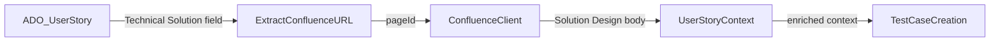

# Confluence Solution Design Integration

## Current State

- Confluence client exists ([src/confluence-client.ts](src/confluence-client.ts)) and can fetch page content by ID
- A standalone `get_confluence_page` tool exists ([src/tools/confluence.ts](src/tools/confluence.ts))
- But the Confluence client is **not passed** to `registerWorkItemTools` or `registerTestCaseTools` ([src/tools/index.ts](src/tools/index.ts))
- `extractUserStoryContext` in [src/tools/work-items.ts](src/tools/work-items.ts) does not read the "Technical Solution" field
- Test case creation in [src/tools/test-cases.ts](src/tools/test-cases.ts) does not incorporate Confluence content

## Data Flow (Target)




## Changes Required

### 1. Discover the exact ADO field reference name

The UI label "Technical Solution" maps to an internal reference name (e.g., `Custom.TechnicalSolution`). We need to confirm this by either:

- Calling `get_user_story` on a known US that has this field populated and inspecting the raw `fields` keys
- Or querying `/_apis/wit/fields` to find the reference name

We'll add the confirmed field name to `US_FIELDS` in [src/tools/work-items.ts](src/tools/work-items.ts).

### 2. Add a Confluence URL parser utility

Create a helper in [src/helpers/confluence-url.ts](src/helpers/confluence-url.ts) that:

- Accepts a raw field value (could be plain URL string or HTML `<a href="...">` tag)
- Extracts the Confluence page ID from URL patterns:
  - `.../pages/{pageId}/...` (space pages)
  - `...?pageId={pageId}` (query param style)
- Returns `pageId | null`

### 3. Update `UserStoryContext` type

In [src/types.ts](src/types.ts), add to `UserStoryContext`:

```typescript
solutionDesignUrl: string | null;
solutionDesignContent: string | null;
```

### 4. Pass Confluence client to work-item and test-case tools

In [src/tools/index.ts](src/tools/index.ts), update:

```typescript
registerWorkItemTools(server, adoClient, confluenceClient);
registerTestCaseTools(server, adoClient, confluenceClient);
```

### 5. Update `get_user_story` tool to auto-fetch Confluence content

In [src/tools/work-items.ts](src/tools/work-items.ts):

- Accept `ConfluenceClient | null` as a parameter
- In `extractUserStoryContext`, read the "Technical Solution" field
- Parse the Confluence page ID from it
- If Confluence client is available and a page ID is found, fetch the page content
- Populate `solutionDesignUrl` and `solutionDesignContent` on the context

### 6. Update `create_test_case` prompt to use Solution Design

In [src/prompts/index.ts](src/prompts/index.ts), update the `create_test_case` prompt to instruct the AI to:

- Fetch the user story (which now includes Solution Design content)
- Use the Solution Design context alongside description/acceptance criteria for test case generation

### 7. Update Confluence setup documentation

In [docs/setup-guide.md](docs/setup-guide.md), add a section explaining:

- Confluence Cloud API token: no scopes needed, user must have "Can view" on relevant spaces
- How to create the token at `https://id.atlassian.com/manage-profile/security/api-tokens`
- The three env vars / credential fields needed

## Confluence Permissions (Reference)

**For API Token (current auth method):** The Atlassian user account must have **"Can view"** permission on the Confluence space(s) containing Solution Design pages. No granular scopes -- the token inherits user permissions.

**If migrating to OAuth 2.0 later:** Minimum scopes: `read:page:confluence` (granular) or `read:confluence-content.all` (classic).