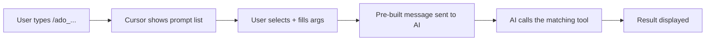

# Add Slash Commands (MCP Prompts) for All ADO Tools

## Why You Don't See Commands Today

The MCP server currently only registers **tools** (via `server.tool()`). Tools are invisible to the user -- the AI decides when to call them based on natural language.

**Prompts** are the MCP feature that creates **slash commands** visible in Cursor's chat. When a user types `/` in the chat, registered prompts appear as a pick-list. Selecting one pre-fills a structured message that triggers the corresponding tool.




## How It Works

The MCP SDK provides `server.registerPrompt()` which registers a named prompt with optional arguments. In Cursor, these appear as `/command_name` slash commands. When invoked, they return a pre-built user message that instructs the AI to call the corresponding tool with the provided arguments.

**SDK method:**

```typescript
server.registerPrompt("ado_get_user_story", {
  title: "Get User Story",
  description: "Fetch a User Story from ADO with description, acceptance criteria, and parent info",
  argsSchema: {
    workItemId: z.string().describe("The ADO work item ID of the User Story")
  }
}, async ({ workItemId }) => ({
  messages: [{
    role: "user",
    content: {
      type: "text",
      text: `Fetch user story ${workItemId} from ADO using the get_user_story tool. Show me the title, description, acceptance criteria, area path, iteration path, state, and parent info.`
    }
  }]
}));
```

## Naming Convention

All prompts prefixed with `ado_` for discoverability:


| Slash Command                 | Maps To Tool             | Arguments                                                 |
| ----------------------------- | ------------------------ | --------------------------------------------------------- |
| `/ado_get_user_story`         | `get_user_story`         | `workItemId`                                              |
| `/ado_list_test_plans`        | `list_test_plans`        | *(none)*                                                  |
| `/ado_get_test_plan`          | `get_test_plan`          | `planId`                                                  |
| `/ado_list_test_suites`       | `list_test_suites`       | `planId`                                                  |
| `/ado_get_test_suite`         | `get_test_suite`         | `planId`, `suiteId`                                       |
| `/ado_ensure_suite_hierarchy` | `ensure_suite_hierarchy` | `planId`, `sprintNumber`, `userStoryId`                   |
| `/ado_create_test_case`       | `create_test_case`       | `planId`, `userStoryId` (AI fills the rest interactively) |
| `/ado_list_test_cases`        | `list_test_cases`        | `planId`, `suiteId`                                       |
| `/ado_get_test_case`          | `get_test_case`          | `workItemId`                                              |
| `/ado_update_test_case`       | `update_test_case`       | `workItemId`                                              |
| `/ado_get_confluence_page`    | `get_confluence_page`    | `pageId`                                                  |


**Note:** `create_test_plan`, `find_or_create_test_suite`, and `add_test_cases_to_suite` are intentionally omitted from slash commands since they are either for future use or internally called by `ensure_suite_hierarchy`. They remain available as tools for the AI to use when needed.

## File Changes

### New file: [src/prompts/index.ts](src/prompts/index.ts)

New module that registers all prompts on the `McpServer`. Follows the same pattern as `src/tools/index.ts` with a single `registerAllPrompts(server)` function. Prompts are purely message templates -- they don't need the ADO client since they just instruct the AI to call the existing tools.

### Modified: [src/index.ts](src/index.ts)

Add `registerAllPrompts(server)` call after `registerAllTools(...)`.

### Modified: [docs/testing-guide.md](docs/testing-guide.md)

Add a section explaining slash commands and how to use them.

## Design Decisions

- **Prompt args are strings** -- MCP prompt arguments are always strings (even for numbers like `planId`). The pre-built message includes the value, and the AI parses it when calling the actual tool.
- `**create_test_case` is kept minimal** -- Only `planId` and `userStoryId` as prompt args. The slash command message instructs the AI to first fetch the US context, then ask the user for feature tags, steps, etc. interactively. This avoids overwhelming the user with too many upfront fields.
- **Prompts don't duplicate tool logic** -- They are thin message templates that delegate to existing tools. No business logic in prompts.

