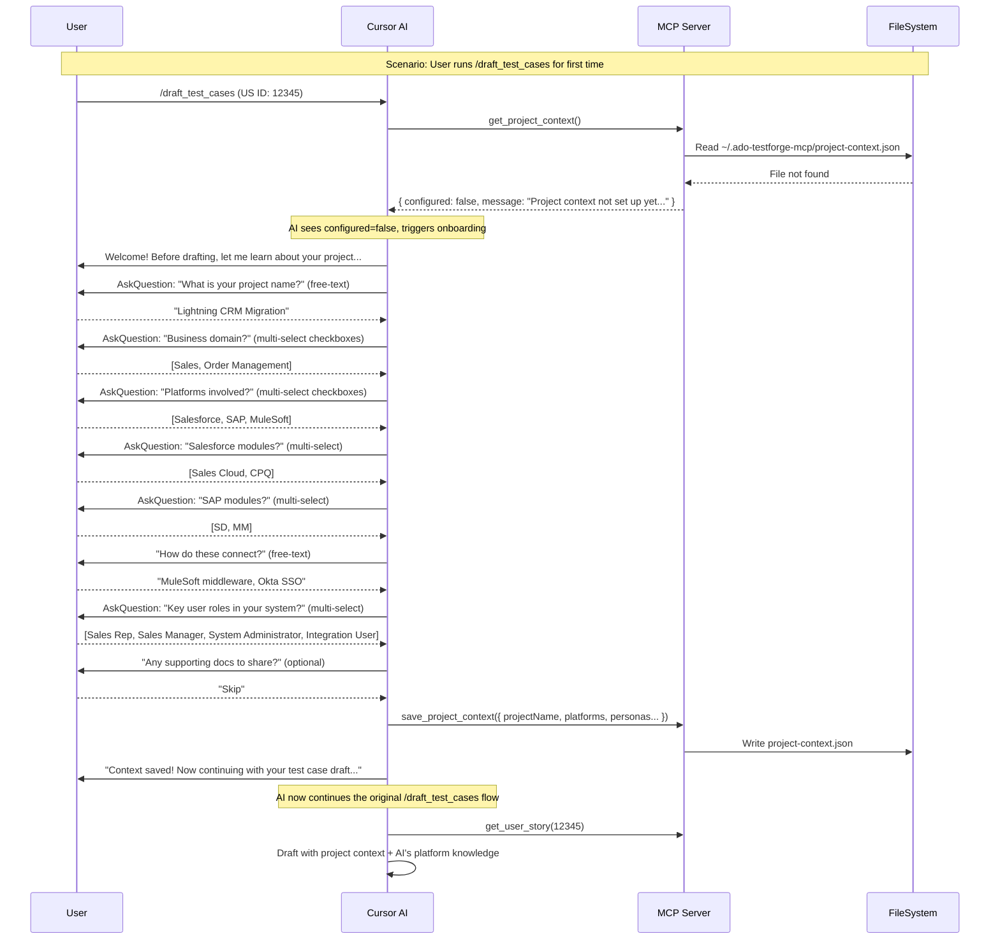

# Post-Install Onboarding and Project Context Capture

## Overview

Add an interactive post-install onboarding experience that auto-detects first run, welcomes the user, collects project context using structured multi-select UI for platforms and free-text for names/notes, and feeds the context into test case drafting.

## Current State

- After installation, user gets a static "Installation complete!" message -- no welcome, no guided tour
- No project context (platforms, domain, technologies) is captured or used
- Test case drafting relies only on: US fields + one Confluence SD page + hardcoded conventions config
- Existing profile/enhanced-context plans are pending and can layer on top later

---

## Key UX Decisions

- **Question format:** Structured multi-select UI (checkboxes) for platform/module/domain selection; free-text for project name, integration notes, and other open-ended inputs
- **Trigger:** Auto-detect on first meaningful tool use -- when `get_project_context` returns "not configured," the AI proactively welcomes and guides onboarding before proceeding
- **Non-blocking:** Onboarding is strongly encouraged but never blocks tool usage
- **No web search:** The AI already has deep knowledge of major platforms from training data. Project context (platforms, modules, personas) tells the AI what's relevant; the AI applies its own knowledge at draft time. No network dependency, no latency, no stale cached results.

---

## How Auto-Detect Works (Step by Step)



**The key insight:** The AI does not need a separate trigger. The `draft_test_cases` prompt instructs it to call `get_project_context` first. If not configured, the AI runs the onboarding inline then the original command continues seamlessly. The user never has to know about a separate `/setup_project` command -- it just happens naturally.

The `/setup_project` prompt still exists as a standalone command for users who want to set up context proactively or update it later.

---

## Structured Question Design

### Questions Using Multi-Select UI (AskQuestion tool with checkboxes)

**Business Domain:**
- Options: Sales, Service, Finance, HR, Supply Chain, Marketing, Order Management, E-Commerce, Analytics, Custom/Other
- `allow_multiple: true`

**Platforms / Technologies:**
- Options: Salesforce, SAP, ServiceNow, MuleSoft, Azure, AWS, Oracle, Workday, Custom Web App, Custom Mobile App, Other
- `allow_multiple: true`

**Per-platform modules** (shown only for selected platforms):
- Salesforce: Sales Cloud, Service Cloud, CPQ, Marketing Cloud, Communities/Experience Cloud, Platform/Custom, Other
- SAP: SD, MM, FI, CO, PP, HR, Other
- (extensible for other platforms)
- `allow_multiple: true`

**User Roles / Personas:**
- Options: System Administrator, Sales Rep, Sales Manager, Service Agent, Finance User, Integration User, End User, Custom/Other
- `allow_multiple: true`
- Purpose: Captured roles become the project's persona catalog. During test case drafting, the AI derives which personas are relevant per US from the AC/SD instead of applying all personas to every TC. Replaces the hardcoded blanket-persona approach in `conventions.config.json`.

**Supporting files:**
- Options: "Upload files now", "Skip for now"
- `allow_multiple: false`

### Questions Using Free-Text

- Project name
- Integration notes ("How do these platforms connect?")
- Additional context or notes

---

## Data Model: `project-context.json`

Stored at `~/.ado-testforge-mcp/project-context.json`:

```json
{
  "projectName": "Lightning CRM Migration",
  "businessDomain": ["Sales", "Order Management"],
  "platforms": [
    {
      "name": "Salesforce",
      "type": "CRM",
      "modules": ["Sales Cloud", "CPQ"]
    },
    {
      "name": "SAP S/4HANA",
      "type": "ERP",
      "modules": ["SD", "MM"]
    },
    {
      "name": "MuleSoft",
      "type": "Middleware",
      "modules": []
    }
  ],
  "personas": ["Sales Rep", "Sales Manager", "System Administrator", "Integration User"],
  "integrations": "MuleSoft handles all integration between SF and SAP. SSO via Okta.",
  "additionalNotes": "",
  "createdAt": "2026-04-09T...",
  "updatedAt": "2026-04-09T..."
}
```

---

## Implementation

### Phase 1: Project Context Module and Tools

**New file: [src/project-context.ts](src/project-context.ts)**
- Zod schema for `ProjectContext` (matching the JSON model above)
- `loadProjectContext()` -- reads from `~/.ado-testforge-mcp/project-context.json`, returns `{ configured: false, message: "..." }` if missing, or `{ configured: true, context: {...} }` if present
- `saveProjectContext(data)` -- validates with Zod, writes to file
- Constants for the home directory path

**Modify: [src/tools/setup.ts](src/tools/setup.ts)**
- Add `get_project_context` tool -- calls `loadProjectContext()`, returns status + context
- Add `save_project_context` tool -- accepts structured project data, calls `saveProjectContext()`
- Enhance `check_setup_status` -- add a "Project Context" line showing configured/not-configured status

### Phase 2: `/setup_project` Prompt

**Modify: [src/prompts/index.ts](src/prompts/index.ts)**

Register `/setup_project` prompt with detailed AI instructions:
- Welcome message text
- Step-by-step question flow
- Explicit instruction to use AskQuestion tool with `allow_multiple: true` for domain, platform, module, and persona questions
- Explicit instruction to use free-text for project name, integration notes
- Instruction to call `save_project_context` at the end
- Closing message with next-steps guidance

### Phase 3: Auto-Detect in Drafting Flow

**Modify: [src/prompts/index.ts](src/prompts/index.ts)** -- update `draft_test_cases` prompt:
- Add instruction: "Before starting, call `get_project_context`. If `configured: false`, welcome the user and run the full onboarding flow (same as `/setup_project`) before proceeding with the draft."
- Add instruction: "If `configured: true`, use the project context (platforms, modules, personas) combined with the AI's own platform knowledge to inform your analysis of the acceptance criteria and solution design."

**Modify: [.cursor/skills/draft-test-cases-salesforce-tpm/SKILL.md](.cursor/skills/draft-test-cases-salesforce-tpm/SKILL.md)**
- Add "Step 0: Load Project Context" before the existing Step 1
- Instruct: "Call `get_project_context`. Use the project context (platforms, modules, domain) combined with the AI's own knowledge to understand domain terminology, identify platform-specific test scenarios, and generate accurate prerequisites. Use the project's `personas` list as the persona catalog — derive which personas are relevant per US from the AC/SD content instead of blanket-applying all personas to every test case."

### Phase 4: `/update_project` for Later Changes

**Modify: [src/prompts/index.ts](src/prompts/index.ts)**
- Register `/update_project` -- loads existing context, shows current summary, asks what to change
- Lighter flow: only re-asks about the parts being updated

### Phase 5: Docs and Deploy

- [docs/user-setup-guide.md](docs/user-setup-guide.md) -- add "Project Context" section explaining that onboarding auto-triggers but can also be run via `/setup_project`
- [docs/implementation.md](docs/implementation.md) -- document new tools and schema
- [docs/testing-guide.md](docs/testing-guide.md) -- add `/setup_project` and `/update_project` to command reference
- Run `npm run deploy`

---

## Design Decisions

- **Auto-detect over explicit trigger:** The user never needs to remember `/setup_project`. It fires naturally on first use. But the slash command exists for proactive/repeat use.
- **Inline onboarding:** When auto-detected during `/draft_test_cases`, onboarding runs inline then the original command continues seamlessly. The user does not have to re-invoke.
- **Mixed UI:** Structured checkboxes for selections (less typing, fewer errors), free-text for names and notes (more natural).
- **Single file, profile-ready:** `project-context.json` lives at `~/.ado-testforge-mcp/` now. When profiles land, `loadProjectContext()` just changes its path -- no other code changes needed.
- **No web search needed:** The AI has deep training knowledge of major platforms (Salesforce, SAP, ServiceNow, etc.). Project context tells the AI WHICH platforms/modules are relevant; the AI applies its own knowledge at draft time. This keeps onboarding fast, offline-capable, and free of stale cached results.
- **Persona derivation over blanket defaults:** User roles captured during onboarding become the project's persona catalog. When drafting test cases, the AI identifies which personas are relevant per US from the AC/SD content — rather than applying all personas to every TC. This replaces the current hardcoded approach where `renderPersonas()` ignores overrides and always renders all `prerequisiteDefaults.personas` from config.

---

## Example: What Check Status Shows

Before onboarding:
```
User: /ado-testforge/check_status

AI:   Setup Status
      ---
      ADO Connection:      Connected (org: myorg, project: myproject)
      Confluence:          Connected
      Project Context:     Not configured
                           Run /setup_project or it will auto-start on your
                           first /draft_test_cases run.
```

After onboarding:
```
      Project Context:     Configured
                           Project: Lightning CRM Migration
                           Platforms: Salesforce (Sales Cloud, CPQ),
                                     SAP S/4HANA (SD, MM), MuleSoft
                           Last updated: 2026-04-09
```

---

## Risks and Mitigations

- **Context drift:** Project scope changes over time. Mitigation: `/update_project` makes it easy to refresh. Context has `updatedAt` timestamp.
- **Privacy:** Project names and platform info are stored locally only (`~/.ado-testforge-mcp/`), never transmitted. No web searches are performed.

---

## Todos

- [ ] Create `src/project-context.ts` -- Zod schema, load/save functions, path constants
- [ ] Add `get_project_context` and `save_project_context` tools to `src/tools/setup.ts`; enhance `check_setup_status` with context status line
- [ ] Register `/setup_project` prompt in `src/prompts/index.ts` with full conversational flow, structured AskQuestion instructions
- [ ] Update `draft_test_cases` prompt to call `get_project_context` first and auto-trigger onboarding if not configured
- [ ] Add Step 0 (Load Project Context) to `SKILL.md` with platform-aware analysis instructions
- [ ] Register `/update_project` prompt for lightweight context updates
- [ ] Update `user-setup-guide.md`, `implementation.md`, `testing-guide.md`; run `npm run deploy`
