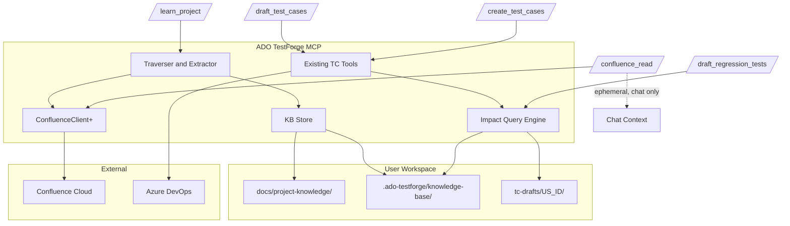

# Project Knowledge Base and Regression-Aware Test Case System

## 1. Goals and Non-Goals

### Goals (your 4 requirements, plus gap coverage)

1. **One-shot learning**: `/learn_project` traverses Confluence (root + descendants + same-space links) and builds a persistent KB.
2. **Persistent knowledge**: KB lives in the user's workspace (split between `docs/project-knowledge/` and `.ado-testforge/knowledge-base/`) and is reused by every subsequent draft/create/regression command.
3. **Regression-scope-aware drafting**: `/draft_test_cases` queries the KB's feature registry for each new US and surfaces impacted features in the draft output.
4. **On-demand regression drafting**: `/draft_regression_tests` generates a dedicated regression TC file per US, saved via the existing `save_tc_supporting_doc` path (`docType: "regression_tests"`).
5. **Ad-hoc Confluence reading**: `/confluence_read` reads a parent page + related child pages on demand with **zero persistence** — content is returned directly into the chat for the user to ask summaries, compare pages, draft one-off TCs, or perform any follow-up action. Separate from KB; does not touch `.ado-testforge/` or `docs/project-knowledge/`.

### Gap-coverage goals (things you did not mention but must be handled)

- Budget controls (depth, page count, character count) to stop runaway traversal
- Rate-limit / concurrency control against Confluence API
- Page-level deduplication when a page is reachable via multiple paths
- Cross-space link handling (record as reference, do not fetch)
- Restricted / 403 page handling (skip with warning, do not abort)
- Staleness warning when KB is old (soft-fail, never block)
- Missing-KB handling: every enhanced command MUST continue to work in degraded mode (current behaviour) if the KB is absent
- Multi-root seeds (user has several top-level architecture pages)
- Feature extraction quality: LLM-extracted first, user can hand-edit `features.json`
- Push path for regression TCs to ADO (a new tool `push_regression_tests_to_ado`)
- Clean re-runs of `/learn_project` (overwrite atomically, no half-written state)
- Git-versioning guidance (commit human docs, optionally gitignore machine cache)

### Non-goals (explicit scope fence, no ambiguity)

- No incremental version-diff refresh in v1 (manual re-run chosen by you). `refresh_project_knowledge` is a thin alias for `build_project_knowledge` for now.
- No cross-space crawl. Cross-space links are recorded as references only.
- No vector embeddings / semantic index. Matching is keyword + LLM reasoning over the registry.
- No automatic write-back to Confluence. Read-only.
- No OCR on flattened PNG text-only screenshots using a separate OCR library — the calling LLM's vision handles all image comprehension.
- No video/GIF frame extraction. Animated GIFs are treated as still images (first frame only).

### Image support (first-class, covers draft / create / confluence_read / learn_project)

Five strategies layered so each command uses the right cost/latency profile:

- **Inline references** (free, always on): every image becomes a textual marker `[IMAGE: <filename> -- <alt-or-caption>]` inside `body_text`, so even text-only consumers see image existence.
- **Vision at read time** (used by `/confluence_read`, `get_user_story`, and any command that fetches a Confluence page on-demand): tool downloads image binaries and returns them as MCP `image` content parts alongside text. The agent LLM (Claude/GPT with vision) sees diagrams inline.
- **Vision cached in KB** (used by `/learn_project`): during KB build, each image is downloaded, the agent LLM is asked to describe it with a targeted "describe this architecture diagram" prompt, and the description is written into `pages/<pageId>.json.body_text`. Subsequent draft/regression commands inherit the enriched text without redownloading.
- **KB-cache fallback** (used by `get_user_story`, `draft_test_cases`, `create_test_cases`): when a page is already cached in the KB with image descriptions, use the enriched cached `body_text` directly. This is free on re-reads and works offline.
- **Safety rails**: per-image size cap (5MB; larger images are skipped with a reason), per-page image count cap (20), resize oversized images to max 2048px longest edge before emitting as MCP image parts, global vision-call cap during `/learn_project` (default 200 images, user-configurable).

Supported image sources (format decision B, confirmed):
- Native attachments: PNG, JPG, JPEG, GIF, SVG, WebP — downloaded via `/rest/api/content/{pageId}/child/attachment` → `/download/attachments/{pageId}/{filename}`
- Rendered macro companions for draw.io, Gliffy, Lucidchart — these macros store XML source plus an auto-generated PNG attachment (typical naming `<macro-name>.png` or `<uuid>.png` with the macro referencing it via `ac:parameter name="diagramName"`). Detector resolves the companion attachment and downloads the PNG.
- Unsupported: PDF attachments (treated as text extraction future work), Office documents, videos.

---

## 2. Architecture



**Two distinct flows, deliberately separated**:
- **Persistent flow**: `/learn_project` → writes KB to disk → `/draft_test_cases`, `/draft_regression_tests`, etc. read KB from disk.
- **Ephemeral flow**: `/confluence_read` → fetches pages → returns content to chat only. No side effects, no files written. Reuses the same Confluence client extensions.

## 3. Data Model

### 3.1 Storage layout (user workspace only)

**Human-visible, git-recommended** — `docs/project-knowledge/`:
- `README.md` — one-paragraph orientation + how the KB is used
- `architecture-overview.md` — narrative summary extracted by the agent
- `features-catalog.md` — human-readable feature list (mirror of `features.json`)
- `traversal-report.md` — which pages were fetched, skipped, blocked (per run)

**Machine-owned, git-optional** — `.ado-testforge/knowledge-base/`:
- `manifest.json` — metadata (version, generated_at, source_roots, counts, conventions_version, image_stats)
- `features.json` — structured feature registry (see §3.3)
- `graph.json` — page link graph `{pageId: {title, children: [], outgoing: [], incoming: []}}`
- `pages/<pageId>.json` — raw cached page `{id, title, url, space, version, fetched_at, body_text, images[]}` where `body_text` includes inline image descriptions
- `images/<pageId>/<filename>` — cached image binaries for offline reference (gitignorable; purely a cache)
- `skipped.json` — pages skipped due to cross-space / restricted / size / cycle
- `skipped_images.json` — images skipped due to size / format / download failure

### 3.2 `manifest.json` shape

```json
{
  "kb_version": 1,
  "generated_at": "2026-05-02T12:00:00Z",
  "conventions_version": "from conventions.config.json",
  "source_roots": [{ "url": "...", "pageId": "...", "title": "..." }],
  "traversal": { "maxDepth": 3, "maxPages": 50, "followSameSpaceLinks": true },
  "images": { "maxPerPage": 20, "maxBytes": 5242880, "visionBudget": 200, "resizeTo": 2048 },
  "stats": {
    "pages_fetched": 37,
    "pages_skipped": 4,
    "features_extracted": 12,
    "images_described": 58,
    "images_skipped": 6
  },
  "staleness_warn_days": 30
}
```

### 3.3 `features.json` shape (core of impact analysis)

```json
{
  "features": [
    {
      "id": "auth-login",
      "name": "User Login",
      "description": "Email/password + SSO login flow",
      "source_pages": ["123456", "789012"],
      "components": ["LoginController", "AuthService", "SessionStore"],
      "keywords": ["login", "sign-in", "authenticate", "sso", "session"],
      "depends_on": ["session-mgmt", "user-directory"],
      "depended_on_by": ["checkout", "profile"],
      "integration_points": ["OAuth provider", "User DB"],
      "risk_notes": "Session fixation, token expiry edge cases"
    }
  ]
}
```

### 3.4 Type additions (TypeScript) in [src/types.ts](src/types.ts)

```typescript
export interface KnowledgePage {
  id: string;
  title: string;
  url: string;
  space: string;
  version: number;
  fetched_at: string;
  body_text: string;
  outgoing_page_ids: string[];
  child_page_ids: string[];
  images: KnowledgeImage[];
}

export interface KnowledgeImage {
  filename: string;
  mimeType: string;
  sourceType: "attachment" | "drawio" | "gliffy" | "lucidchart" | "inline";
  alt: string | null;
  caption: string | null;
  description: string | null;
  cached_path: string | null;
  bytes: number;
  skipped_reason: string | null;
}

export interface FeatureEntry {
  id: string;
  name: string;
  description: string;
  source_pages: string[];
  components: string[];
  keywords: string[];
  depends_on: string[];
  depended_on_by: string[];
  integration_points: string[];
  risk_notes: string;
}

export interface ProjectKnowledgeManifest { /* see §3.2 */ }

export interface ImpactedFeatureHit {
  feature: FeatureEntry;
  match_reason: "keyword" | "component" | "semantic";
  matched_terms: string[];
  confidence: "high" | "medium" | "low";
}
```

---

## 4. Confluence Client Extensions

Extend [src/confluence-client.ts](src/confluence-client.ts). Current client only has `getPageContent(pageId)`. Add:

**Page and link traversal**:
- `getPage(pageId, expand: string[])` — generic expand support. Baseline expand: `body.storage,version,space,ancestors,children.page`.
- `getChildPages(pageId, limit, start)` — `GET /rest/api/content/{id}/child/page?limit=25&start=0` with pagination helper `getAllChildPages(pageId)` that loops `start` until empty.
- `extractLinkedPageIds(bodyStorageHtml, sameSpaceKey)` — parse `<ac:link><ri:page ri:content-title="..." ri:space-key="..." /></ac:link>` and `<a href="...">` elements; resolve titles to IDs via CQL (`GET /rest/api/content/search?cql=space=KEY and title="..."`). Return `{ sameSpaceIds: [], crossSpaceRefs: [] }`.
- `cqlSearch(cql, limit)` — thin wrapper on `/rest/api/content/search` for title → pageId resolution.

**Images and attachments (new)**:
- `listAttachments(pageId)` — `GET /rest/api/content/{pageId}/child/attachment?limit=50&expand=version,metadata`. Returns `{ id, title, mediaType, fileSize, downloadUrl }[]`.
- `downloadAttachment(pageId, filename)` — `GET /wiki/download/attachments/{pageId}/{filename}` → `Buffer`. Uses Basic auth; applies per-image byte cap (skip if exceeded); falls back through the same 401 → `api.atlassian.com` path.
- `extractImageReferences(bodyStorageHtml)` — single-pass regex + lightweight tag walker that returns a merged list of:
  - `<ac:image>` with `<ri:attachment ri:filename="..."/>` → native attachment
  - `` anchors pointing at Confluence download URLs → native attachment
  - `<ac:structured-macro ac:name="drawio|gliffy|lucidchart">` with `ac:parameter` children → macro-rendered attachment. The detector reads the `diagramName` / `name` parameter, then finds the matching PNG attachment via `listAttachments` name match.
  - Each entry carries `{ filename, alt, caption, sourceType }`.
- `resizeImageIfNeeded(buffer, mimeType, maxEdgePx)` — pure function using a lightweight sharp-less path (Node's `Jimp` or built-in canvas is not available, so we use `sharp` as an optional peer dep; if `sharp` fails to load, we skip resizing and emit the original image unchanged). This is explicitly a best-effort optimisation.

**Shared infrastructure**:
- Concurrency gate: internal `pLimit(3)`-style semaphore to avoid hammering Confluence. Applies to both page and attachment requests from the same gate (Confluence rate-limits per user, not per endpoint).
- Keep the existing 401 → `api.atlassian.com/ex/confluence/{cloudId}` fallback for all new endpoints.

**Why this is bounded:** every extension is a direct Confluence Cloud v1 REST endpoint already documented. No new auth path, no breaking change to `ConfluencePageResult`. `sharp` is treated as optional — the feature degrades gracefully when it's missing.

---

## 5. New Tools (MCP)

Add in a new file [src/tools/project-knowledge.ts](src/tools/project-knowledge.ts), registered via [src/tools/index.ts](src/tools/index.ts).

### 5.1 `build_project_knowledge`
- **Inputs**: `rootUrls: string[]`, `maxDepth?: number` (default 3), `maxPages?: number` (default 50), `followSameSpaceLinks?: boolean` (default true), `workspaceRoot?: string`, `maxImagesPerPage?: number` (default 20), `visionBudget?: number` (default 200, global cap across the whole build).
- **Behavior**:
  1. Resolve page IDs from URLs via existing `extractConfluencePageId`.
  2. BFS traversal with dedup set, depth counter, page budget.
  3. For each page: fetch with `expand=body.storage,version,space,children.page`; call `extractImageReferences` on storage body; call `listAttachments` to resolve filenames to downloadable URLs and for draw.io/Gliffy/Lucid macro-rendered companions.
  4. For each image within per-page and global budgets: download via `downloadAttachment`, optionally resize, write to `.ado-testforge/knowledge-base/images/<pageId>/<filename>`, and return the binary to the calling agent LLM as an MCP image content part **together with a structured describe-prompt**. The tool's output for this phase explicitly instructs the agent: "Return one sentence per image describing architecture relevance, components shown, data/control flow depicted. Keep ≤ 40 words." The agent's response text is captured by the prompt orchestrator (the `learn_project` prompt in §6.1) and fed back via a small `attach_image_descriptions` tool call that writes the descriptions into `pages/<pageId>.json` and into `body_text` as inline markers.
  5. Follow children unconditionally; follow linked pages only if `sameSpaceKey` matches root and `followSameSpaceLinks` is true.
  6. Record skipped pages (cross-space, restricted 403, depth/budget cutoff, cycle) into `skipped.json` and skipped images (>5MB, unsupported mime, download failure, vision budget exhausted) into `skipped_images.json`.
  7. After traversal and image description: feature-extraction pass. The tool returns raw enriched pages (text + image descriptions) + a feature-extraction prompt payload back to the LLM, which then produces `features.json`. Feature keywords now organically include terms from image descriptions (e.g., "sequence diagram", "OAuth handshake", "S3 upload"). Feature extraction is LLM-driven, not hardcoded regex.
  8. Write `manifest.json`, `graph.json`, `features.json`, `skipped_images.json`, and regenerate `docs/project-knowledge/*.md` atomically (temp files + rename). The human `architecture-overview.md` references image descriptions inline for review.
- **Output**: summary JSON (page counts, image counts, paths written, first 5 features).
- **Vision budget safety**: if `visionBudget` is exhausted, remaining images are still cached as binaries and referenced in `body_text` with placeholder descriptions (`[IMAGE: <filename> -- description pending, re-run with larger visionBudget]`). The KB is never blocked on images.

### 5.2 `get_project_knowledge`
- **Inputs**: `workspaceRoot?: string`.
- **Behavior**: returns `{ manifest, features, stalenessDays, exists: boolean }`. Used by prompts to detect KB presence.

### 5.3 `query_impacted_features`
- **Inputs**: `userStoryId?: number`, `text?: string`, `workspaceRoot?: string`.
- **Behavior**:
  1. Build a search blob: if `userStoryId`, fetch US via existing `get_user_story` logic (title + description + AC + Solution Design); else use provided `text`.
  2. Stage 1 (deterministic, cheap): keyword / component match against `features.json` → list of candidate feature IDs with matched terms.
  3. Stage 2 (LLM-assisted, already in the calling agent's context): return the candidates **plus** the full feature entries so the prompt can ask the LLM to reason over them. The tool itself does no LLM call — it just provides structured candidates and full context. This keeps the tool cheap and deterministic; the intelligence lives in the prompt.
- **Output**: `{ candidates: ImpactedFeatureHit[], full_registry: FeatureEntry[], kb_exists: boolean, kb_stale: boolean }`.

### 5.4 `save_regression_tc_draft`
- Reuses existing [src/tools/tc-drafts.ts](src/tools/tc-drafts.ts) `save_tc_supporting_doc` with `docType: "regression_tests"`. **No new tool needed** — this is already present.
- File path: `tc-drafts/US_<id>/US_<id>_regression_tests.md`.

### 5.5 `push_regression_tests_to_ado` (new)
- **Inputs**: `userStoryId`, `workspaceRoot?`, `draftsPath?`, `repush?`, `regressionSuiteName?` (default from conventions).
- **Behavior**:
  1. Read `US_<id>_regression_tests.md`.
  2. Parse with same markdown parser as `push_tc_draft_to_ado` (factor out the parser to `src/tools/tc-draft-parser.ts` in this work).
  3. Ensure a child suite under the US's suite called `Regression` (configurable name).
  4. Create or update TCs; write a JSON sibling `US_<id>_regression_tests.json`.
  5. Tag TCs with `Tags: "Regression; KB-Impacted"` for traceability.
- Keeps regression TC lifecycle parallel to main TC lifecycle.

### 5.6 `refresh_project_knowledge`
- V1: thin alias for `build_project_knowledge` using source roots stored in `manifest.json`. Lets prompt language stay separate from implementation and enables incremental refresh later without a prompt change.

### 5.6b Enhance `get_user_story` — image-aware solution design (impacts draft + create)

Update [src/tools/work-items.ts](src/tools/work-items.ts) `extractUserStoryContext` (lines ~148–156 today):

- Current: reads Technical Solution field → Confluence page ID → `getPageContent(pageId)` → stores `solutionDesignContent` as text only.
- New behavior (order matters):
  1. Resolve the Confluence page ID from the Technical Solution field.
  2. **KB-cache first**: if a project KB exists and that page ID is cached in `pages/<pageId>.json`, use the cached enriched `body_text` (which already includes image descriptions). Cheap, offline-friendly, reuses prior vision work.
  3. **Live fallback**: if no KB cache, call the new `getPage` + image extraction path inline. Download up to 10 images from the solution design page (hard cap to bound cost on a per-US basis), resize, and emit them as MCP image content parts in the `get_user_story` tool response alongside text.
  4. Expose which path was used in the response: `solutionDesignSource: "kb-cache" | "live" | "none"`.
- This is the key unlock for your ask: `/draft_test_cases` and `/create_test_cases` already call `get_user_story`. They now automatically get image context with zero prompt changes. The agent LLM sees solution design diagrams inline.
- Updated `UserStoryContext` fields in [src/types.ts](src/types.ts): add `solutionDesignImages: KnowledgeImage[]` (structured metadata, parallel to the image content parts emitted on the wire).
- Safety: the image-emission from `get_user_story` is gated by a `includeSolutionDesignImages?: boolean` parameter (default `true`). Set to `false` by automation that doesn't want image bytes (cheap text-only mode).

### 5.7 `read_confluence_tree` (ephemeral, no persistence, image-aware)

Registered in [src/tools/confluence.ts](src/tools/confluence.ts) alongside the existing `get_confluence_page` tool (not in `project-knowledge.ts` — this is intentionally decoupled from KB code so it works even when no KB exists and requires no workspace).

- **Inputs**:
  - `url?: string` OR `pageId?: string` (exactly one required)
  - `includeChildren?: boolean` (default `true`)
  - `includeLinkedPages?: boolean` (default `false`) — follow `<ac:link>` and `<a href>` same-space references
  - `maxDepth?: number` (default `1` — parent + direct children only; max allowed `3`)
  - `maxPages?: number` (default `20`; hard cap `50`)
  - `includeBody?: boolean` (default `true`) — if `false`, returns only the tree structure (titles/URLs) for cheap previews
  - `includeImages?: boolean` (default `true`) — if `true`, downloads and emits all images as MCP image content parts alongside text. Set `false` to skip image download entirely (fast preview).
  - `maxImagesPerPage?: number` (default `10`, hard cap `20`)
- **Behavior**:
  1. Resolve `pageId` from `url` if needed (existing `extractConfluencePageId`).
  2. BFS traversal using the same Confluence client extensions as §5.1, but with **no file I/O**, **no feature extraction**, **no manifest**.
  3. Apply same safety rails: dedup set, depth/page budgets, 403 skip, same-space gate, rate-limit backoff.
  4. For each page, if `includeImages` is true, download up to `maxImagesPerPage` images (same rules as §5.1: size cap, resize, draw.io/Gliffy companion resolution) and include them as MCP `image` content parts in the tool response, each annotated with its `pageId`, `filename`, `alt`, `caption`.
  5. Return a structured tree directly to the MCP response. Every page entry contains `{ id, title, url, space, depth, parentId, body_text?, child_ids[], outgoing_ids[], image_refs[], skipped_reason? }`. The separate `content` array in the MCP response carries the actual image bytes.
  6. Include a flat `summary` field: total pages, total characters, total images, pages skipped, images skipped (with reasons).
- **Output shape**:
  ```typescript
  // MCP response
  {
    content: [
      { type: "text", text: "<serialized tree + summary JSON>" },
      { type: "image", data: "<base64>", mimeType: "image/png" }, // one per included image
      ...
    ]
  }
  // The text block contains:
  {
    root: { id, title, url, space },
    pages: PageNode[], // each PageNode has image_refs: { filename, alt, caption, emitted_index }[]
    summary: {
      fetched_count: number,
      skipped: { id?: string, url?: string, reason: string }[],
      total_chars: number,
      images_emitted: number,
      images_skipped: { pageId: string, filename: string, reason: string }[],
      depth_reached: number
    },
    cross_space_refs: { url: string, title: string }[]
  }
  ```
  The `emitted_index` on each image ref tells the agent which subsequent image content part in the MCP response corresponds to which page's image, so the agent can correlate diagrams with page text.
- **What this explicitly does NOT do**:
  - Does not write to `.ado-testforge/knowledge-base/` or `docs/project-knowledge/` (images are transient, never cached)
  - Does not extract features or update the feature registry
  - Does not update `manifest.json` or affect staleness calculations
  - Does not require the KB to exist
  - Does not persist image binaries anywhere — they live only in the chat session's response
- **Why a separate tool (not just reusing `build_project_knowledge`)**: different ergonomics (cheap, session-only, different defaults — depth 1 vs 3, images transient vs cached), different mental model for the user, and critically, it must work in projects that never intend to build a KB.

---

## 6. New and Enhanced Prompts (slash commands)

All prompts are static-text (existing pattern in [src/prompts/index.ts](src/prompts/index.ts)), exposed as `/ado-testforge/<name>`.

### 6.1 New: `learn_project`
Orchestrates:
1. If user did not provide root URL(s), prompt for one or more Confluence URLs.
2. Call `build_project_knowledge`. The build emits image content parts for each page; the prompt instructs the LLM (that's *you*, the agent running this prompt) to produce one short description per image following a fixed rubric ("architecture relevance, components shown, data/control flow, ≤40 words").
3. After the agent describes all images, call `attach_image_descriptions` tool to persist the descriptions into `pages/*.json` and `body_text`.
4. Run feature extraction using the now-enriched text.
5. Display traversal stats (pages fetched/skipped, **images described/skipped**, features extracted).
6. Display extracted features (name + one-line description) for user review.
7. Remind user: "You can hand-edit `.ado-testforge/knowledge-base/features.json` to refine. Commit `docs/project-knowledge/` to share with team; `.ado-testforge/knowledge-base/images/` and `.ado-testforge/knowledge-base/pages/` should usually be gitignored (can be large)."

### 6.2 New: `draft_regression_tests`
Orchestrates:
1. Ask for US ID (or accept from conversation).
2. If no KB exists, warn and offer to run `/learn_project` first (but allow user to proceed with degraded "no impact analysis" regression).
3. Call `get_user_story` + `query_impacted_features`.
4. Show impacted features and ask user to confirm/trim scope.
5. Apply the `test-case-asset-manager` and `draft-test-cases-salesforce-tpm` skills.
6. Generate regression TC markdown that explicitly lists impacted feature IDs in each TC's prerequisites/tags.
7. Save via `save_tc_supporting_doc` (`docType: "regression_tests"`).
8. Never push. Tell user: "To push to ADO, run `/push_regression_tests`."

### 6.3 New: `push_regression_tests`
- Pair prompt to §5.5.
- Strict confirmation flow mirroring existing `create_test_cases` prompt.

### 6.4 New (optional, recommended): `inspect_knowledge`
- Shows KB manifest + stats + staleness age. Useful for debugging.

### 6.5 New: `confluence_read` (ad-hoc, no persistence, image-aware)

Orchestrates a read-only, session-only walk of a Confluence tree. Use this when the user wants to **analyse**, **summarize**, **compare**, or **draft one-off artifacts** from Confluence pages without committing anything to the KB.

**Prompt text outline**:
1. If the user did not provide a URL or page ID, ask for one (accept either).
2. Ask scope preferences (with sensible defaults pre-filled):
   - Include children? (default yes)
   - Follow same-space linked pages? (default no)
   - Depth (default 1, max 3)
   - Page budget (default 20, hard cap 50)
   - Include images inline? (default yes) — agent sees diagrams directly
3. Call `read_confluence_tree` with the chosen parameters.
4. Images are delivered as MCP image content parts in the tool response. The agent (you) sees them directly. Use them when summarizing, comparing, or extracting architecture.
5. Present the results in chat as:
   - A **tree outline** (titles + URLs) with depth indentation
   - A **skipped summary** (if any pages or images were skipped, show reasons)
   - An **at-a-glance** one-line TL;DR per page **that incorporates what you saw in the page's diagrams**
6. Prompt the user with follow-up options:
   - "Summarize across these pages (including what the diagrams show)"
   - "Compare page A vs page B" (use both text and diagrams)
   - "Draft test cases from these pages for US `<id>`" (note: this is one-off; does NOT persist to KB)
   - "Extract integration points / APIs / data flows from diagrams"
   - "Save this reading session to the KB" → instructs user to run `/learn_project` with the same URL instead
7. Make it explicit (both in prompt output and in the tool's summary line): **"This reading is session-only and not stored, and image binaries are not cached. For persistent project knowledge with cached image descriptions, use `/learn_project`."**

**Boundary rules enforced in the prompt**:
- Never call `save_tc_draft`, `save_tc_supporting_doc`, `build_project_knowledge`, or any writer from within this prompt. If the user asks to save, redirect them to the appropriate slash command (`/learn_project` for KB, `/draft_test_cases` for TCs).
- Never push to ADO from this prompt.

**Comparison with `/learn_project`** (include in prompt text for clarity):
- `/confluence_read` = ephemeral, analyse-in-chat, no files written, depth 1 default, bypass KB entirely
- `/learn_project` = persistent, feature extraction, KB written to workspace, depth 3 default, drives regression awareness

### 6.6 Enhanced: `draft_test_cases` (now image-aware)
Update prompt text to insert steps **before** test case drafting:
- Call `get_project_knowledge` to detect KB.
- Call `get_user_story` — this now returns solution design text **and** solution design diagrams as inline image content parts (either from KB cache or live). The agent sees the architecture.
- If KB present, call `query_impacted_features` with the US.
- Include a **"Regression Impact Preview"** section at the top of the draft markdown listing impacted feature IDs and one-line reasons.
- When diagrams are present, explicitly require the agent to incorporate flow/sequence/integration details from the diagrams into test case steps and expected results. Add to prompt text: "Treat each solution design diagram as authoritative for flow, boundaries, and integration points. If a diagram shows a step the text omits, the diagram wins."
- Add a footer sentence: "To generate regression test cases for these impacted areas, run `/draft_regression_tests`."
- If KB is missing or stale, emit a one-line soft warning but never block drafting.

### 6.7 Enhanced: `create_test_cases` (image-aware via get_user_story)
No behavioural change to push logic itself. But since this prompt re-reads the US at confirmation time via `get_user_story`, it too now has diagram context.
- Add one line: "If regression TCs have also been drafted in `US_<id>_regression_tests.md`, use `/push_regression_tests` separately after this."
- Add one line: "When reviewing the draft pre-push, cross-check that test case steps align with solution design diagrams visible in the get_user_story response. Flag mismatches before pushing."

### 6.8 Enhanced: `draft_regression_tests` (image-aware)
- `get_user_story` already delivers solution design diagrams inline. Add to prompt text: "Use diagram content to identify implicit integration points and data flows that may need regression coverage (e.g., a sequence diagram showing a webhook callback path that the US text doesn't mention)."

---

## 7. `conventions.config.json` additions

Add a `projectKnowledge` section to [conventions.config.json](conventions.config.json) and to the loader schema in [src/config.ts](src/config.ts):

```json
{
  "projectKnowledge": {
    "humanDocsPath": "docs/project-knowledge",
    "machineStorePath": ".ado-testforge/knowledge-base",
    "traversal": {
      "maxDepth": 3,
      "maxPages": 50,
      "followSameSpaceLinks": true,
      "excludeTitlePatterns": ["^Meeting Notes", "^Retro", "^Standup"]
    },
    "images": {
      "enabled": true,
      "maxPerPage": 20,
      "maxBytes": 5242880,
      "resizeMaxEdgePx": 2048,
      "visionBudget": 200,
      "solutionDesignImageCap": 10,
      "confluenceReadImageCap": 10,
      "supportedMacros": ["drawio", "gliffy", "lucidchart"]
    },
    "staleness": { "warnDays": 30 },
    "regression": {
      "suiteName": "Regression",
      "defaultTags": "Regression; KB-Impacted"
    },
    "sourceRoots": []
  }
}
```

`sourceRoots` is user-editable so teams can commit the chosen root URLs.

---

## 8. Skills

### 8.1 New skill: `.cursor/skills/project-knowledge-builder/SKILL.md`
Step-by-step guide the agent follows during `/learn_project`:
- How to call `build_project_knowledge`
- **Image description rubric** — exactly how to describe each diagram in ≤40 words: "What kind of diagram (sequence / component / ER / flow / wireframe)? What actors/components are shown? What data or control flow is depicted? What are the named integration points?"
- Feature extraction rubric (how to turn raw pages into `FeatureEntry` records — name, keywords, components, dependencies) — now including image description text as input
- Quality gates (every feature must have ≥3 keywords and ≥1 source page; if image descriptions exist, at least one keyword should reference a diagram concept)
- How to resolve duplicate features (merge rule)
- How to write the narrative `architecture-overview.md` (must reference images with inline `(see diagram: <filename>)` pointers)

### 8.2 New skill: `.cursor/skills/regression-test-drafting/SKILL.md`
Step-by-step guide for `/draft_regression_tests`:
- How to interpret `query_impacted_features` output
- How to read solution design diagrams for implicit integration points (webhook callbacks, async flows, third-party APIs often only shown in sequence diagrams)
- How to pick test types per impacted feature (smoke, integration, boundary, negative, cross-feature)
- Prerequisite inheritance from the main US draft
- Naming convention: `REG | <FeatureId> | <Scenario>`
- Tagging discipline (feature IDs, "Regression" tag)

### 8.3 Update existing skill: `.cursor/skills/test-case-asset-manager/SKILL.md`
- Document the new `US_<id>_regression_tests.md` artifact
- Note KB-driven impact preview section added to `US_<id>_test_cases.md`
- Clarify: KB files live outside `tc-drafts/` — do not mix
- Add guidance: when solution design diagrams are visible (via `get_user_story` image parts), test case steps should reflect diagram-visible flows even if not in US text

### 8.4 Update existing skill: `.cursor/skills/draft-test-cases-salesforce-tpm/SKILL.md`
- Add a section: "Using solution design diagrams" — prompt the agent to treat each diagram as authoritative for flows, boundaries, and integration points; include diagram-derived steps in test cases; cite which diagram (filename) informed each step in a comment line at the top of the test case block.

---

## 9. Documentation Updates (required by `deploy-after-changes` rule)

All four docs the rule names must be updated:

- [docs/implementation.md](docs/implementation.md) — new section "Project Knowledge Base" + "Ad-hoc Confluence Reading" + "Image and Diagram Support"; tool table additions (including `read_confluence_tree`, `listAttachments`, `downloadAttachment`); file-system diagram; feature-extraction rubric; image description rubric; link to skills; explicit "persistent vs ephemeral" comparison
- [docs/setup-guide.md](docs/setup-guide.md) — first-run workflow: Configure → `/learn_project` → then normal drafting; Confluence permissions and API token; note that `/confluence_read` works with only Confluence credentials configured; note optional `sharp` peer dependency for image resize (and that it degrades gracefully if missing)
- [docs/testing-guide.md](docs/testing-guide.md) — new slash commands in quick-reference table (`/learn_project`, `/confluence_read`, `/draft_regression_tests`, `/push_regression_tests`, `/inspect_knowledge`, `/refresh_project_knowledge`); "When to use which Confluence command" decision matrix; troubleshooting (missing KB, stale KB, restricted pages, traversal budget hit, oversized confluence_read response, image edge cases: oversized, macro without rendered companion, vision budget exhausted)
- [docs/tc-style-guide-and-consistency-strategy.md](docs/tc-style-guide-and-consistency-strategy.md) — regression TC style, ID format, tag discipline, feature-ID traceability; guidance on citing solution design diagrams in test case comments

New doc: [docs/project-knowledge-guide.md](docs/project-knowledge-guide.md) — deep-dive: file layout, editing `features.json`, gitignore guidance, refresh cadence, limitations (no videos, no PDFs, no macro without rendered PNG), **dedicated section "Ad-hoc vs Persistent Confluence reading"** that explains `/confluence_read` vs `/learn_project` with a decision flowchart, and a section "How images flow through the system" covering the four image strategies (inline reference / vision at read time / vision cached in KB / KB-cache fallback).

---

## 10. Build, Deploy, Bootstrap

- [build-dist.mjs](build-dist.mjs) already copies `.cursor/skills/`, `.cursor/rules/`, `docs/`, `conventions.config.json` — **no change needed**.
- Verify new `src/tools/project-knowledge.ts` compiles into `dist/` via existing `tsc` pipeline.
- After all code + doc updates: run `npm run deploy` (per `deploy-after-changes` rule) to copy `dist-package/` to the configured Google Drive folder.
- No bootstrap changes required — server comes up the same way; KB is purely per-workspace.

---

## 11. Failure, Edge Case, and 360° Coverage Matrix

- Traversal cycle → dedup set by pageId. Skipped entry in `skipped.json`.
- Budget hit (maxPages or maxDepth) → stop cleanly, record cutoff in `manifest.stats`.
- Restricted page (403) → skip with reason, continue, show in traversal report.
- Confluence auth broken → build fails fast with the same credentials guidance `get_confluence_page` already prints; **no partial KB written** (atomic rename pattern).
- Confluence rate limit (429) → backoff + retry once; if still fails, mark page skipped.
- Missing KB at draft time → enhanced `draft_test_cases` emits a soft warning and continues in the current behavior.
- Stale KB (> `staleness.warnDays`) → soft warning in draft / regression commands.
- Multi-root traversal → each root seeds BFS; graph unifies via shared pageIds.
- User hand-edits `features.json` → respected on next draft; `build_project_knowledge` re-run overwrites unless we add a `--preserve-manual-edits` flag (v2 — noted but not implemented now to keep v1 tight).
- Empty / tiny projects → feature extraction can legitimately yield zero features; still writes manifest and lets draft commands proceed with warning.
- HTML-only pages (no ac:link, only anchors) → `extractLinkedPageIds` falls back to `<a href>` parsing + existing `extractConfluencePageId`.
- Diagrams / images in Confluence → not extracted (documented limitation in `project-knowledge-guide.md`).
- Gitignore guidance → `docs/project-knowledge/` committed, `.ado-testforge/knowledge-base/pages/` optionally gitignored (docs will show the suggested `.gitignore` snippet).
- Concurrency safety → build uses a temp directory, then atomic `rename`, so partial runs cannot corrupt a previous KB.
- Security → never logs the API token; redaction in error messages already exists.
- Multi-workspace user → each workspace has its own KB; no cross-workspace bleed.
- `/confluence_read` vs `/learn_project` confusion → both prompts include a one-line comparison banner so the user always knows which one writes to disk.
- `/confluence_read` response size → `maxPages: 50` hard cap + optional `includeBody: false` mode prevents blowing up the chat context.
- `/confluence_read` follow-up actions that write → prompt text explicitly blocks writer tools; if user asks to save, it redirects them to `/learn_project` or `/draft_test_cases`.
- `/confluence_read` without KB, ADO credentials, or workspace → works anyway; only requires Confluence credentials. No preconditions beyond Confluence auth.

**Image-specific edge cases**:
- Image > 5MB → skipped with reason "oversized", recorded in `skipped_images.json` (KB) or `summary.images_skipped` (confluence_read). Never silent.
- Unsupported mime (e.g. PDF, MP4) → skipped with reason "unsupported_mime".
- Corrupt / zero-byte attachment → skipped with reason "download_failed".
- `sharp` (resize library) missing → images emitted unresized; a one-line warning appears once per build. Not fatal.
- Draw.io / Gliffy / Lucid macro present but no rendered companion PNG exists (rare — happens when the macro hasn't been rendered yet) → record as `skipped_image` with reason "no_rendered_attachment", include the storage source text as fallback context.
- Vision budget exhausted during `/learn_project` → remaining images cached as binaries with placeholder description `[IMAGE: <filename> -- description pending]`. User can re-run with higher `visionBudget` to fill in.
- Image-heavy solution design page called by `get_user_story` during `/draft_test_cases` → capped at `solutionDesignImageCap` (default 10). Remaining images appear as `[IMAGE: ...]` text markers only.
- Attachment behind private Confluence space user can't see (403) → skip with reason "attachment_forbidden"; continue with other images on the page.
- Confluence Cloud signed download URL expired between list and download → re-list attachments once and retry; if still failing, skip with reason "signed_url_expired".
- Base64 payload size when emitting many images → MCP stdio transport can handle reasonably large payloads but very image-heavy pages may be slow. Image cap + resize mitigate; if still a problem, users set `confluenceReadImageCap: 5` in conventions.
- KB cache has old image descriptions, Confluence image was updated → cached description may be stale. User re-runs `/learn_project` (manual refresh, per earlier decision). Staleness warning during `/draft_test_cases` covers this.
- Text and diagrams disagree → prompt rule above ("diagram wins") is explicit. Record the conflict implicitly via the generated test cases' steps.

---

## 12. Phased Implementation Order

The plan is deliberately ordered so each phase is independently testable.

- **Phase A (foundation)**: types, conventions schema, Confluence client extensions **including image and attachment support (A.2b)**, and `get_user_story` image-aware enhancement (A.4). Also ships `read_confluence_tree` tool + `/confluence_read` prompt. This means users get **three immediate wins** before any persistence work lands: ad-hoc multi-page Confluence reading, image-aware solution design in existing `/draft_test_cases`, and the foundation for everything else.
- **Phase B (KB write path)**: `build_project_knowledge` tool (with vision-cached image descriptions) + `/learn_project` prompt + `project-knowledge-builder` skill. User can now build the KB end-to-end with images fully described.
- **Phase C (KB read path for draft)**: `get_project_knowledge` + `query_impacted_features` + enhanced `draft_test_cases` prompt. Drafts become impact-aware.
- **Phase D (regression)**: `/draft_regression_tests` prompt + `regression-test-drafting` skill (writes use existing `save_tc_supporting_doc`).
- **Phase E (regression push)**: `push_regression_tests_to_ado` tool + `/push_regression_tests` prompt. Closes the loop to ADO.
- **Phase F (docs, skill updates, deploy)**: update the four required docs + new `project-knowledge-guide.md`, run `npm run deploy`.

Each phase is shippable on its own.