# Project-Specific Prerequisite Configuration with Named Profiles

## Problem

1. **Hardcoded personas** — The system forces three project-specific personas onto every test case via [conventions.config.json](conventions.config.json), [src/helpers/prerequisites.ts](src/helpers/prerequisites.ts), and [src/helpers/tc-draft-formatter.ts](src/helpers/tc-draft-formatter.ts). End users on different projects cannot customize them.
2. **Forced optional sections** — TO BE TESTED FOR and Test Data are always rendered whether users need them or not.
3. **Single-client credentials** — `~/.ado-testforge-mcp/credentials.json` supports only one ADO org/project at a time. QA analysts working across multiple clients must manually edit the file to switch.

## Solution

1. **Named Profiles** — Replace the flat `~/.ado-testforge-mcp/credentials.json` with a profile-based directory structure. Each profile holds its own credentials AND project config.
2. **Interactive Project Setup** — A `/configure_project` prompt collects user-specific personas, attribute columns, and optional section preferences. Saved per-profile.
3. **Dynamic Rendering** — Prerequisites (HTML for ADO, markdown for drafts) render from the active profile's project config instead of hardcoded defaults.

---

## Directory Structure

### Before (current flat layout)

```
~/.ado-testforge-mcp/
├── credentials.json          ← single credential set
```

### After (named profiles)

```
~/.ado-testforge-mcp/
├── active-profile            ← plain text: "client-a"
├── profiles/
│   ├── client-a/
│   │   ├── credentials.json
│   │   └── project-config.json
│   └── client-b/
│       ├── credentials.json
│       └── project-config.json
```

### Auto-Migration

On first run after the update, if the system detects the old flat `credentials.json` at `~/.ado-testforge-mcp/credentials.json` (no `profiles/` directory), it:

1. Creates `profiles/default/`
2. Moves `credentials.json` into `profiles/default/credentials.json`
3. Writes `active-profile` as `default`
4. Deletes the old flat file

This is transparent — existing users experience no disruption.

---

## Interactive Setup Flow Example

When a user runs `/ado-testforge/configure_project` (or is prompted after first install), the AI conducts this conversational flow:

---

**Step 1 — Persona Collection**

```
Welcome to ADO TestForge Project Setup!

Let's configure your project-specific settings. These will be saved and
reused for all future test case drafts until you update them.

━━━ PERSONA CONFIGURATION ━━━

Please provide the personas used in your project. For each persona, share:
  - Role/Label (e.g., "System Administrator", "Sales Manager")
  - Profile (e.g., "System Admin", "Standard User")
  - Any additional attributes (roles, permission sets, groups, etc.)

Example format:
  1. System Administrator | Profile: System Admin
  2. Sales Rep | Profile: Sales_User_Profile | Role: Sales Rep | PSG: Global Sales Users

Enter your personas (one per line), or type SKIP to leave as NA:
```

**User responds:**

```
1. System Administrator | Profile: System Admin
2. Regional Manager | Profile: RM_Profile | Role: Regional Manager | PSG: Global RM Users
3. Field Sales Rep | Profile: FSR_Profile | Role: Field Sales | PSG: Field Sales PSG
```

---

**Step 2 — Persona Attribute Columns**

```
I detected these attribute columns from your input: Profile, Role, PSG.

Would you like to adjust these columns?
  A. These look good, keep them
  B. Add more columns (e.g., "Permission Set", "License Type", "Business Unit")
  C. Rename a column
  D. Remove a column

Your choice:
```

**User responds:** `A`

---

**Step 3 — Optional Prerequisite Headers**

```
━━━ PREREQUISITE SECTIONS ━━━

The standard prerequisite sections are:
  1. Persona       — [ALWAYS included, configured above]
  2. Pre-requisite — [ALWAYS included, auto-generated per User Story]

These optional sections can be added:
  3. TO BE TESTED FOR — Summary of what's being validated
  4. Test Data        — Test data requirements

Which optional sections do you want INCLUDED in your test case drafts?

  A. Include both TO BE TESTED FOR and Test Data
  B. Include only TO BE TESTED FOR
  C. Include only Test Data
  D. Skip both (only Persona + Pre-requisite)
```

**User responds:** `B`

---

**Step 4 — Custom Headers**

```
━━━ CUSTOM SECTIONS ━━━

Do you want any ADDITIONAL custom headers in your prerequisites?
(e.g., "Environment", "Feature Flags", "Integration Dependencies")

  A. No, the above sections are sufficient
  B. Yes, I want to add custom headers

Your choice:
```

**User responds:** `B`

```
Enter your custom header names (comma-separated):
```

**User responds:** `Environment, Integration Dependencies`

---

**Step 5 — Confirmation**

```
━━━ CONFIGURATION SUMMARY ━━━

Profile: client-a (OrgA / ProjectAlpha)

PERSONAS:
┌────┬──────────────────┬──────────────┬──────────────────┬─────────────────────┐
│  # │ Label            │ Profile      │ Role             │ PSG                 │
├────┼──────────────────┼──────────────┼──────────────────┼─────────────────────┤
│  1 │ System Admin     │ System Admin │ —                │ —                   │
│  2 │ Regional Manager │ RM_Profile   │ Regional Manager │ Global RM Users     │
│  3 │ Field Sales Rep  │ FSR_Profile  │ Field Sales      │ Field Sales PSG     │
└────┴──────────────────┴──────────────┴──────────────────┴─────────────────────┘

PREREQUISITE SECTIONS (in order):
  1. Persona              — Always
  2. Pre-requisite        — Always
  3. TO BE TESTED FOR     — Enabled
  4. Test Data            — Disabled
  5. Environment          — Custom
  6. Integration Deps     — Custom

FALLBACK RULE: Headers with insufficient info will show "NA"

Save this configuration? (YES to confirm, EDIT to revise)
```

**User responds:** `YES`

```
Configuration saved to profile "client-a".

To update later, run:  /ado-testforge/configure_project
To switch profiles:    /ado-testforge/switch_profile
```

---

## Profile Management Flows

### Adding a New Profile

User runs `/ado-testforge/add_profile`:

```
━━━ ADD NEW PROFILE ━━━

Enter a name for this profile (e.g., "client-b", "project-beta"):
```

User responds: `client-b`

```
Profile "client-b" created.

Next steps:
  1. Fill in credentials: ~/.ado-testforge-mcp/profiles/client-b/credentials.json
  2. Run /ado-testforge/configure_project to set up personas and sections.

Switch to this profile now? (YES / NO)
```

### Switching Profiles

User runs `/ado-testforge/switch_profile`:

```
━━━ SWITCH PROFILE ━━━

Your saved profiles:
  1. client-a  →  OrgA / ProjectAlpha  (last used: 2026-04-05)
  2. client-b  →  OrgB / ProjectBeta   (last used: 2026-04-08)  ← active

Switch to which profile? (enter name or number)
```

User responds: `1`

```
Switched to profile "client-a" (OrgA / ProjectAlpha).

All tools now use client-a's credentials and project configuration.
```

### Updating Existing Project Config

User runs `/ado-testforge/configure_project` when a config already exists:

```
━━━ PROJECT CONFIGURATION ━━━

Profile: client-a (OrgA / ProjectAlpha)

You already have a saved configuration:

  Personas: System Administrator, Regional Manager, Field Sales Rep
  Sections: Persona, Pre-requisite, TO BE TESTED FOR, Environment

What would you like to do?
  A. View full configuration
  B. Update personas (add, remove, or edit)
  C. Update prerequisite sections (toggle or add custom headers)
  D. Start fresh (replace entire configuration)
```

---

## Saved Config File Shape

`~/.ado-testforge-mcp/profiles/client-a/project-config.json`:

```json
{
  "version": 1,
  "lastUpdated": "2026-04-08",
  "personas": {
    "SystemAdministrator": {
      "label": "System Administrator",
      "profile": "System Admin",
      "attributes": {}
    },
    "RegionalManager": {
      "label": "Regional Manager",
      "profile": "RM_Profile",
      "attributes": {
        "Role": "Regional Manager",
        "PSG": "Global RM Users"
      }
    },
    "FieldSalesRep": {
      "label": "Field Sales Rep",
      "profile": "FSR_Profile",
      "attributes": {
        "Role": "Field Sales",
        "PSG": "Field Sales PSG"
      }
    }
  },
  "personaColumns": ["Profile", "Role", "PSG"],
  "prerequisiteSections": {
    "toBeTested": { "enabled": true },
    "testData": { "enabled": false },
    "custom": [
      { "key": "environment", "label": "Environment" },
      { "key": "integrationDeps", "label": "Integration Dependencies" }
    ]
  }
}
```

---

## Architecture

```mermaid
flowchart TD
    subgraph profiles [Profile Management]
        P1["/add_profile"] --> P2["Create profile dir + credentials template"]
        P3["/switch_profile"] --> P4["Update active-profile file"]
        P5["/list_profiles"] --> P6["Read profiles/ directory + credentials"]
    end

    subgraph setup [First-Time / Update Flow]
        A["/configure_project"] --> A1{"Config exists for active profile?"}
        A1 -->|No| B["AI asks persona questions"]
        A1 -->|Yes| A2["Show current config, offer edit/replace"]
        A2 --> B
        B --> C["AI asks optional section prefs"]
        C --> D["AI asks for custom headers"]
        D --> E["User confirms"]
        E --> F["save_project_config writes to active profile dir"]
    end

    subgraph runtime [Test Case Drafting Flow]
        G["draft_test_cases / create_test_cases"] --> G1["Load active profile"]
        G1 --> H{"project-config.json exists in profile?"}
        H -->|No| I["Prompt: run /configure_project first"]
        H -->|Yes| J["Load project config"]
        J --> K["Use user personas in Persona section"]
        J --> L["Use user column definitions"]
        J --> M["Include/exclude optional sections per config"]
        J --> N["Include custom headers"]
        K --> O["Render prerequisites HTML / markdown"]
        L --> O
        M --> O
        N --> O
    end

    subgraph migration [Auto-Migration on First Run]
        MIG1["Detect old flat credentials.json"] --> MIG2["Create profiles/default/"]
        MIG2 --> MIG3["Move credentials.json into default profile"]
        MIG3 --> MIG4["Write active-profile = default"]
    end
```



---

## Files to Change

### New files

- **`src/profiles.ts`** — Profile directory management: list profiles, get active profile, switch profile, create profile, auto-migrate from flat layout. Resolves paths like `~/.ado-testforge-mcp/profiles/{name}/credentials.json`.
- **`src/project-config.ts`** — Zod schema, load/save/validate `project-config.json` within the active profile directory. Singleton-cached like `config.ts` but invalidated on profile switch.

### Modified files

- **`src/types.ts`** — Add `ProjectConfig`, `UserPersona`, `PrerequisiteSectionConfig` interfaces
- **`src/credentials.ts`** — Refactor `loadCredentials()` and `createCredentialsTemplate()` to use active profile directory. Add `migrateFromFlatLayout()` for backward compat.
- **`src/helpers/prerequisites.ts`** — Replace `renderPersonas()` to use dynamic personas from project config with dynamic attribute columns. Add custom header rendering. Respect `enabled: false` sections. Default to `NA` when content is unavailable.
- **`src/helpers/tc-draft-formatter.ts`** — Replace `buildPersonaTableRows()` to generate dynamic column headers from `personaColumns`. Render custom headers. Respect section enabled/disabled. Default to `NA`.
- **`src/helpers/tc-draft-parser.ts`** — Parse dynamic persona table columns and custom header sections from markdown.
- **`src/tools/tc-drafts.ts`** — Remove `personas: undefined` hardcode (line 412). Load project config and pass to prerequisite builders.
- **`src/tools/setup.ts`** — Add tools: `save_project_config`, `get_project_config`, `list_profiles`, `switch_profile`, `add_profile`.
- **`src/prompts/index.ts`** — Add prompts: `configure_project`, `add_profile`, `switch_profile`, `list_profiles`. Update `draft_test_cases` to check for project config (no hardcoded persona references). Update `create_test_cases` similarly.
- **`bin/bootstrap.mjs`** — Add auto-migration check before proxy/install decision.
- **`.cursor/skills/draft-test-cases-salesforce-tpm/SKILL.md`** — Remove "always all three personas" rule. Add: "Use personas from project config. If no project config exists, prompt user to run /configure_project."
- **`conventions.config.json`** — Keep `prerequisiteDefaults.personas` as example/fallback only. Runtime uses project config when available.
- **Docs** — Update `setup-guide.md`, `implementation.md`, `testing-guide.md` with profiles and project config documentation.

---

## NA Fallback Rule

Every configured header (Persona, Pre-requisite, TO BE TESTED FOR, Test Data, custom headers) is always rendered in the output. If no content is available or derivable for a header, its value is set to `NA`. Headers are never silently omitted.

---

## Key Design Decisions

- **No copy between profiles** — When creating a new profile, the project config always starts fresh. Users configure from scratch for each new client/project.
- **Profile = credentials + project config** — A profile is a self-contained unit. Switching profiles switches both the ADO connection and the test case formatting rules.
- **Active profile auto-detected** — The system reads `~/.ado-testforge-mcp/active-profile` to determine which profile directory to use. All tools and prompts transparently use the active profile.
- **`conventions.config.json` remains shared** — Title format, preConditionFormat operators/examples, suite structure, and other non-persona conventions stay in the shared config. Only persona definitions and section preferences move to per-profile project config.
