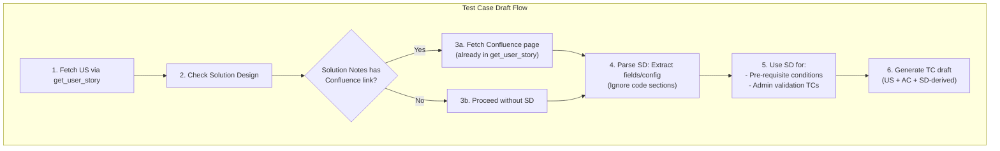

# Solution Design Integration for Test Case Generation

## Current State

- [src/tools/work-items.ts](src/tools/work-items.ts) already reads `Custom.TechnicalSolution` (UI: "Solution Notes"), extracts Confluence URL from rich text via [src/helpers/confluence-url.ts](src/helpers/confluence-url.ts), and fetches page content when Confluence is configured.
- `get_user_story` returns `solutionDesignUrl` and `solutionDesignContent` in the context.
- No explicit guidance exists on **how** to use Solution Design content for test case generation (pre-requisites, admin validation TCs, or what to ignore).

## Target State




## Usage Rules (Template)

Add a **Solution Design usage template** to `conventions.config.json` so the AI consistently applies these rules:


| Rule        | Description                                                                                     |
| ----------- | ----------------------------------------------------------------------------------------------- |
| **Use for** | Business process, functionality context, new fields, new configurations                         |
| **Use for** | Pre-requisite conditions (technical format: Object.Field = Value)                               |
| **Use for** | Admin validation test cases (verify new fields/settings are accessible to System Administrator) |
| **Ignore**  | Code snippets, implementation details, Apex/JavaScript/LWC, deployment steps                    |
| **Ignore**  | Test steps (those go in the Steps section, not pre-requisites)                                  |


## Implementation

### 1. Add `solutionDesign` section to [conventions.config.json](conventions.config.json)

```json
"solutionDesign": {
  "adoFieldRef": "Custom.TechnicalSolution",
  "uiLabel": "Solution Notes",
  "usageRules": {
    "useFor": [
      "Business process and functionality context",
      "New fields (Object.Field__c) introduced in the solution",
      "New configurations, settings, or feature flags",
      "Pre-requisite conditions in technical format",
      "Admin validation: verify fields/settings accessible to System Administrator"
    ],
    "ignore": [
      "Code snippets, Apex, JavaScript, LWC, triggers",
      "Implementation or deployment details",
      "Test steps (belong in Steps section)"
    ],
    "adminValidationTemplate": "Verify {fieldOrSetting} is accessible and present in the system for System Administrator"
  },
  "extractionHints": [
    "Look for: New custom fields (__c suffix), new picklist values, new page layouts, new Lightning actions",
    "Look for: Configuration tables, setup requirements, permission/PSG changes",
    "Output pre-requisites as: Object.Field = Value (see preConditionFormat)"
  ]
}
```

### 2. Update [src/helpers/confluence-url.ts](src/helpers/confluence-url.ts) for rich text with text + link

The current implementation already:

- Scans `href` attributes in HTML (handles `<a href="...">Link text</a>`)
- Falls back to plain URL if no href
- Returns first Confluence URL

**Enhancement:** If the field contains multiple Confluence links (e.g., main SD + appendix), consider returning the first one as primary. No code change needed for "text along with link" — the extractor already handles mixed content. Add a brief comment in the helper documenting that rich text may contain descriptive text plus link(s).

### 3. Update [src/types.ts](src/types.ts)

Add `SolutionDesignUsage` interface and extend `ConventionsConfig` to include the new `solutionDesign` block. Update [src/config.ts](src/config.ts) Zod schema to validate it.

### 4. Update prompts to enforce SD usage

In [src/prompts/index.ts](src/prompts/index.ts), update the `create_test_case` and `draft_test_cases` (when implemented) prompts to:

1. **Explicitly check** for `solutionDesignContent` in the US context
2. **Apply the template**: When SD is present, extract new fields/config; add to pre-requisites (technical format); create at least one admin validation TC per new field/config if applicable
3. **Ignore** code sections per the template

### 5. Update [docs/implementation.md](docs/implementation.md)

- Add "Step 2: Check Solution Design" explicitly in the sequence diagram
- Document the SD usage template and admin validation TC pattern
- Note that Solution Notes (Technical Solution) is a rich text field — the system extracts Confluence links from HTML anchors or plain URLs

### 6. Optional: `extract_solution_design_summary` helper

A lightweight helper in `src/helpers/solution-design.ts` could return a structured summary for the AI:

```typescript
// Returns: { newFields: string[], newConfigs: string[], businessContext: string }
// Parses solutionDesignContent and extracts:
// - Lines matching Object.Field__c, Object.Setting__c patterns
// - Configuration/setup sections (by heading)
// - Excludes code blocks (

```...

```)
```

This is optional — the AI can parse the raw content using the template. If we add it, it makes extraction more deterministic.

## Template Benefit

Having this as a **config-driven template** in `conventions.config.json`:

- Ensures consistent behavior across sessions
- Allows teams to tune usage rules without code changes
- Documents the standard for QA and developers
- Keeps admin validation TC pattern reusable

## Field Name Handling

The user mentioned "US Solution Notes field." The ADO API reference is `Custom.TechnicalSolution`. If your project uses a different field (e.g., `Custom.SolutionNotes`), make it configurable via `solutionDesign.adoFieldRef` so it can be overridden without code changes.