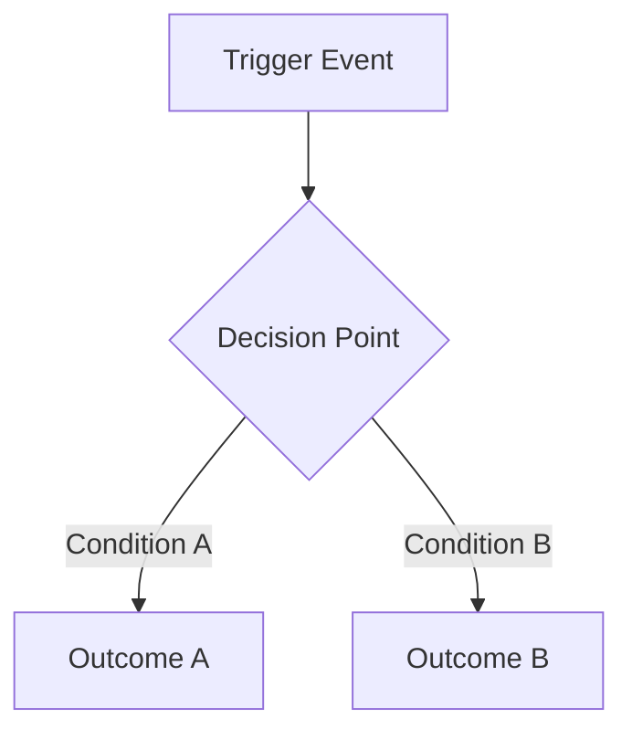
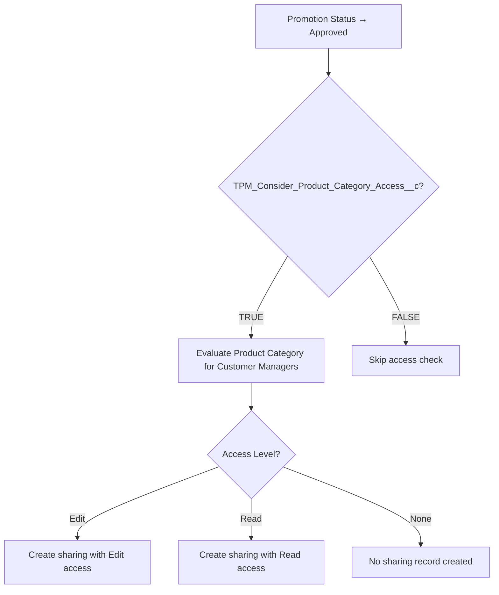
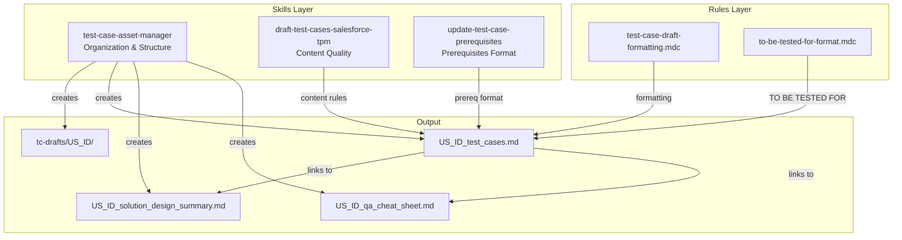

# Test Case Asset Folder Structure Plan

## Approach: Wrapper/Orchestrator Skill (Option C)

Create a new `test-case-asset-manager` skill that orchestrates folder structure and file organization, while the existing `draft-test-cases-salesforce-tpm` skill remains unchanged and focused on test case content quality.

**Key Principle:** Separation of concerns - organization vs. content quality.

---

## What Will Be Created

```
.cursor/skills/
├── draft-test-cases-salesforce-tpm/     ← UNCHANGED (existing)
│   ├── SKILL.md
│   └── config-summary-examples.md
│
└── test-case-asset-manager/             ← NEW
    ├── SKILL.md
    ├── templates/
    │   ├── test_cases.template.md
    │   ├── solution_design_summary.template.md
    │   └── qa_cheat_sheet.template.md
    └── examples/
        └── US_EXAMPLE/
            ├── US_EXAMPLE_test_cases.md
            ├── US_EXAMPLE_solution_design_summary.md
            └── US_EXAMPLE_qa_cheat_sheet.md

.cursor/rules/
└── test-case-draft-formatting.mdc       ← UPDATED (add folder reference)
```

---

## Deliverable 1: SKILL.md

**File:** [.cursor/skills/test-case-asset-manager/SKILL.md](.cursor/skills/test-case-asset-manager/SKILL.md)

```markdown
---
name: test-case-asset-manager
description: Organize test case assets per user story with dedicated folders, separate files for test cases, solution design summary, and QA cheat sheet. Use when drafting test cases, creating test case folders, or organizing QA documentation for a User Story.
---

# Test Case Asset Manager

Organize and manage test case documentation assets for User Stories with a consistent folder structure.

**When to Use:**
- Drafting test cases for a new User Story
- Creating supporting documentation (solution design summary, QA cheat sheet)
- Organizing existing test case drafts into the standard structure

---

## Folder Structure

### Location
All US folders go inside `tc-drafts/` in the workspace root:
```
tc-drafts/
└── US_<ID>/
    ├── US_<ID>_test_cases.md
    ├── US_<ID>_solution_design_summary.md
    └── US_<ID>_qa_cheat_sheet.md
```

### Naming Conventions

**Folder:**
- `US_<ID>` — preferred (e.g., `US_1399001`)
- `US_<ID>_<short_title_slug>` — optional when disambiguation needed (e.g., `US_1399001_product_category_access`)

**Files:**
- `US_<ID>_test_cases.md` — main test case draft
- `US_<ID>_solution_design_summary.md` — solution design summary
- `US_<ID>_qa_cheat_sheet.md` — QA execution cheat sheet

---

## File Rules

### Main Test Cases File

**Purpose:** Primary draft containing test cases ready for ADO push.

**Structure:**
1. Title and metadata block
2. **Supporting Documents links** (immediately after metadata)
3. Functionality Process Flow
4. Common Prerequisites
5. Test Data
6. Test Cases
7. Review Notes (optional)

**Link Placement:**
```markdown
## Supporting Documents
- Solution Design Summary: [Open](./US_<ID>_solution_design_summary.md)
- QA Cheat Sheet: [Open](./US_<ID>_qa_cheat_sheet.md)
```

**Rules:**
- Do NOT embed full solution design or cheat sheet content
- Keep focused on test cases
- Use relative paths for links
- Update links in place (do not duplicate)

### Solution Design Summary File

**Purpose:** Concise reference for business logic and configurations.

**Must Include:**
- US ID and title
- Scope note (if partial coverage)
- Business goal (1-2 sentences)
- Core process/access/visibility logic
- Supported functional areas
- Key configurations (Object.Field = Value)
- Recalculation/refresh triggers (where relevant)

**Rules:**
- Keep concise and reusable
- Use condition-based format for configurations
- Do not include implementation details or code

### QA Cheat Sheet File

**Purpose:** Quick execution aid for QA testers.

**Should Include (where relevant):**
- Quick decision rules (If X then Y)
- Setup checklist
- Positive validations
- Negative validations
- Retest triggers
- Role-based reminders
- Dependency/hierarchy reminders

**Rules:**
- Keep compact and scannable
- Use tables and checklists for quick reference
- Self-contained (no external references needed during execution)

---

## Accuracy Rules

1. **Source Material Only:** Use only supported sources:
   - User Story / Acceptance Criteria
   - Confluence Solution Design
   - Approved documentation
   - Explicit user clarification

2. **No Invention:** Do not invent:
   - Requirements
   - Scope
   - Logic
   - Conditions
   - Assumptions

3. **Partial Coverage:** If source only supports part of the story scope, state that clearly in the supporting documents.

4. **Terminology Conflicts:** Prefer the latest explicit user clarification.

5. **Story-Specific:** Keep prompts generic to the current US. Do not reuse story-specific assumptions from previous work.

---

## Prerequisite Writing Standard

Write prerequisites as condition-based setup statements.

**Preferred Formats:**
| Pattern | Example |
|---------|---------|
| `<Object>.<Field> = <Value>` | `Promotion.Status = Adjusted` |
| `<Object>.<Field> != NULL` | `Tactic.Planned_Rate__c != NULL` |
| `<Object>.<Field> = TRUE/FALSE` | `Template.TPM_Enable_LOA__c = TRUE` |
| `<Object>.<Field> CONTAINS <Value>` | `FieldSet.Fields CONTAINS Rate` |
| `<Object>.<Field> IN (<Values>)` | `User.Sales_Org IN (1111, 0404)` |

**Avoid:**
- "Setup is configured"
- "Required configuration exists"
- "Conditions are met"
- "Appropriate setup in place"

---

## Test Case Quality Standard

Each test case must have:
- Clear use case (what is being validated)
- Relevant prerequisites (condition-based)
- Unambiguous action (imperative, short)
- Precise expected result ("should" form)

**Content Quality:** For test case content rules (coverage matrix, logic interpretation, step format), reference the [draft-test-cases-salesforce-tpm](../draft-test-cases-salesforce-tpm/SKILL.md) skill.

---

## Maintenance Rules

1. **Update Together:** When updating a US draft, update or validate linked summary and cheat-sheet files.

2. **Create Folder First:** If US folder doesn't exist, create it before adding files.

3. **Consistent Naming:** Keep naming consistent within the same folder.

4. **Version Control:** Update version number in metadata when making revisions.

---

## Final Validation Checklist

Before considering a US draft complete:

- [ ] All files belong to the same US
- [ ] Draft links point to correct files (relative paths)
- [ ] Test case draft is lightweight (no embedded large summaries)
- [ ] Prerequisites use condition-based wording
- [ ] Folder structure is clean and self-contained
- [ ] Solution design summary has all required sections
- [ ] QA cheat sheet is scannable and self-contained

---

## Templates

Use templates in `templates/` folder as starting points:
- [test_cases.template.md](./templates/test_cases.template.md)
- [solution_design_summary.template.md](./templates/solution_design_summary.template.md)
- [qa_cheat_sheet.template.md](./templates/qa_cheat_sheet.template.md)

## Examples

See `examples/US_EXAMPLE/` for a complete reference implementation.
```

---

## Deliverable 2: Templates

### Template 1: test_cases.template.md

**File:** [.cursor/skills/test-case-asset-manager/templates/test_cases.template.md](.cursor/skills/test-case-asset-manager/templates/test_cases.template.md)

```markdown
# US <ID> - <Title>

**Status:** Draft
**Drafted By:** <username>
**Version:** 1

---

## Supporting Documents

- Solution Design Summary: [Open](./US_<ID>_solution_design_summary.md)
- QA Cheat Sheet: [Open](./US_<ID>_qa_cheat_sheet.md)

---

## Functionality Process Flow

<!-- Use Mermaid diagram for visual flows, or text-based flow when details are insufficient -->



OR text-based:
```
1. User performs action X
2. System checks condition Y
3. If TRUE → outcome A
4. If FALSE → outcome B
```

---

## Common Prerequisites

| Section | Conditions |
|---------|------------|
| **Persona** | System Administrator, ADMIN User, KAM User |
| **Pre-requisite** | User.Sales_Organization = <value><br>Object.Field = <value> |
| **TO BE TESTED FOR** | <validation summary> |
| **Test Data** | N/A |

---

## Test Data

<!-- Add test data tables or combinations if applicable -->

| Scenario | Field A | Field B | Expected |
|----------|---------|---------|----------|
| Scenario 1 | Value | Value | Result |

---

## Test Cases

### TC_<ID>_01 → <Feature Tag> → <Sub-Feature> → Verify that <action/verification>

| Field | Value |
|-------|-------|
| **Pre-requisite** | Object.Field = Value |
| **TO BE TESTED FOR** | Validation summary |

| Step | Action | Expected Result |
|------|--------|-----------------|
| 1 | Login as KAM User | you should be able to do so |
| 2 | <Action> | <Expected outcome should...> |

---

### TC_<ID>_02 → <Feature Tag> → <Sub-Feature> → Verify that <action/verification>

| Field | Value |
|-------|-------|
| **Pre-requisite** | Object.Field = Value |
| **TO BE TESTED FOR** | Validation summary |

| Step | Action | Expected Result |
|------|--------|-----------------|
| 1 | Login as KAM User | you should be able to do so |
| 2 | <Action> | <Expected outcome should...> |

---

## Review Notes

<!-- Optional: Add notes for reviewers, open questions, or clarifications needed -->
```

### Template 2: solution_design_summary.template.md

**File:** [.cursor/skills/test-case-asset-manager/templates/solution_design_summary.template.md](.cursor/skills/test-case-asset-manager/templates/solution_design_summary.template.md)

```markdown
# Solution Design Summary - US <ID>

**US ID:** <ID>
**Title:** <Title>
**Scope:** Full | Partial — <note if partial>

---

## Business Goal

<!-- 1-2 sentences describing the business objective -->

<Business goal description>

---

## Core Logic

### Process Flow
<!-- Key steps in the business process -->

1. <Trigger event>
2. <System check/evaluation>
3. <Outcome based on conditions>

### Access / Visibility Rules
<!-- Who can see/do what -->

- <Role/User> can <action> when <condition>

### Controlling Conditions
<!-- Fields/configs that control behavior -->

- `Object.Field = Value` → <behavior>

---

## Supported Functional Areas

- <Area 1>
- <Area 2>
- <Area 3>

---

## Key Configurations

| Object | Field | Values | Impact |
|--------|-------|--------|--------|
| <Object> | <Field__c> | TRUE / FALSE | <what it controls> |

---

## Recalculation / Refresh Triggers

<!-- When does the system recalculate or refresh data? -->

| Trigger | Action |
|---------|--------|
| <Event> | <What gets recalculated> |

---

## Dependencies

<!-- Other features, objects, or configurations this depends on -->

- <Dependency 1>
- <Dependency 2>

---

## Out of Scope

<!-- Explicitly state what is NOT covered -->

- <Item not covered>
```

### Template 3: qa_cheat_sheet.template.md

**File:** [.cursor/skills/test-case-asset-manager/templates/qa_cheat_sheet.template.md](.cursor/skills/test-case-asset-manager/templates/qa_cheat_sheet.template.md)

```markdown
# QA Cheat Sheet - US <ID>

Quick reference for test execution.

---

## Quick Decision Rules

| If... | Then... |
|-------|---------|
| <Condition A> | <Expected behavior> |
| <Condition B> | <Expected behavior> |
| <Condition C> | <Expected behavior> |

---

## Setup Checklist

Before executing tests, verify:

- [ ] User.Sales_Organization = <value>
- [ ] <Config Object>.<Field> = <required value>
- [ ] <User has required role/profile>
- [ ] <Test data is available>

---

## Positive Validations

Expected behaviors when conditions are met:

- <Validation 1>
- <Validation 2>
- <Validation 3>

---

## Negative Validations

Expected behaviors for error/edge cases:

- <Negative case 1> → <Expected error/behavior>
- <Negative case 2> → <Expected error/behavior>

---

## Retest Triggers

Retest when:

- [ ] <Configuration change>
- [ ] <Data change>
- [ ] <Related feature change>

---

## Role Reminders

| Role | Key Points |
|------|------------|
| **KAM** | <What KAM can/cannot do> |
| **ADMIN** | <What ADMIN can/cannot do> |
| **System Admin** | <Setup/verification only> |

---

## Dependency Reminders

- <Parent object> must exist before <child object>
- <Config A> must be enabled for <feature B> to work

---

## Common Pitfalls

- <Common mistake 1> — <how to avoid>
- <Common mistake 2> — <how to avoid>
```

---

## Deliverable 3: Example Files

### Example 1: US_EXAMPLE_test_cases.md

**File:** [.cursor/skills/test-case-asset-manager/examples/US_EXAMPLE/US_EXAMPLE_test_cases.md](.cursor/skills/test-case-asset-manager/examples/US_EXAMPLE/US_EXAMPLE_test_cases.md)

```markdown
# US 1399001 - Customer Manager Product Category Access

**Status:** Draft
**Drafted By:** kavita.badgujar
**Version:** 1

---

## Supporting Documents

- Solution Design Summary: [Open](./US_EXAMPLE_solution_design_summary.md)
- QA Cheat Sheet: [Open](./US_EXAMPLE_qa_cheat_sheet.md)

---

## Functionality Process Flow



---

## Common Prerequisites

| Section | Conditions |
|---------|------------|
| **Persona** | System Administrator, ADMIN User, KAM User |
| **Pre-requisite** | User.Sales_Organization = 1111<br>Promotion.TPM_Consider_Product_Category_Access__c = TRUE<br>CustomerManager.Product_Category_Access__c = Edit / Read / None |
| **TO BE TESTED FOR** | Product Category access creates correct sharing records based on access level |
| **Test Data** | N/A |

---

## Test Cases

### TC_1399001_01 → Promotion Management → Customer Managers → Verify that Edit access creates Edit sharing record

| Field | Value |
|-------|-------|
| **Pre-requisite** | CustomerManager.Product_Category_Access__c = Edit |
| **TO BE TESTED FOR** | Edit access → Edit sharing record created |

| Step | Action | Expected Result |
|------|--------|-----------------|
| 1 | Login as KAM User | you should be able to do so |
| 2 | Create a new Promotion record | you should be able to do so |
| 3 | Transition Promotion to Approved status | Promotion should transition to Approved |
| 4 | Verify sharing records for Customer Manager | Sharing record should be created with Edit access |

---

### TC_1399001_02 → Promotion Management → Customer Managers → Verify that Read access creates Read sharing record

| Field | Value |
|-------|-------|
| **Pre-requisite** | CustomerManager.Product_Category_Access__c = Read |
| **TO BE TESTED FOR** | Read access → Read sharing record created |

| Step | Action | Expected Result |
|------|--------|-----------------|
| 1 | Login as KAM User | you should be able to do so |
| 2 | Create a new Promotion record | you should be able to do so |
| 3 | Transition Promotion to Approved status | Promotion should transition to Approved |
| 4 | Verify sharing records for Customer Manager | Sharing record should be created with Read access |

---

### TC_1399001_03 → Promotion Management → Customer Managers → Verify that None access creates no sharing record

| Field | Value |
|-------|-------|
| **Pre-requisite** | CustomerManager.Product_Category_Access__c = None |
| **TO BE TESTED FOR** | None access → No sharing record |

| Step | Action | Expected Result |
|------|--------|-----------------|
| 1 | Login as KAM User | you should be able to do so |
| 2 | Create a new Promotion record | you should be able to do so |
| 3 | Transition Promotion to Approved status | Promotion should transition to Approved |
| 4 | Verify sharing records for Customer Manager | No sharing record should be created for Customer Manager |

---

### TC_1399001_04 → Promotion Management → Customer Managers → Verify that disabled config skips access check

| Field | Value |
|-------|-------|
| **Pre-requisite** | Promotion.TPM_Consider_Product_Category_Access__c = FALSE |
| **TO BE TESTED FOR** | Config disabled → Access check skipped |

| Step | Action | Expected Result |
|------|--------|-----------------|
| 1 | Login as KAM User | you should be able to do so |
| 2 | Create a new Promotion with TPM_Consider_Product_Category_Access__c = FALSE | you should be able to do so |
| 3 | Transition Promotion to Approved status | Promotion should transition to Approved |
| 4 | Verify sharing records | No Product Category-based sharing records should be created (access check skipped) |

---

## Review Notes

- Confirm with BA: Does recalculation happen on Customer Manager access change?
- Edge case to consider: Multiple Customer Managers with different access levels
```

### Example 2: US_EXAMPLE_solution_design_summary.md

**File:** [.cursor/skills/test-case-asset-manager/examples/US_EXAMPLE/US_EXAMPLE_solution_design_summary.md](.cursor/skills/test-case-asset-manager/examples/US_EXAMPLE/US_EXAMPLE_solution_design_summary.md)

```markdown
# Solution Design Summary - US 1399001

**US ID:** 1399001
**Title:** Customer Manager Product Category Access
**Scope:** Full — All acceptance criteria covered

---

## Business Goal

Enable Product Category-based access control for Customer Managers on Promotions, allowing Edit, Read, or No access based on configuration.

---

## Core Logic

### Process Flow

1. User transitions Promotion to Approved status
2. System checks `TPM_Consider_Product_Category_Access__c` field on Promotion
3. If TRUE → evaluates each Customer Manager's Product Category access level
4. Creates/updates sharing records based on access level

### Access / Visibility Rules

- Customer Manager with **Edit** access → Can edit Promotion-related records
- Customer Manager with **Read** access → Can view but not edit
- Customer Manager with **None** access → No sharing record created

### Controlling Conditions

- `Promotion.TPM_Consider_Product_Category_Access__c = TRUE` → Access evaluation enabled
- `Promotion.TPM_Consider_Product_Category_Access__c = FALSE` → Access evaluation skipped

---

## Supported Functional Areas

- Promotion Management
- Customer Manager Access Control
- Sharing Record Management

---

## Key Configurations

| Object | Field | Values | Impact |
|--------|-------|--------|--------|
| Promotion | TPM_Consider_Product_Category_Access__c | TRUE / FALSE | Enables/disables Product Category access check |
| Customer Manager | Product_Category_Access__c | Edit / Read / None | Determines sharing access level |

---

## Recalculation / Refresh Triggers

| Trigger | Action |
|---------|--------|
| Promotion status → Approved | Sharing records evaluated and created |
| Customer Manager access change | TBD — confirm if recalculation is triggered |

---

## Dependencies

- Customer Manager records must exist and be associated with the Promotion
- Promotion Template must support the TPM_Consider_Product_Category_Access__c field

---

## Out of Scope

- Sharing record deletion on status rollback (handled by separate US)
- Bulk operations performance optimization
```

### Example 3: US_EXAMPLE_qa_cheat_sheet.md

**File:** [.cursor/skills/test-case-asset-manager/examples/US_EXAMPLE/US_EXAMPLE_qa_cheat_sheet.md](.cursor/skills/test-case-asset-manager/examples/US_EXAMPLE/US_EXAMPLE_qa_cheat_sheet.md)

```markdown
# QA Cheat Sheet - US 1399001

Quick reference for Customer Manager Product Category Access testing.

---

## Quick Decision Rules

| If... | Then... |
|-------|---------|
| TPM_Consider_Product_Category_Access__c = FALSE | Skip all Product Category checks — no sharing created |
| Access = Edit | Sharing record created with **Edit** access |
| Access = Read | Sharing record created with **Read** access |
| Access = None | **No** sharing record created |

---

## Setup Checklist

Before executing tests, verify:

- [ ] User.Sales_Organization = 1111
- [ ] Promotion Template supports TPM_Consider_Product_Category_Access__c field
- [ ] Customer Manager records exist with varying Product_Category_Access__c values (Edit, Read, None)
- [ ] KAM User has permission to create Promotions
- [ ] At least one Customer Manager associated with test Account

---

## Positive Validations

- Edit access → Edit sharing record created
- Read access → Read sharing record created
- Config enabled (TRUE) → Access evaluated for all Customer Managers
- Multiple Customer Managers → Each gets correct sharing based on their access level

---

## Negative Validations

- None access → No sharing record created
- Config disabled (FALSE) → No access check performed, no sharing records
- Missing Customer Manager → No error, processing continues

---

## Retest Triggers

Retest when:

- [ ] Product_Category_Access__c value changed on Customer Manager
- [ ] TPM_Consider_Product_Category_Access__c toggled on Promotion
- [ ] Promotion status rolled back and re-approved
- [ ] New Customer Manager added to Account

---

## Role Reminders

| Role | Key Points |
|------|------------|
| **KAM** | Creates Promotions, triggers access evaluation on Approved |
| **ADMIN** | Configures TPM_Consider_Product_Category_Access__c on Promotion Template |
| **System Admin** | Verifies field accessibility, manages sharing settings |

---

## Dependency Reminders

- Customer Manager must be associated with Account **before** Promotion is created
- Promotion must use a Template that has TPM_Consider_Product_Category_Access__c field

---

## Common Pitfalls

- Forgetting to set TPM_Consider_Product_Category_Access__c = TRUE → No sharing created
- Testing with Customer Manager not associated to the Promotion's Account → No sharing expected
- Checking sharing immediately after status change → Allow brief processing time
```

---

## Deliverable 4: Update Existing Rule

**File:** [.cursor/rules/test-case-draft-formatting.mdc](.cursor/rules/test-case-draft-formatting.mdc)

**Change:** Add section 11 referencing the new folder structure.

```markdown
## Folder Structure (NEW)

11. **US Folder Convention** — Test case drafts should be organized in per-US folders inside `tc-drafts/`:
   - Folder: `tc-drafts/US_<ID>/`
   - Files: `US_<ID>_test_cases.md`, `US_<ID>_solution_design_summary.md`, `US_<ID>_qa_cheat_sheet.md`
   - Main draft must include relative links to supporting documents
   - See `test-case-asset-manager` skill for full structure rules
```

---

## Integration Diagram



---

## Implementation Steps

1. **Create skill folder structure:**
   ```
   mkdir -p .cursor/skills/test-case-asset-manager/templates
   mkdir -p .cursor/skills/test-case-asset-manager/examples/US_EXAMPLE
   ```

2. **Create SKILL.md** with orchestration rules

3. **Create templates:**
   - test_cases.template.md
   - solution_design_summary.template.md
   - qa_cheat_sheet.template.md

4. **Create example files:**
   - US_EXAMPLE_test_cases.md
   - US_EXAMPLE_solution_design_summary.md
   - US_EXAMPLE_qa_cheat_sheet.md

5. **Update rule:** Add folder structure section to test-case-draft-formatting.mdc

6. **Deploy:** Run `npm run deploy` to push to Google Drive

---

## Risk Mitigation

| Risk | Mitigation |
|------|------------|
| Breaking existing skill | Existing `draft-test-cases-salesforce-tpm` is NOT modified |
| Conflicting rules | New skill references existing skill for content; no overlap |
| Folder creation errors | Templates provide clear structure; examples show correct output |

---

## Post-Implementation Validation

- [ ] Verify `draft-test-cases-salesforce-tpm` skill unchanged
- [ ] Verify new skill is discoverable in Cursor
- [ ] Test creating a new US folder manually using templates
- [ ] Verify relative links work in markdown preview
- [ ] Run `npm run deploy` and confirm Google Drive sync
