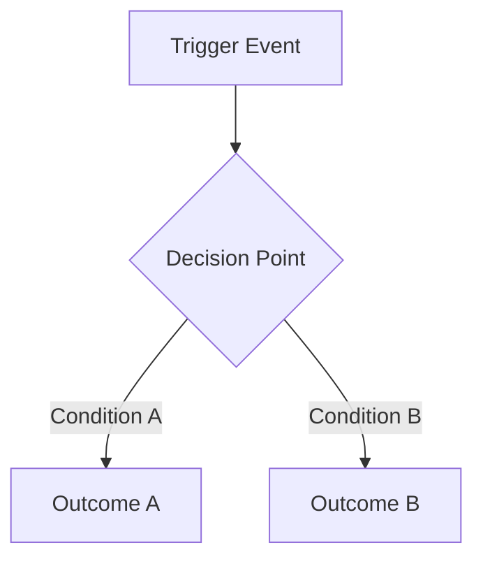
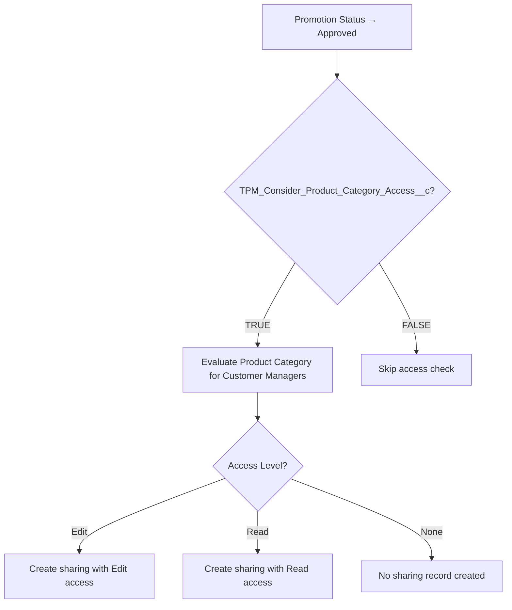
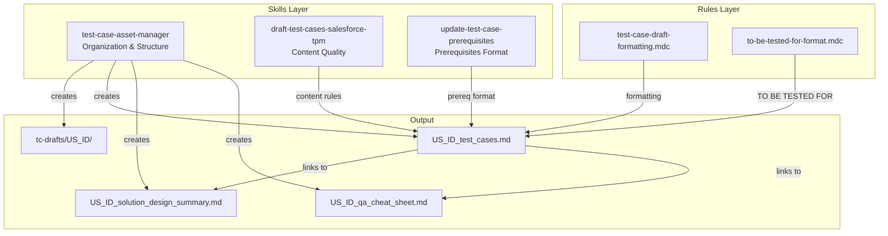

# Test Case Asset Folder Structure Plan

## Approach: Wrapper/Orchestrator Skill (Option C)

Create a new `test-case-asset-manager` skill that orchestrates folder structure and file organization, while the existing `draft-test-cases-salesforce-tpm` skill remains unchanged and focused on test case content quality.

**Key Principles:**
- Separation of concerns - organization vs. content quality
- Examples are learning patterns, not copy-paste content
- Documents serve as QA intelligence for regression test preparation
- Support quick decision-making, debugging, and impact analysis

---

## What Will Be Created

```
.cursor/skills/
├── draft-test-cases-salesforce-tpm/     ← UNCHANGED (existing)
│   ├── SKILL.md
│   └── config-summary-examples.md
│
└── test-case-asset-manager/             ← NEW
    ├── SKILL.md
    └── templates/
        ├── test_cases.template.md
        ├── solution_summary.template.md       ← Enhanced (10 sections + Executive QA Snapshot)
        ├── qa_cheat_sheet.template.md         ← Enhanced (decision tables, debug order)
        └── cheat_sheet_review_guide.md        ← NEW (review framework)

.cursor/rules/
└── test-case-draft-formatting.mdc       ← UPDATED (add folder reference)
```

**Note:** Examples are reference-only in this plan document. No example files are created in the skill folder. The AI learns from examples in this plan; users get clean templates with placeholders.

---

## Deliverable 1: SKILL.md

**File:** [.cursor/skills/test-case-asset-manager/SKILL.md](.cursor/skills/test-case-asset-manager/SKILL.md)

```markdown
---
name: test-case-asset-manager
description: Organize test case assets per user story with dedicated folders, separate files for test cases, solution design summary, and QA cheat sheet. Use when drafting test cases, creating test case folders, or organizing QA documentation for a User Story.
---

# Test Case Asset Manager

Organize and manage test case documentation assets for User Stories with a consistent folder structure.

**When to Use:**
- Drafting test cases for a new User Story
- Creating supporting documentation (solution design summary, QA cheat sheet)
- Organizing existing test case drafts into the standard structure

---

## Folder Structure

### Location
All US folders go inside `tc-drafts/` in the workspace root:
```

tc-drafts/
└── US_/
    ├── US_*test_cases.md
    ├── US**solution_design_summary.md
    └── US**_qa_cheat_sheet.md*

```

### Naming Conventions

**Folder:**
- `US_<ID>` — preferred (e.g., `US_1399001`)
- `US_<ID>_<short_title_slug>` — optional when disambiguation needed (e.g., `US_1399001_product_category_access`)

**Files:**
- `US_<ID>_test_cases.md` — main test case draft
- `US_<ID>_solution_design_summary.md` — solution design summary
- `US_<ID>_qa_cheat_sheet.md` — QA execution cheat sheet

---

## File Rules

### Main Test Cases File

**Purpose:** Primary draft containing test cases ready for ADO push.

**Structure:**
1. Title and metadata block
2. **Supporting Documents links** (immediately after metadata)
3. Functionality Process Flow
4. Common Prerequisites
5. Test Data
6. Test Cases
7. Review Notes (optional)

**Link Placement:**
```markdown
## Supporting Documents
- Solution Design Summary: [Open](./US_<ID>_solution_design_summary.md)
- QA Cheat Sheet: [Open](./US_<ID>_qa_cheat_sheet.md)
```

**Rules:**

- Do NOT embed full solution design or cheat sheet content
- Keep focused on test cases
- Use relative paths for links
- Update links in place (do not duplicate)

### Solution Design Summary File

**Purpose:** Concise reference for business logic and configurations.

**Must Include:**

- US ID and title
- Scope note (if partial coverage)
- Business goal (1-2 sentences)
- Core process/access/visibility logic
- Supported functional areas
- Key configurations (Object.Field = Value)
- Recalculation/refresh triggers (where relevant)

**Rules:**

- Keep concise and reusable
- Use condition-based format for configurations
- Do not include implementation details or code

### QA Cheat Sheet File

**Purpose:** Quick execution aid for QA testers.

**Should Include (where relevant):**

- Quick decision rules (If X then Y)
- Setup checklist
- Positive validations
- Negative validations
- Retest triggers
- Role-based reminders
- Dependency/hierarchy reminders

**Rules:**

- Keep compact and scannable
- Use tables and checklists for quick reference
- Self-contained (no external references needed during execution)

---

## Accuracy Rules

1. **Source Material Only:** Use only supported sources:
  - User Story / Acceptance Criteria
  - Confluence Solution Design
  - Approved documentation
  - Explicit user clarification
2. **No Invention:** Do not invent:
  - Requirements
  - Scope
  - Logic
  - Conditions
  - Assumptions
3. **Partial Coverage:** If source only supports part of the story scope, state that clearly in the supporting documents.
4. **Terminology Conflicts:** Prefer the latest explicit user clarification.
5. **Story-Specific:** Keep prompts generic to the current US. Do not reuse story-specific assumptions from previous work.

---

## Prerequisite Writing Standard

Write prerequisites as condition-based setup statements.

**Preferred Formats:**


| Pattern                             | Example                             |
| ----------------------------------- | ----------------------------------- |
| `<Object>.<Field> = <Value>`        | `Promotion.Status = Adjusted`       |
| `<Object>.<Field> != NULL`          | `Tactic.Planned_Rate__c != NULL`    |
| `<Object>.<Field> = TRUE/FALSE`     | `Template.TPM_Enable_LOA__c = TRUE` |
| `<Object>.<Field> CONTAINS <Value>` | `FieldSet.Fields CONTAINS Rate`     |
| `<Object>.<Field> IN (<Values>)`    | `User.Sales_Org IN (1111, 0404)`    |


**Avoid:**

- "Setup is configured"
- "Required configuration exists"
- "Conditions are met"
- "Appropriate setup in place"

---

## Test Case Quality Standard

Each test case must have:

- Clear use case (what is being validated)
- Relevant prerequisites (condition-based)
- Unambiguous action (imperative, short)
- Precise expected result ("should" form)

**Content Quality:** For test case content rules (coverage matrix, logic interpretation, step format), reference the [draft-test-cases-salesforce-tpm](../draft-test-cases-salesforce-tpm/SKILL.md) skill.

---

## Maintenance Rules

1. **Update Together:** When updating a US draft, update or validate linked summary and cheat-sheet files.
2. **Create Folder First:** If US folder doesn't exist, create it before adding files.
3. **Consistent Naming:** Keep naming consistent within the same folder.
4. **Version Control:** Update version number in metadata when making revisions.

---

## Final Validation Checklist

Before considering a US draft complete:

- All files belong to the same US
- Draft links point to correct files (relative paths)
- Test case draft is lightweight (no embedded large summaries)
- Prerequisites use condition-based wording
- Folder structure is clean and self-contained
- Solution design summary has all required sections
- QA cheat sheet is scannable and self-contained

---

## Templates

Use templates in `templates/` folder as starting points:

- [test_cases.template.md](./templates/test_cases.template.md)
- [solution_summary.template.md](./templates/solution_summary.template.md)
- [qa_cheat_sheet.template.md](./templates/qa_cheat_sheet.template.md)
- [cheat_sheet_review_guide.md](./templates/cheat_sheet_review_guide.md)

---

## Using Examples (Learning Patterns)

Examples in this plan document are **learning patterns**, not copy-paste content.

**Learn from examples:**
- Structure and section organization
- Condition-based wording patterns
- Decision table formatting
- How to identify regression triggers
- How to separate setup from scenario variables

**Never copy verbatim:**
- Domain-specific field names
- Project-specific business logic
- User Story-specific assumptions
- Sample test data values

**Key insight:** Each user's documents are generated fresh from their own User Story context and source material.

---

## Regression Test Case Preparation

When asked to prepare regression test cases:

1. **Start with Solution Summary Section 8** (Risk Areas and Regression Triggers)
   - Identify what changed
   - Map change to risk areas

2. **Use Cheat Sheet Regression Triggers**
   - Find impacted scenarios per trigger
   - Generate test cases for each impacted scenario

3. **Use Decision Table for Combinations**
   - Identify which condition columns are affected
   - Generate test cases for affected combinations

4. **Cross-reference QA Impact section**
   - Include high-value combinations
   - Include risks easy to miss

5. **Output format:** Separate `US_<ID>_regression_tests.md` file in the same US folder

```

---

## Deliverable 2: Templates

### Template 1: test_cases.template.md

**File:** [.cursor/skills/test-case-asset-manager/templates/test_cases.template.md](.cursor/skills/test-case-asset-manager/templates/test_cases.template.md)

```markdown
# US <ID> - <Title>

**Status:** Draft
**Drafted By:** <username>
**Version:** 1

---

## Supporting Documents

- Solution Design Summary: [Open](./US_<ID>_solution_design_summary.md)
- QA Cheat Sheet: [Open](./US_<ID>_qa_cheat_sheet.md)

---

## Functionality Process Flow

<!-- Use Mermaid diagram for visual flows, breakor text-based flow when details are insufficient -->



OR text-based:

```
1. User performs action X
2. System checks condition Y
3. If TRUE → outcome A
4. If FALSE → outcome B
```

---

## Common Prerequisites


| Section              | Conditions                                 |
| -------------------- | ------------------------------------------ |
| **Persona**          | System Administrator, ADMIN User, KAM User |
| **Pre-requisite**    | User.Sales_Organization = Object.Field =   |
| **TO BE TESTED FOR** |                                            |
| **Test Data**        | N/A                                        |


---

## Test Data


| Scenario   | Field A | Field B | Expected |
| ---------- | ------- | ------- | -------- |
| Scenario 1 | Value   | Value   | Result   |


---

## Test Cases

### TC__01 →  →  → Verify that <action/verification>


| Field                | Value                |
| -------------------- | -------------------- |
| **Pre-requisite**    | Object.Field = Value |
| **TO BE TESTED FOR** | Validation summary   |


| Step | Action            | Expected Result             |
| ---- | ----------------- | --------------------------- |
| 1    | Login as KAM User | you should be able to do so |
| 2    |                   |                             |


---

### TC__02 →  →  → Verify that <action/verification>


| Field                | Value                |
| -------------------- | -------------------- |
| **Pre-requisite**    | Object.Field = Value |
| **TO BE TESTED FOR** | Validation summary   |


| Step | Action            | Expected Result             |
| ---- | ----------------- | --------------------------- |
| 1    | Login as KAM User | you should be able to do so |
| 2    |                   |                             |


---

## Review Notes


```

### Template 2: solution_summary.template.md

**File:** [.cursor/skills/test-case-asset-manager/templates/solution_summary.template.md](.cursor/skills/test-case-asset-manager/templates/solution_summary.template.md)

```markdown
# Solution Summary - US <ID>

**US ID:** <ID>
**Title:** <Title>
**Scope:** Full | Partial — <note if partial>

---

## 1. Purpose and Scope

**Business Problem:**
<What business problem this solution addresses>

**Behavior Introduced/Changed:**
<What is being introduced or changed>

**In Scope:**
- <Item 1>
- <Item 2>

**Out of Scope:**
- <Item not covered>

---

## 2. Business Process Overview

**Triggering Action:** <Entry point / trigger event>

**Key Actors:**
- <Role 1> — <what they do>
- <Role 2> — <what they do>

**Process Flow:**
1. <Trigger event>
2. <System check/evaluation>
3. <Outcome based on conditions>

**Expected Outcome:** <What happens when successful>

**Alternate Flows:**
- If <condition> → <alternate outcome>

---

## 3. Core Decision Logic

<!-- Use decision table or rule matrix for clarity -->

| Condition A | Condition B | Outcome |
|-------------|-------------|---------|
| TRUE        | Edit        | <Result> |
| TRUE        | Read        | <Result> |
| TRUE        | None        | <Result> |
| FALSE       | Any         | <Result> |

**Feature Flags / Controlling Settings:**
- `Object.Field = Value` → <behavior enabled/disabled>

**Eligibility Rules:**
- <Rule 1>
- <Rule 2>

---

## 4. Key Solution Decisions

| Decision | Why It Matters | QA Impact |
|----------|----------------|-----------|
| <Decision 1> | <Business/technical reason> | <What QA must verify> |
| <Decision 2> | <Business/technical reason> | <What QA must verify> |

---

## 5. Data and Configuration Elements

| Element | Type | Role in Solution | QA Impact |
|---------|------|------------------|-----------|
| <Object.Field> | Field | <What it controls> | <Why QA cares> |
| <Setting> | Config | <What it enables> | <Why QA cares> |

---

## 6. Behavior by Scenario

| Scenario | Conditions | Expected Behavior |
|----------|------------|-------------------|
| Happy path | <All conditions met> | <Success outcome> |
| Negative - config disabled | <Config = FALSE> | <No processing> |
| Edge - missing data | <Required data absent> | <Graceful handling> |
| Role variation | <Different user role> | <Role-specific behavior> |

---

## 7. QA Impact / Test Design Guidance

**What Must Always Be Validated:**
- <Critical validation 1>
- <Critical validation 2>

**High-Value Test Combinations:**
- <Combination 1>
- <Combination 2>

**Risks Easy to Miss:**
- <Risk 1> — <why it's easy to miss>
- <Risk 2> — <why it's easy to miss>

**Coverage Guidance:**
- Positive: <What to test>
- Negative: <What to test>
- Boundary: <What to test>

---

## 8. Risk Areas and Regression Triggers

| Risk Area | Why It Matters | Regression Test When |
|-----------|----------------|----------------------|
| <Area 1> | <Explanation> | <Trigger condition> |
| <Area 2> | <Explanation> | <Trigger condition> |

---

## 9. Open Questions / Assumptions

**Missing Information:**
- <What is unknown>

**Assumptions Needing Confirmation:**
- <Assumption 1> — awaiting confirmation from <source>

---

## 10. QA Reuse Notes

**Test Case Generation:** Use Section 3 (Decision Logic) and Section 6 (Behavior by Scenario) to derive test cases.

**Cheat Sheet Creation:** Use Section 3 for decision tables, Section 5 for setup requirements.

**Regression Scoping:** Use Section 8 (Risk Areas) to identify regression test scope.

---

## Executive QA Snapshot

| Aspect | Details |
|--------|---------|
| **What controls behavior** | <Key config/flag> |
| **What must match for success** | <Required conditions> |
| **What causes failure/no access** | <Failure conditions> |
| **Regression test areas** | <Key areas to retest> |

```

### Template 3: qa_cheat_sheet.template.md

**File:** [.cursor/skills/test-case-asset-manager/templates/qa_cheat_sheet.template.md](.cursor/skills/test-case-asset-manager/templates/qa_cheat_sheet.template.md)

```markdown
# QA Cheat Sheet - US <ID>

Quick reference for test execution and debugging.

---

## Executive Decision Summary

| Aspect | Details |
|--------|---------|
| **What controls behavior** | `<Object.Field>` = TRUE/FALSE |
| **What must match for success** | <Required conditions> |
| **What causes failure/no access** | <Failure conditions> |

---

## Decision Table

<!-- Use consistent outcome language: access granted / not granted, visible / hidden, created / not created -->

| Config Enabled | Access Level | Outcome |
|----------------|--------------|---------|
| TRUE           | Edit         | Access granted (Edit) |
| TRUE           | Read         | Access granted (Read-only) |
| TRUE           | None         | Access not granted |
| FALSE          | Any          | No processing (config disabled) |

---

## Setup Prerequisites

**System Config Requirements:**
- [ ] `<Object.Field>` = <required value>
- [ ] <Feature flag enabled>

**User/Role Requirements:**
- [ ] User has <required role/profile>
- [ ] User.Sales_Organization = <value>

**Data State Requirements:**
- [ ] <Required data exists>
- [ ] <Required relationships established>

---

## Scenario Variables

Variables that change per test (use for test combination planning):

| Variable | Valid Values | Notes |
|----------|--------------|-------|
| <Variable 1> | <Value A, Value B, Value C> | <Combination guidance> |
| <Variable 2> | <TRUE, FALSE> | <Impact on outcome> |

---

## Positive Validations

Expected behaviors when conditions are met (use consistent outcome language):

- Config = TRUE + Access = Edit → Access granted (Edit)
- Config = TRUE + Access = Read → Access granted (Read-only)
- <Additional positive validation>

---

## Negative Validations

Expected behaviors for error/edge/failure cases:

- Config = FALSE → No processing occurs (not: "default access")
- Access = None → Access not granted
- <Missing required data> → <Graceful handling / error message>

---

## Debug / Triage Order

When access or behavior is incorrect, check in this order:

1. [ ] **Config check:** Is `<Object.Field>` = TRUE?
2. [ ] **User check:** Does user have required role/profile?
3. [ ] **Data check:** Does required data exist and have correct values?
4. [ ] **Relationship check:** Are required object relationships established?
5. [ ] **Timing check:** Has background processing completed?

**Common Root Causes:**
- Config not enabled at expected level (Template vs. Record)
- Required data created after trigger event
- User role missing required permission

---

## Regression Triggers

| Change | Impacted Test Areas |
|--------|---------------------|
| <Config value changed> | <Which tests to rerun> |
| <Data relationship changed> | <Which tests to rerun> |
| <Role/permission changed> | <Which tests to rerun> |
| <Related feature updated> | <Which tests to rerun> |

---

## Role-Based Behavior Matrix

| Role | Can Create | Can Edit | Can View | Special Notes |
|------|------------|----------|----------|---------------|
| **KAM** | Yes | <Conditional> | Yes | <Notes> |
| **ADMIN** | Yes | Yes | Yes | <Notes> |
| **System Admin** | Setup only | Setup only | Yes | <Notes> |

---

## Dependency Reminders

- <Parent object> must exist **before** <child object>
- <Config A> must be enabled **for** <feature B> to work
- <Data X> must be associated **with** <Object Y> before trigger

---

## Common Pitfalls

- <Common mistake 1> — <how to avoid / what to check>
- <Common mistake 2> — <how to avoid / what to check>
- Assuming FALSE config means "default access" — it means "no processing"
```

### Template 4: cheat_sheet_review_guide.md

**File:** [.cursor/skills/test-case-asset-manager/templates/cheat_sheet_review_guide.md](.cursor/skills/test-case-asset-manager/templates/cheat_sheet_review_guide.md)

```markdown
# QA Cheat Sheet Review Guide

Use this guide when reviewing or enhancing an existing QA cheat sheet.

---

## Review Process

Before editing any cheat sheet, analyze and document:

1. **Keep As-Is** — What is already effective and should be preserved
2. **Improvement Opportunities** — Issues, limitations, ambiguities
3. **Structural Changes** — Better section order or organization
4. **Content Changes** — Wording improvements for testability
5. **Prioritized Plan** — High/medium/optional changes

---

## Quality Checklist

- [ ] Decision logic in table format (not prose or if/then bullets)
- [ ] Setup prerequisites separated from scenario variables
- [ ] Outcome language consistent (granted/not granted, visible/hidden, created/not created)
- [ ] FALSE-path behavior explicit (not implied as "default")
- [ ] Debug/triage order included for troubleshooting
- [ ] Regression triggers linked to specific impacted test areas
- [ ] Role-based behavior in matrix format (Role x Action x Outcome)
- [ ] All validations testable (not vague like "works correctly")
- [ ] Executive summary captures the 3 key decision points

---

## Optimization Targets

The cheat sheet should support:

- **Quick decision-making** — What outcome for which condition?
- **Setup validation** — What must be true before testing?
- **Positive/negative test thinking** — What succeeds vs. fails?
- **Troubleshooting** — Where to look when behavior is wrong?
- **Clear distinctions** — Access rules vs. UI behavior vs. permissions

---

## Improvement Priority

**High impact / low effort:**
- Convert if/then rules to decision table
- Add debug/triage order
- Standardize outcome language

**Medium impact:**
- Separate setup prerequisites from scenario variables
- Add regression trigger → impacted area mapping
- Convert role reminders to behavior matrix

**Optional refinements:**
- Add executive summary
- Add scenario variable combination guidance
- Tighten common pitfalls with specific checks

---

## Output Format

When documenting a review, structure as:

1. Overall Assessment (2-3 sentences)
2. Keep As-Is (bullet list)
3. Improvement Opportunities (bullet list)
4. Recommended Changes (prioritized list)
5. Proposed Structure Skeleton (outline)
```

---

## Reference Examples (Learning Patterns Only)

> **IMPORTANT:** These examples are for AI learning and reference only. They are NOT created as actual files in the skill folder. Each user's documents are generated fresh from their own User Story context. Learn the structure and patterns; never copy domain-specific content verbatim.

### Example 1: US_EXAMPLE_test_cases.md (Reference Only)

```markdown
# US 1399001 - Customer Manager Product Category Access

**Status:** Draft
**Drafted By:** kavita.badgujar
**Version:** 1

---

## Supporting Documents

- Solution Design Summary: [Open](./US_EXAMPLE_solution_design_summary.md)
- QA Cheat Sheet: [Open](./US_EXAMPLE_qa_cheat_sheet.md)

---

## Functionality Process Flow



---

## Common Prerequisites


| Section              | Conditions                                                                                                                                              |
| -------------------- | ------------------------------------------------------------------------------------------------------------------------------------------------------- |
| **Persona**          | System Administrator, ADMIN User, KAM User                                                                                                              |
| **Pre-requisite**    | User.Sales_Organization = 1111 Promotion.TPM_Consider_Product_Category_Access__c = TRUE CustomerManager.Product_Category_Access__c = Edit / Read / None |
| **TO BE TESTED FOR** | Product Category access creates correct sharing records based on access level                                                                           |
| **Test Data**        | N/A                                                                                                                                                     |


---

## Test Cases

### TC_1399001_01 → Promotion Management → Customer Managers → Verify that Edit access creates Edit sharing record


| Field                | Value                                             |
| -------------------- | ------------------------------------------------- |
| **Pre-requisite**    | CustomerManager.Product_Category_Access__c = Edit |
| **TO BE TESTED FOR** | Edit access → Edit sharing record created         |


| Step | Action                                      | Expected Result                                   |
| ---- | ------------------------------------------- | ------------------------------------------------- |
| 1    | Login as KAM User                           | you should be able to do so                       |
| 2    | Create a new Promotion record               | you should be able to do so                       |
| 3    | Transition Promotion to Approved status     | Promotion should transition to Approved           |
| 4    | Verify sharing records for Customer Manager | Sharing record should be created with Edit access |


---

### TC_1399001_02 → Promotion Management → Customer Managers → Verify that Read access creates Read sharing record


| Field                | Value                                             |
| -------------------- | ------------------------------------------------- |
| **Pre-requisite**    | CustomerManager.Product_Category_Access__c = Read |
| **TO BE TESTED FOR** | Read access → Read sharing record created         |


| Step | Action                                      | Expected Result                                   |
| ---- | ------------------------------------------- | ------------------------------------------------- |
| 1    | Login as KAM User                           | you should be able to do so                       |
| 2    | Create a new Promotion record               | you should be able to do so                       |
| 3    | Transition Promotion to Approved status     | Promotion should transition to Approved           |
| 4    | Verify sharing records for Customer Manager | Sharing record should be created with Read access |


---

### TC_1399001_03 → Promotion Management → Customer Managers → Verify that None access creates no sharing record


| Field                | Value                                             |
| -------------------- | ------------------------------------------------- |
| **Pre-requisite**    | CustomerManager.Product_Category_Access__c = None |
| **TO BE TESTED FOR** | None access → No sharing record                   |


| Step | Action                                      | Expected Result                                          |
| ---- | ------------------------------------------- | -------------------------------------------------------- |
| 1    | Login as KAM User                           | you should be able to do so                              |
| 2    | Create a new Promotion record               | you should be able to do so                              |
| 3    | Transition Promotion to Approved status     | Promotion should transition to Approved                  |
| 4    | Verify sharing records for Customer Manager | No sharing record should be created for Customer Manager |


---

### TC_1399001_04 → Promotion Management → Customer Managers → Verify that disabled config skips access check


| Field                | Value                                                     |
| -------------------- | --------------------------------------------------------- |
| **Pre-requisite**    | Promotion.TPM_Consider_Product_Category_Access__c = FALSE |
| **TO BE TESTED FOR** | Config disabled → Access check skipped                    |


| Step | Action                                                                      | Expected Result                                                                    |
| ---- | --------------------------------------------------------------------------- | ---------------------------------------------------------------------------------- |
| 1    | Login as KAM User                                                           | you should be able to do so                                                        |
| 2    | Create a new Promotion with TPM_Consider_Product_Category_Access__c = FALSE | you should be able to do so                                                        |
| 3    | Transition Promotion to Approved status                                     | Promotion should transition to Approved                                            |
| 4    | Verify sharing records                                                      | No Product Category-based sharing records should be created (access check skipped) |


---

## Review Notes

- Confirm with BA: Does recalculation happen on Customer Manager access change?
- Edge case to consider: Multiple Customer Managers with different access levels

```

### Example 2: US_EXAMPLE_solution_summary.md (Reference Only)

```markdown
# Solution Design Summary - US 1399001

**US ID:** 1399001
**Title:** Customer Manager Product Category Access
**Scope:** Full — All acceptance criteria covered

---

## Business Goal

Enable Product Category-based access control for Customer Managers on Promotions, allowing Edit, Read, or No access based on configuration.

---

## Core Logic

### Process Flow

1. User transitions Promotion to Approved status
2. System checks `TPM_Consider_Product_Category_Access__c` field on Promotion
3. If TRUE → evaluates each Customer Manager's Product Category access level
4. Creates/updates sharing records based on access level

### Access / Visibility Rules

- Customer Manager with **Edit** access → Can edit Promotion-related records
- Customer Manager with **Read** access → Can view but not edit
- Customer Manager with **None** access → No sharing record created

### Controlling Conditions

- `Promotion.TPM_Consider_Product_Category_Access__c = TRUE` → Access evaluation enabled
- `Promotion.TPM_Consider_Product_Category_Access__c = FALSE` → Access evaluation skipped

---

## Supported Functional Areas

- Promotion Management
- Customer Manager Access Control
- Sharing Record Management

---

## Key Configurations

| Object | Field | Values | Impact |
|--------|-------|--------|--------|
| Promotion | TPM_Consider_Product_Category_Access__c | TRUE / FALSE | Enables/disables Product Category access check |
| Customer Manager | Product_Category_Access__c | Edit / Read / None | Determines sharing access level |

---

## Recalculation / Refresh Triggers

| Trigger | Action |
|---------|--------|
| Promotion status → Approved | Sharing records evaluated and created |
| Customer Manager access change | TBD — confirm if recalculation is triggered |

---

## Dependencies

- Customer Manager records must exist and be associated with the Promotion
- Promotion Template must support the TPM_Consider_Product_Category_Access__c field

---

## Out of Scope

- Sharing record deletion on status rollback (handled by separate US)
- Bulk operations performance optimization
```

### Example 3: US_EXAMPLE_qa_cheat_sheet.md (Reference Only)

```markdown
# QA Cheat Sheet - US 1399001

Quick reference for Customer Manager Product Category Access testing.

---

## Quick Decision Rules

| If... | Then... |
|-------|---------|
| TPM_Consider_Product_Category_Access__c = FALSE | Skip all Product Category checks — no sharing created |
| Access = Edit | Sharing record created with **Edit** access |
| Access = Read | Sharing record created with **Read** access |
| Access = None | **No** sharing record created |

---

## Setup Checklist

Before executing tests, verify:

- [ ] User.Sales_Organization = 1111
- [ ] Promotion Template supports TPM_Consider_Product_Category_Access__c field
- [ ] Customer Manager records exist with varying Product_Category_Access__c values (Edit, Read, None)
- [ ] KAM User has permission to create Promotions
- [ ] At least one Customer Manager associated with test Account

---

## Positive Validations

- Edit access → Edit sharing record created
- Read access → Read sharing record created
- Config enabled (TRUE) → Access evaluated for all Customer Managers
- Multiple Customer Managers → Each gets correct sharing based on their access level

---

## Negative Validations

- None access → No sharing record created
- Config disabled (FALSE) → No access check performed, no sharing records
- Missing Customer Manager → No error, processing continues

---

## Retest Triggers

Retest when:

- [ ] Product_Category_Access__c value changed on Customer Manager
- [ ] TPM_Consider_Product_Category_Access__c toggled on Promotion
- [ ] Promotion status rolled back and re-approved
- [ ] New Customer Manager added to Account

---

## Role Reminders

| Role | Key Points |
|------|------------|
| **KAM** | Creates Promotions, triggers access evaluation on Approved |
| **ADMIN** | Configures TPM_Consider_Product_Category_Access__c on Promotion Template |
| **System Admin** | Verifies field accessibility, manages sharing settings |

---

## Dependency Reminders

- Customer Manager must be associated with Account **before** Promotion is created
- Promotion must use a Template that has TPM_Consider_Product_Category_Access__c field

---

## Common Pitfalls

- Forgetting to set TPM_Consider_Product_Category_Access__c = TRUE → No sharing created
- Testing with Customer Manager not associated to the Promotion's Account → No sharing expected
- Checking sharing immediately after status change → Allow brief processing time
```

---

## Deliverable 4: Update Existing Rule

**File:** [.cursor/rules/test-case-draft-formatting.mdc](.cursor/rules/test-case-draft-formatting.mdc)

**Change:** Add section 11 referencing the new folder structure.

```markdown
## Folder Structure (NEW)

11. **US Folder Convention** — Test case drafts should be organized in per-US folders inside `tc-drafts/`:
   - Folder: `tc-drafts/US_<ID>/`
   - Files: `US_<ID>_test_cases.md`, `US_<ID>_solution_design_summary.md`, `US_<ID>_qa_cheat_sheet.md`
   - Main draft must include relative links to supporting documents
   - See `test-case-asset-manager` skill for full structure rules
```

---

## Integration Diagram




---

## Implementation Steps

1. **Create skill folder structure:**

```bash
mkdir -p .cursor/skills/test-case-asset-manager/templates
```

2. **Create SKILL.md** with:
   - Folder structure rules
   - File rules for each document type
   - Examples as learning patterns guidance
   - Regression test case preparation support
   - Accuracy rules and quality standards

3. **Create templates:**
   - `test_cases.template.md`
   - `solution_summary.template.md` (enhanced 10-section version)
   - `qa_cheat_sheet.template.md` (enhanced with decision tables, debug order)
   - `cheat_sheet_review_guide.md` (review framework)

4. **Update rule:** Add folder structure section to test-case-draft-formatting.mdc

5. **Deploy:** Run `npm run deploy` to push to Google Drive

**Note:** No example files are created. Examples in this plan document serve as learning patterns for the AI.

---

## Risk Mitigation


| Risk                    | Mitigation                                                      |
| ----------------------- | --------------------------------------------------------------- |
| Breaking existing skill | Existing `draft-test-cases-salesforce-tpm` is NOT modified      |
| Conflicting rules       | New skill references existing skill for content; no overlap     |
| Project-specific leakage | No example files deployed; templates use generic placeholders   |
| Verbose documents       | Enhanced templates are longer but structured for quick scanning |


---

## Post-Implementation Validation

- Verify `draft-test-cases-salesforce-tpm` skill unchanged
- Verify new skill is discoverable in Cursor
- Test creating a new US folder manually using templates
- Verify enhanced templates have all required sections
- Verify relative links work in markdown preview
- Run `npm run deploy` and confirm Google Drive sync

