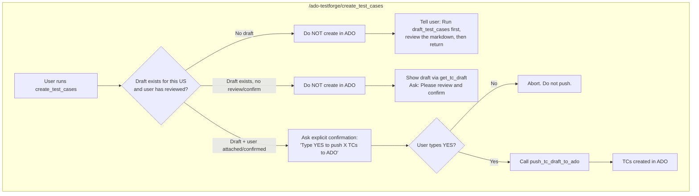
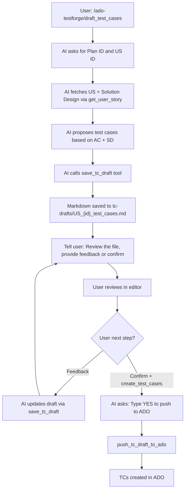

# Test Case Draft-Review-Approve Workflow

## Two Commands


| Command                       | Purpose                                                                                           |
| ----------------------------- | ------------------------------------------------------------------------------------------------- |
| `/ado-testforge/draft_test_cases`  | Generate test case draft (markdown) for review. Never creates in ADO.                             |
| `/ado-testforge/create_test_cases` | Create test cases in ADO. **Always** requires prior review and explicit confirmation before push. |


## Golden Rule

**Never create test cases in ADO without human review and explicit confirmation.** The `create_test_cases` command must handle all scenarios to enforce this.

## Scenario Matrix




| Scenario                        | User Action                                                                          | System Behavior                                                                                                                                      |
| ------------------------------- | ------------------------------------------------------------------------------------ | ---------------------------------------------------------------------------------------------------------------------------------------------------- |
| **A. Direct create (no draft)** | Runs `/create_test_cases` without prior draft                                        | Do NOT create in ADO. Generate draft first via `save_tc_draft`, tell user to review `tc-drafts/US_xxx_test_cases.md`, then return with confirmation. |
| **B. Create without review**    | Runs `/create_test_cases` but has not reviewed draft                                 | Do NOT create. Show draft content, ask user to review and explicitly confirm before proceeding.                                                      |
| **C. Draft + attach + create**  | Runs `/draft_test_cases`, reviews, attaches draft to chat, runs `/create_test_cases` | Ask: "I see the draft for US xxx. Confirm: Type YES to push N test cases to ADO." Only call `push_tc_draft_to_ado` after user types YES.             |
| **D. Draft + confirm in chat**  | User says "approved" or "confirmed" or "yes push" after reviewing                    | Treat as confirmation. Ask one more time: "Type YES to push." Then push.                                                                             |
| **E. Create with feedback**     | User attaches draft with edits/feedback                                              | Treat as revised draft. Update via `save_tc_draft` with user changes, then ask confirmation before push.                                             |


## Workflow (Draft-First Path)




## Storage

```
tc-drafts/
  US_1273966_test_cases.md     <-- human-readable, reviewable
  US_1273966_test_cases.json   <-- structured data for ADO push
```

- **Markdown file**: formatted for review with tables, sections, story context
- **JSON file**: companion structured data matching the `create_test_case` tool input schema -- used by `push_tc_draft_to_ado` so no fragile markdown parsing is needed
- Both files are overwritten on each revision (the markdown tracks the version number)

## Markdown Format

The generated markdown includes:

- **Header** with US ID, title, status (DRAFT/APPROVED), version number, last updated timestamp
- **Story Summary** table (ID, title, state, area path, iteration, parent)
- **Common Prerequisites** section (personas table + pre-requisite list from config defaults)
- **Each test case** as its own section with:
  - Full `TC_USID_##` title
  - Priority
  - Any TC-specific prerequisite overrides (only shown if different from common)
  - Steps table (# / Action / Expected Result)
  - Horizontal rule separator between TCs
- After push to ADO: status changes to APPROVED, ADO work item IDs added to each TC section

## New File: `src/tools/tc-drafts.ts`

Four MCP tools:

### `save_tc_draft`

Accepts structured test case data, writes both `.md` and `.json` to `tc-drafts/`. Accepts the full array of test cases for the story in one call. Reuses `buildTcTitle()` from [src/helpers/tc-title-builder.ts](src/helpers/tc-title-builder.ts) for consistent title formatting. The markdown rendering is handled by a new helper.

Input schema:

- `userStoryId`, `storyTitle`, `storyState`, `areaPath`, `iterationPath`, `parentId?`, `parentTitle?`
- `planId`
- `version` (number, starts at 1, incremented on each revision)
- `testCases[]` -- each with: `tcNumber`, `featureTags`, `useCaseSummary`, `priority?`, `prerequisites?`, `steps[]`

### `get_tc_draft`

Reads and returns the markdown content for a given US ID. The AI shows this to the user during review.

### `list_tc_drafts`

Lists all draft files in `tc-drafts/` with US ID, title (from JSON), status, and version.

### `push_tc_draft_to_ado`

Reads the JSON file for a given US ID, iterates over test cases, and calls the existing `createTestCase` logic for each one. After all TCs are created, updates the markdown to set status = APPROVED and adds the ADO work item IDs next to each TC title.

Returns a summary of created TCs with their ADO IDs.

## New File: `src/helpers/tc-draft-formatter.ts`

Pure function that takes structured test case data and returns formatted markdown string. Uses conventions config for persona defaults and title formatting. Produces clean, reviewable tables.

## Modified: [src/tools/index.ts](src/tools/index.ts)

Add `import { registerTcDraftTools } from "./tc-drafts.ts"` and call `registerTcDraftTools(server, adoClient)`.

## Modified: [src/prompts/index.ts](src/prompts/index.ts)

### `draft_test_cases` prompt

Instructs the AI to:

1. Ask for plan ID and US ID
2. Fetch the US via `get_user_story` (includes Solution Design if linked)
3. Analyze acceptance criteria and Solution Design; propose test cases
4. Call `save_tc_draft` to create the markdown
5. Tell the user: "Review `tc-drafts/US_xxx_test_cases.md`. Provide feedback for revisions, or run `/ado-testforge/create_test_cases` when ready to push to ADO."
6. On feedback, revise and call `save_tc_draft` again (increment version)
7. **Never** call `push_tc_draft_to_ado` from this prompt -- that is only via `create_test_cases`

### `create_test_cases` prompt

Instructs the AI to handle all scenarios. **Skill set:** The AI must check context before any ADO push.

**Prompt message (condensed):**

1. Ask for plan ID and US ID (if not in context)
2. **Check:** Does a draft exist? Call `list_tc_drafts` or `get_tc_draft(userStoryId)` to verify
3. **If no draft:** Call `save_tc_draft` to generate one. Tell user: "I've created a draft. Please review `tc-drafts/US_xxx_test_cases.md`. When you've reviewed and are ready, run this command again and confirm."
4. **If draft exists but user has not confirmed:** Show draft summary. Ask: "Have you reviewed the draft? If yes, type YES to push N test cases to ADO."
5. **If user types YES (or equivalent):** Call `push_tc_draft_to_ado`. Report results.
6. **If user provides feedback or edits:** Update draft via `save_tc_draft`, then ask for confirmation again.
7. **Never** call `push_tc_draft_to_ado` without explicit user confirmation (YES, approved, push, etc.)

**Remove or deprecate** the old `create_test_case` prompt that directly created TCs without review. The new `create_test_cases` (plural) is the only path to ADO, and it always goes through the draft + confirmation flow.

## New: `tc-drafts/.gitkeep`

Empty file so the directory is tracked by git. Add `tc-drafts/*.json` to `.gitignore` (JSON files are intermediate data; markdown files are the reviewable artifact worth keeping).