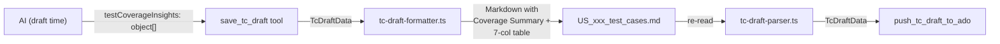

# Test Coverage Insights Enhancement

## Scope

Replace `coverageValidationChecklist` (simple `string[]`) with `testCoverageInsights` (structured object array) across the full stack: data model, Zod schema, formatter, parser, AI prompts, skill, and documentation. The old section is removed entirely.

## Architecture



## Files to Modify (Source)

### 1. Data Model + Schema: [src/helpers/tc-draft-formatter.ts](src/helpers/tc-draft-formatter.ts) and [src/tools/tc-drafts.ts](src/tools/tc-drafts.ts)

**Remove** from `TcDraftData` interface:
```typescript
coverageValidationChecklist?: string[] | null;
```

**Add** new interface and field:
```typescript
export interface CoverageInsightRow {
  scenario: string;
  covered: boolean;
  positiveNegative: "P" | "N";
  functionalNonFunctional: "F" | "NF";
  priority: "High" | "Medium" | "Low";
  notes?: string;
}
```
```typescript
testCoverageInsights?: CoverageInsightRow[] | null;
```

**Update Zod schema** in `tc-drafts.ts` (line 74): Replace the `coverageValidationChecklist` z.array(z.string()) with a new `testCoverageInsights` z.array(z.object({...})).

### 2. Formatter: [src/helpers/tc-draft-formatter.ts](src/helpers/tc-draft-formatter.ts) (lines 82-94)

Replace the old `## Coverage Validation Checklist` block (simple 2-col table) with:

- **Section header:** `## Test Coverage Insights`
- **Coverage Summary block** (computed from the array):
  - Total Scenarios, Covered count, Coverage %, P vs N count, F vs NF count
  - Format: `Coverage Summary:` followed by bullet list
- **Enhanced 7-column table:**
  - `| ID | Scenario | Covered | P/N | F/NF | Priority | Notes |`
  - Covered column uses `<span style="color:green; font-weight:600;">check</span>` / `<span style="color:red; font-weight:600;">cross</span>`
  - P/N column uses `<span style="color:blue;">P</span>` / `<span style="color:orange;">N</span>`
  - Falls back to plain symbols (no HTML) if styling is not rendered

Since the formatting is markdown (rendered in IDEs, GitHub, etc.), the `<span>` tags will work in most renderers and gracefully degrade to showing the plain symbol text content in renderers that strip HTML.

### 3. Parser: [src/helpers/tc-draft-parser.ts](src/helpers/tc-draft-parser.ts) (lines 78-91)

Replace old parsing block that looks for `## Coverage Validation Checklist` with new logic:
- Look for `## Test Coverage Insights`
- Skip the Coverage Summary text block
- Parse the 7-column table rows
- Extract each row into a `CoverageInsightRow` object (strip HTML spans, map symbols to booleans)
- Return as `testCoverageInsights` on the `TcDraftData`

### 4. Tool Input Mapping: [src/tools/tc-drafts.ts](src/tools/tc-drafts.ts) (line 112)

Update the `data` construction in `save_tc_draft` handler:
- Replace `coverageValidationChecklist: input.coverageValidationChecklist` with `testCoverageInsights: input.testCoverageInsights`

### 5. AI Skill: [.cursor/skills/draft-test-cases-salesforce-tpm/SKILL.md](.cursor/skills/draft-test-cases-salesforce-tpm/SKILL.md) (line 145-147)

Replace:
```
### 2. Coverage Validation Checklist
List all logic branches covered. If any branch is missing -> generate additional test case.
```

With updated instructions telling the AI to produce classified scenario rows:
- Each scenario gets: covered (boolean), P/N, F/NF, Priority, optional Notes
- Reference the enhanced table format
- Keep the "if any branch missing, generate additional TC" rule

### 6. Prompt: [src/prompts/index.ts](src/prompts/index.ts) (line 170)

Update the `draft_test_cases` prompt text:
- Replace "Coverage Validation Checklist" with "Test Coverage Insights"
- Add instruction for AI to classify each scenario with P/N, F/NF, Priority

## Files to Modify (Documentation)

All documentation references need updating from "Coverage Validation Checklist" / "coverageValidationChecklist" to "Test Coverage Insights" / "testCoverageInsights":

- [docs/implementation.md](docs/implementation.md) (lines 538, 548)
- [docs/testing-guide.md](docs/testing-guide.md) (line 478)
- [docs/changelog.md](docs/changelog.md) (lines 152, 157) -- add new changelog entry
- [docs/plan-enhanced-context-and-interactive-workflow.md](docs/plan-enhanced-context-and-interactive-workflow.md) (line 417)

## Deploy

After all changes, run `npm run build:dist` to rebuild the distribution bundle (Vercel tarball distribution handles delivery; see docs/distribution-guide.md).

## Example Output (what the markdown will look like)

```markdown
## Test Coverage Insights

Coverage Summary:
- Total Scenarios: 10
- Covered: 8
- Coverage: **80%**
- Distribution: 6P / 4N | 8F / 2NF

| ID | Scenario | Covered | P/N | F/NF | Priority | Notes |
|---|---|---|---|---|---|---|
| 1 | Feature config present and accessible for System Admin | <span style="color:green; font-weight:600;">check</span> | <span style="color:blue;">P</span> | F | High | |
| 2 | Trigger status config missing for Business Unit | <span style="color:green; font-weight:600;">check</span> | <span style="color:orange;">N</span> | F | High | Missing config case |
| 3 | Performance under bulk record processing | <span style="color:red; font-weight:600;">cross</span> | <span style="color:blue;">P</span> | NF | Medium | Deferred to perf sprint |
```
