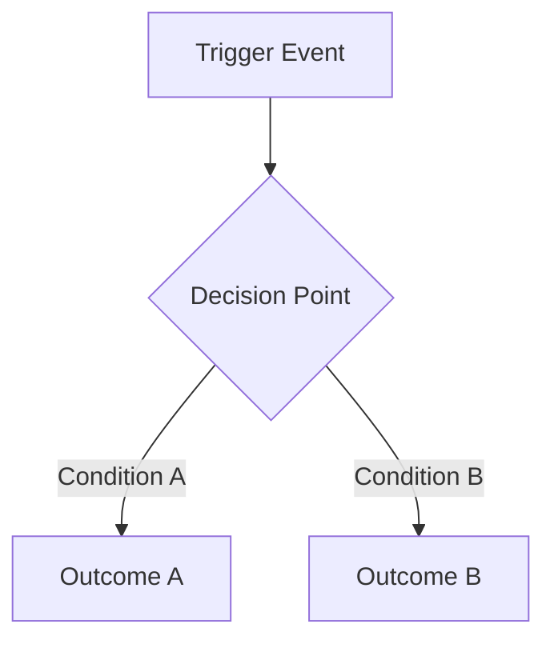

# US <ID> - <Title>

**Status:** Draft
**Drafted By:** <username>
**Version:** 1

---

## Supporting Documents

- Solution Design Summary: [Open](./US_<ID>_solution_design_summary.md)
- QA Cheat Sheet: [Open](./US_<ID>_qa_cheat_sheet.md)

---

## Functionality Process Flow

<!-- Use Mermaid diagram for visual flows, or text-based flow when details are insufficient -->



OR text-based:

```
1. User performs action X
2. System checks condition Y
3. If TRUE → outcome A
4. If FALSE → outcome B
```

---

## Common Prerequisites

| Section              | Conditions                                 |
| -------------------- | ------------------------------------------ |
| **Persona**          | System Administrator, ADMIN User, KAM User |
| **Pre-requisite**    | User.Sales_Organization = Object.Field =   |
| **TO BE TESTED FOR** |                                            |
| **Test Data**        | N/A                                        |

---

## Test Data

| Scenario   | Field A | Field B | Expected |
| ---------- | ------- | ------- | -------- |
| Scenario 1 | Value   | Value   | Result   |

---

## Test Cases

### TC_<ID>_01 → <Feature> → <Area> → Verify that <action/verification>

| Field                | Value                |
| -------------------- | -------------------- |
| **Pre-requisite**    | Object.Field = Value |
| **TO BE TESTED FOR** | Validation summary   |

| Step | Action            | Expected Result             |
| ---- | ----------------- | --------------------------- |
| 1    | Login as KAM User | you should be able to do so |
| 2    |                   |                             |

---

### TC_<ID>_02 → <Feature> → <Area> → Verify that <action/verification>

| Field                | Value                |
| -------------------- | -------------------- |
| **Pre-requisite**    | Object.Field = Value |
| **TO BE TESTED FOR** | Validation summary   |

| Step | Action            | Expected Result             |
| ---- | ----------------- | --------------------------- |
| 1    | Login as KAM User | you should be able to do so |
| 2    |                   |                             |

---

## Review Notes

