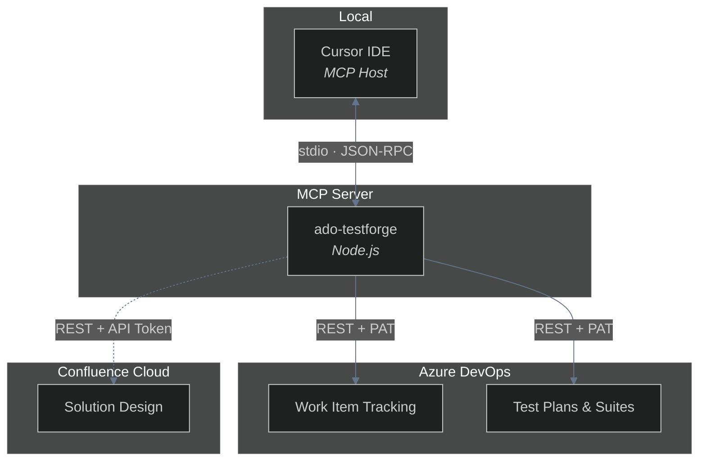

# ADO TestForge MCP — Azure DevOps Test Case Automation

[](https://opensource.org/licenses/MIT)

A Model Context Protocol (MCP) server that integrates Azure DevOps with Cursor IDE for streamlined QA test case management. Draft, review, and push test cases directly from Cursor's AI chat—with automatic User Story enrichment and Confluence Solution Design integration.

---

## Overview

ADO TestForge MCP enables QA teams to automate test case creation and management workflows directly within Cursor. Use natural language prompts and slash commands to fetch User Stories, generate test case drafts from acceptance criteria and Solution Design, and push validated test cases to Azure DevOps—all without leaving your IDE.

---

## Features

| Capability | Description |
|------------|-------------|
| **User Story Integration** | Fetch User Stories with full context: description, acceptance criteria, area path, iteration, and linked Solution Design |
| **Solution Design Enrichment** | Automatic extraction of Confluence Solution Design content from the Technical Solution field |
| **Test Case Drafting** | Generate draft test cases using AI—QA architect methodology applied before pushing to ADO |
| **Test Plan & Suite Management** | Smart suite hierarchy: sprint folders, parent US/epic folders, query-based US suites |
| **Prerequisite Formatting** | Structured prerequisites (Persona, Pre-conditions, TO BE TESTED FOR, Test Data) with ADO-compatible HTML |
| **Clone & Enhance** | Clone test cases from one User Story to another with enhancements |

---

## Architecture



---

## Prerequisites

- **Node.js** v18 or higher
- **Cursor IDE** (latest version)
- **Azure DevOps** access with a Personal Access Token (PAT)
- **Confluence** (optional) — for Solution Design enrichment

---

## Quick Start

1. **Add this folder to your workspace**  
   - Open Cursor → **File > Add Folder to Workspace** (or **Open Folder**)

2. **Run the installer**  
   - Open Cursor's AI chat (Cmd+L / Ctrl+L)  
   - Type `/ado-testforge/install` and run the command

3. **Configure credentials**  
   - Edit `~/.ado-testforge-mcp/credentials.json` (created by installer)  
   - Add your ADO PAT, organization name, and project name

4. **Restart Cursor** (or reload MCP in Settings > MCP)

After setup, ADO TestForge MCP is available globally in all workspaces.

---

## Key Commands

| Command | Purpose |
|---------|---------|
| `/ado-testforge/ado-check` | Verify setup and credentials |
| `/ado-testforge/ado-story` | Fetch User Story with acceptance criteria and Solution Design |
| `/ado-testforge/qa-draft` | Generate test case draft for review (no ADO write) |
| `/ado-testforge/qa-publish` | Push draft to ADO (create test cases) |
| `/ado-testforge/qa-tc-update` | Update existing test case (prerequisites, steps, etc.) |
| `/ado-testforge/qa-tc-delete` | Delete a single test case |
| `/ado-testforge/qa-tc-bulk-delete` | Delete multiple test cases |
| `/ado-testforge/ado-plans` | List test plans in the project |
| `/ado-testforge/ado-fields` | List ADO field definitions |

---

## Documentation

| Document | Purpose |
|----------|---------|
| [Setup Guide](docs/setup-guide.md) | Full installation, credentials, slash commands |
| [Implementation](docs/implementation.md) | Architecture, tools, conventions, API reference |
| [Testing Guide](docs/testing-guide.md) | Step-by-step testing, tool quick reference |
| [Test Case Writing Style](docs/test-case-writing-style-reference.md) | Title format, steps, admin validation |
| [Prerequisite Formatting](docs/prerequisite-formatting-instruction.md) | Prerequisite HTML structure |
| [Distribution Guide](docs/distribution-guide.md) | Build the dist-package bundle and the Vercel-hosted install flow |
| [Changelog](docs/changelog.md) | Release history |

---

## Project Structure

```
├── bin/              # Bootstrap script (installer + launcher)
├── src/               # MCP server source (TypeScript)
│   ├── tools/         # ADO tools (work items, test cases, suites, plans)
│   ├── helpers/       # Prerequisites, steps builder, formatting
│   └── prompts/       # Slash command definitions
├── .cursor/
│   ├── skills/       # QA architect methodology (draft, TO BE TESTED FOR, prerequisites)
│   └── rules/        # Draft formatting, deployment rules
├── docs/              # Documentation
├── conventions.config.json  # Test case naming, prerequisite structure
└── package.json
```

---

## Distribution

End users install ADO TestForge MCP via a one-line `curl` command from the Vercel-hosted install site, which fetches the latest tarball. See [docs/distribution-guide.md](docs/distribution-guide.md) for the full install flow and publishing workflow.

---

## License

MIT © [Kavita Badgujar](https://github.com/badgujar-kavita)

---

## Author

**Kavita Badgujar**
