# Extend ADO TestForge MCP with Cursor `.mdc` Rules

**Audience:** QA leads, tenant admins, project owners who want to tune the MCP's behavior for their team — without forking the server, without code changes, and without filing enhancement requests.

**What you get:** per-project policy (regression coverage, SIT scope, priority rules, persona conventions, and more) applied automatically every time someone runs `/qa-draft`, `/qa-publish`, or any other ADO TestForge command in your repo.

**Time to first rule:** about 10 minutes. **Time to understand the model:** 5 minutes.

---

## 1. What Cursor `.mdc` rules are

Cursor IDE lets each project define its own AI instructions via files at `.cursor/rules/<rule-name>.mdc`. These rules flow into the agent's context alongside whatever prompt is active — so when you run `/ado-testforge/qa-draft`, the agent sees **both** the MCP's instructions **and** your team's rules.

This is the right place to put anything that is:

- **Team-specific** — your coverage floor, your persona list, your priority matrix
- **Project-specific** — which integration points always need regression, which fields trigger SIT
- **Agent-facing** — guidance the LLM should internalize (not a code knob)

It is **not** the right place for:

- **Mechanical settings** — field reference names, title prefixes, sprint naming — those live in `conventions.config.json`
- **Hard safety rails** — never-push-without-YES, destructive-action confirmations — those live in the MCP prompts and can't be overridden
- **Sensitive data** — credentials, API tokens, PII — those belong in `~/.ado-testforge-mcp/credentials.json`

---

## 2. The precedence model

When the agent runs a command, three layers of instruction converge. They resolve in this fixed order:

| Layer | Source | What it governs | Can be overridden by a rule? |
|---|---|---|---|
| **1. MCP prompt (hardest)** | `src/prompts/index.ts` (server code) | Safety rails, tool-call protocol, consent vocabulary, destructive-action gates | **No** — rules augment, never override |
| **2. Tenant `.mdc` rules** | `.cursor/rules/*.mdc` in your repo | Team policy, coverage, priority, naming additions, category definitions | **This layer** |
| **3. `conventions.config.json`** | `conventions.config.json` in your repo | Mechanical settings honored by MCP code (field refs, prefixes, testPlanMapping) | N/A — config is the data, not policy |

**Plain-English rule:** *Safety always wins. Team policy layers on top. Config gives the machine-readable knobs.*

**What this means in practice:**

- A rule that says *"always push drafts without asking"* — ignored. MCP's `CONFIRM_BEFORE_ACT_CONTRACT` wins.
- A rule that says *"all regression TCs go at priority 2"* — applied, because it doesn't collide with a safety rail.
- A config that sets `suiteStructure.sprintPrefix: "Sprint_"` — always used for folder naming, regardless of what rules say.

---

## 3. File location + frontmatter

### Where rules live

```
your-project-root/
├── .cursor/
│   └── rules/
│       ├── regression-policy.mdc       # your team's rules
│       ├── sit-coverage.mdc
│       └── e2e-scope.mdc
├── conventions.config.json             # machine settings (unchanged)
└── tc-drafts/                          # where drafts land
```

The `.cursor/rules/` directory travels with your repo — any teammate who clones it and opens it in Cursor automatically inherits the rules. No per-user setup.

### Frontmatter structure

```markdown
---
description: One-line summary (shows in Cursor's rule picker)
globs: tc-drafts/**/*.md
alwaysApply: false
---

<rule body in Markdown>
```

| Field | Required | Purpose |
|---|---|---|
| `description` | Yes | Short summary shown in Cursor UI when rules list |
| `globs` | Recommended | File patterns that activate the rule. Omit for `alwaysApply: true` rules. |
| `alwaysApply` | Optional | When `true`, the rule loads for every agent interaction regardless of the current file. Use sparingly. |

### Rule of thumb for `globs` vs `alwaysApply`

| Scenario | Use |
|---|---|
| Rule applies only when drafting/editing test cases | `globs: tc-drafts/**/*.md` |
| Rule applies only during /qa-publish flow | `globs: tc-drafts/**/*.md` (same folder — push reads the same files) |
| Rule is a universal team policy (e.g. persona list) | `alwaysApply: true` (omit `globs`) |
| Rule is language- or framework-specific in code | `globs: **/*.ts` or similar |

For ADO TestForge rules, 90% of the time you want `globs: tc-drafts/**/*.md`.

---

## 4. The TC title convention — how tenants classify TCs without code changes

The MCP parses TC titles with this pattern:

```
TC_<USID>_<NN> -> <segment1> -> <segment2> -> ... -> <summary>
```

Everything between `TC_<USID>_<NN>` and the final summary becomes the `featureTags` array. The summary is the last segment.

**This gives tenants a built-in classification slot.** Use the **first segment** as your category tag:

### Standard functional test cases (no category prefix)

```
TC_12345_01 -> Promotion -> Compensation -> Verify new plan calculates correctly
TC_12345_02 -> Order -> Creation -> Verify order creates with default fields
```

### Tagged categories (first segment is the category)

```
TC_12345_06 -> Regression -> Promotion -> Compensation -> Verify existing plan still calculates correctly
TC_12345_07 -> SIT -> Order -> Fulfillment -> Verify order sync to warehouse API
TC_12345_08 -> E2E -> KAM User -> Order-to-Cash -> Verify full promotion-to-invoice flow
```

**Why this works:**

- ✅ Zero parser changes — the tag is just the first `featureTag`
- ✅ Scannable — `Regression`, `SIT`, `E2E` stand out at the start of the title
- ✅ Filterable in ADO — use WIQL `Title Contains "-> Regression ->"`
- ✅ Categories are tenant-defined — no need to petition the MCP for new values
- ✅ Untagged TCs remain untagged — category is opt-in

### Filterable WIQL queries tenants can save

```
-- All regression test cases in project
SELECT [System.Id], [System.Title]
FROM WorkItems
WHERE [System.WorkItemType] = 'Test Case'
  AND [System.Title] Contains '-> Regression ->'

-- All SIT cases for a specific US
SELECT [System.Id], [System.Title]
FROM WorkItems
WHERE [System.WorkItemType] = 'Test Case'
  AND [System.Title] Contains 'TC_12345_'
  AND [System.Title] Contains '-> SIT ->'

-- All E2E in a specific area path
SELECT [System.Id], [System.Title]
FROM WorkItems
WHERE [System.WorkItemType] = 'Test Case'
  AND [System.Title] Contains '-> E2E ->'
  AND [System.AreaPath] Under 'YourProject\Your Area'
```

### Tenant-defined categories are fine

You are not limited to `Regression`, `SIT`, `E2E`. Any team can introduce:

```
TC_12345_11 -> Smoke -> Login -> Verify login page loads
TC_12345_12 -> Accessibility -> Checkout -> Verify screen reader announces totals
TC_12345_13 -> Performance -> Search -> Verify results under 2s at P95
TC_12345_14 -> Security -> Auth -> Verify rate-limit kicks in at 10 req/min
```

As long as it's the first arrow segment and consistent across the team's rules, it works.

---

## 5. Worked examples

Each of the following is a complete, copy-paste-ready `.mdc` file. Save each one as `.cursor/rules/<name>.mdc` in your project root.

### Example A — Regression coverage policy

```markdown
---
description: Regression coverage policy — applied during /qa-draft
globs: tc-drafts/**/*.md
---

# Regression Coverage Policy

When drafting test cases for this project, include regression test cases for any
of the following triggers detected in the User Story or Solution Design:

1. **Cross-service integration touchpoints** — any field or flow touching Billing,
   Promotions, Order Fulfillment, or Customer Master.
2. **Dependency fields** — any custom field whose reference name ends with
   `Dependency__c`, `_Link__c`, or `RelatedTo__c`.
3. **Persona/profile access changes** — any modification to permission sets,
   profiles, page layouts for `System Administrator`, `ADMIN User`, or `KAM User`.
4. **Query-based suite additions** — any change that could affect existing
   query-based test suite membership.

## Format rules

- Keep regression TCs in the **same** `US_<ID>_test_cases.md` draft file as
  functional TCs. Do not create a separate file.
- Place them under a new `## Regression Scenarios` section immediately after
  `## Test Cases`.
- TC title format: `TC_<USID>_<NN> -> Regression -> <feature> -> <area> -> <summary>`
  — the word `Regression` is the **first arrow segment**, before feature and area.
- Continue numbering from the main TCs (e.g. if functional goes 01–05,
  regression starts at 06).

## Coverage scope (minimum)

For each regression trigger above, include at least:

- 1 positive scenario (verify existing behavior still works as expected)
- 1 negative or boundary scenario (verify error paths / rejections unchanged)

## Priority guidance

- Critical-path regression (billing totals, order commit, persona access): Priority 1
- Broad-coverage regression (UI, reports, non-critical flows): Priority 2
- Happy-path re-runs (smoke-like): Priority 3
```

### Example B — System Integration Test (SIT) coverage policy

```markdown
---
description: SIT coverage policy — applied during /qa-draft
globs: tc-drafts/**/*.md
---

# System Integration Test Coverage

When drafting test cases, include SIT cases for any external system interaction:

- Outbound API calls (WareHouse API, Payment gateway, Email service, CDP)
- Inbound webhook handlers (order-status updates, payment callbacks)
- Scheduled/batch jobs that cross the project boundary
- Files uploaded to or consumed from shared drives (SharePoint, S3)
- Events published to or consumed from message buses (Kafka, Pub/Sub, Platform Events)

## Format rules

- Title format: `TC_<USID>_<NN> -> SIT -> <external-system> -> <interaction-type> -> <summary>`
- Example: `TC_12345_09 -> SIT -> WarehouseAPI -> Outbound -> Verify order payload includes SKU and quantity`

## Coverage scope

For each integration identified, cover:

- Happy path — valid request, expected response
- Retry path — transient failure then success (if the system retries)
- Failure path — permanent failure, verify error handling and user-facing behavior
- Timeout path — no response within SLA, verify circuit-breaker / fallback

## Priority guidance

- Revenue-impacting integrations (payment, fulfillment): Priority 1
- Customer-facing informational integrations (notifications): Priority 2
- Internal-only integrations (reporting, logging): Priority 3

## Pre-requisites template

Always include in the SIT pre-requisites:
- The target integration is reachable (connectivity verified)
- Mock mode disabled (`IntegrationSettings.UseMockAPI = FALSE` or equivalent)
- Any auth tokens / API keys for the target system are current
```

### Example C — End-to-end (E2E) test coverage

```markdown
---
description: E2E test scope — applied during /qa-draft when a user story spans multiple personas or modules
globs: tc-drafts/**/*.md
---

# End-to-End Test Coverage

E2E test cases cover complete user journeys that span multiple personas, modules,
or system boundaries. Include E2E TCs when the User Story:

- Involves more than one persona handing off work
- Crosses two or more major modules (e.g. CRM → Order → Fulfillment → Invoice)
- Requires an external system round-trip with visible downstream effect

## Format rules

- Title format: `TC_<USID>_<NN> -> E2E -> <primary-persona> -> <journey-name> -> <summary>`
- Example: `TC_12345_11 -> E2E -> KAM User -> Order-to-Cash -> Verify promotion applies and invoice reflects discount`

## Scope boundaries

E2E tests are **deliberately coarse**. Each E2E TC should:

- Exercise the real integration path (not mocked) — the SIT tier covers mocked/edge cases
- Validate the **end-state** (invoice total, customer-facing confirmation, report output)
  rather than each intermediate state
- Have a clear business observable (a customer can or cannot do X)

## Priority guidance

E2E tests default to **Priority 1** because they represent the business-critical
value proposition of the release. Downgrade only with explicit justification in
the TC `notes` field.

## Pre-requisites template

Always include:
- All integrations in the chain are live (not mock)
- All personas in the journey have valid credentials and required access
- Test data is prepared end-to-end (customer, product, config all pre-staged)
```

### Example D — Priority assignment policy (bonus, non-category)

```markdown
---
description: Project-wide priority assignment — applied during /qa-draft
globs: tc-drafts/**/*.md
---

# Test Case Priority Policy

Use this scale when setting TC priority during draft generation. Override only
with explicit justification in the TC `notes` field.

| Priority | Use when                                                                              |
|---------:|---------------------------------------------------------------------------------------|
|        1 | Touches billing, invoicing, customer-visible money fields, or regulatory compliance   |
|        1 | E2E tests (default — see E2E policy)                                                  |
|        2 | Touches order fulfillment, customer notifications, or audit trail                     |
|        2 | Critical-path regression                                                              |
|        3 | Reporting, dashboards, internal tooling                                               |
|        3 | Broad-coverage regression and happy-path smoke                                        |
|        4 | Non-functional polish, minor UI tweaks, optional flags                                |

## Rule of thumb

When in doubt, ask: *"If this test fails in production for a week, what's the
customer impact?"* Severe → P1/P2. Mild → P3/P4.

Never set a TC at P1 if you cannot name the customer-impact scenario in one
sentence.
```

### Example E — Team-specific persona conventions (bonus)

```markdown
---
description: Persona naming + access matrix for Team X
alwaysApply: true
---

# Personas for Team X

Use only these personas when drafting test cases. Do not invent project-specific
personas without approval from the QA lead.

| Label                        | Profile               | TPM roles | PSG                                |
|------------------------------|-----------------------|-----------|------------------------------------|
| System Administrator         | System Admin          | —         | —                                  |
| "ADMIN User" User            | TPM_User_Profile      | ADMIN     | TPM Global ADMIN Users             |
| Key Account Manager (KAM) User | TPM_User_Profile    | KAM       | TPM Global KAM Users PSG           |
| Trade Marketing Analyst      | TPM_Analyst_Profile   | ANALYST   | TPM Global Analyst Users PSG       |
| Regional Sales Director      | TPM_RSD_Profile       | RSD       | TPM Global RSD PSG                 |

## Persona selection rules

- If the US does not specify, default to "ADMIN User" User
- If the US mentions approval workflow, include Regional Sales Director
- For admin-validation TCs (config accessibility), always include System Administrator
- If the US mentions reporting or analytics, include Trade Marketing Analyst

## Prohibited shortcuts

- Never use generic labels like "Manager User" or "Team Lead" — map to one of the above
- Never split a single TC across two personas — create one TC per persona
```

---

## 6. How these rules integrate with `/qa-draft` and `/qa-publish`

### Lifecycle

```mermaid
flowchart LR
    A[User runs /qa-draft &lt;US-ID&gt;] --> B[Cursor loads .mdc rules
matching tc-drafts/**/*.md]
    B --> C[Agent reads MCP prompt
+ your rules
+ config]
    C --> D[Agent calls ado_story,
fetches US + Solution Design]
    D --> E[Agent drafts TCs per rules:
regression, SIT, E2E, priority]
    E --> F[qa_draft_save writes
US_&lt;id&gt;_test_cases.md]
    F --> G[User reviews draft]
    G --> H[User runs /qa-publish &lt;US-ID&gt;]
    H --> I[qa_publish_push parses
the draft file]
    I --> J[Creates test cases in ADO
with title pattern intact]
```



### Key points

- Rules load **at draft time** — they shape what gets written to the markdown.
- Rules **do not re-run at publish time** — by then the content is fixed. The parser reads whatever the agent wrote.
- Rules are **non-blocking** — the agent may decline to apply a rule if the US context is unclear. When unsure, the agent is instructed to ASK rather than guess.
- Rules **compose** — you can have `regression-policy.mdc` + `sit-coverage.mdc` + `priority-policy.mdc` all active. They combine; they do not override one another.

### Testing a new rule

1. Drop the `.mdc` file in `.cursor/rules/`.
2. Restart Cursor (or reload the MCP — Settings → MCP → refresh `ado-testforge`).
3. Run `/ado-testforge/qa-draft` on a User Story you know well.
4. Inspect `tc-drafts/US_<id>/US_<id>_test_cases.md`.
5. Iterate on the rule text until the draft reflects your policy.

Tip: the fastest way to tune a rule is to diff two drafts — one with the rule, one without — and update the rule body until the diff matches what you want.

---

## 7. Gotchas and precedence details

### What rules CAN do

- ✅ Introduce new categories (`Regression`, `SIT`, `E2E`, `Smoke`, `Accessibility`, `Performance`, anything else)
- ✅ Mandate coverage floors (*"always include X when Y"*)
- ✅ Set default priorities
- ✅ Constrain persona selection
- ✅ Add project-specific TC conventions (pre-req phrasing, assertion style)
- ✅ Reference internal design docs or Confluence pages in the rule body — the agent will read them from URLs

### What rules CANNOT do

- ❌ Override the consent vocabulary (see `AGENTS.md`) — "YES" is always required for mutating actions
- ❌ Skip the duplicate-TC preflight on `/qa-publish` — that's a safety rail in MCP code
- ❌ Bypass the work-item-type check on `/qa-tc-delete` — the server refuses to delete non-test-cases
- ❌ Make `/qa-publish` push files other than `US_<ID>_test_cases.md` — the publish path is fixed
- ❌ Change the TC title format away from `TC_<USID>_<NN> -> ...` — the parser is strict on this prefix
- ❌ Disable MCP safety warnings for permanent deletes

### Precedence when rules conflict

If two rules give conflicting guidance:

- **More specific wins over general.** A rule with `globs: tc-drafts/US_12345/**` beats one with `globs: tc-drafts/**`.
- **`alwaysApply: true` loses to a matching `globs` rule** — explicit targeting wins.
- **Last writes last** in the file order — not deterministic; avoid this by consolidating rules into one file per topic.

**Recommended:** one rule per concern (regression, SIT, E2E, priority, persona). Don't stuff multiple policies in one file.

### Context budget

Rules consume LLM context window. Keep each rule under ~100 lines. If a rule is growing past that, split by sub-policy (e.g. `regression-policy.mdc` and `regression-examples.mdc`).

### Cursor-only

These rules work **only in Cursor IDE**. If someone on your team uses a different MCP client (Claude Desktop, VS Code MCP extension, the ADO TestForge web portal if any), they won't see these rules — the agent will run with MCP defaults only. Document the supported-client expectation in your team's onboarding.

### Rules are guidance, not enforcement

A rule is text in the LLM's context window. A sufficiently off-script agent can still drift — though it's rare. For things that **absolutely cannot drift** (never push without YES, never delete a non-test-case), the MCP's server-side and prompt-side safeguards do the enforcing. Rules are for quality-of-life and team conventions.

---

## 8. Quickstart template

Save the following as `.cursor/rules/your-team-policy.mdc` and edit:

```markdown
---
description: [Team name] test case drafting policy
globs: tc-drafts/**/*.md
---

# [Team name] Test Case Policy

## Category classification

Apply the following category prefixes in the **first arrow segment** of the TC title:

- `Regression` — for re-verification of previously working behavior
- `SIT` — for integration with [list your external systems here]
- `E2E` — for multi-persona, multi-module journeys
- (add more as needed)

Title format: `TC_<USID>_<NN> -> <Category> -> <feature> -> <area> -> <summary>`.
Standard functional TCs have **no** category prefix.

## Coverage floors

When the US touches [your project's critical areas], always include:

- [ ] [Coverage item 1]
- [ ] [Coverage item 2]
- [ ] [Coverage item 3]

## Priority guidance

- Priority 1: [your P1 criteria]
- Priority 2: [your P2 criteria]
- Priority 3: [your P3 criteria]
- Priority 4: [your P4 criteria]

## Persona conventions

- Default persona: [your default]
- Admin-validation TCs: always include `System Administrator`
- [Add other persona rules specific to your project]

## Pre-requisite format

- Use condition-based format: `Object.Field = Value`
- [Add your team's specific format rules]
```

---

## 9. Where to go next

- **Ready-to-copy example files:** see the `.mdc` files in this same folder — standalone, copy-edit-use. The [README](./README.md) in this folder has a "which ones do I need?" matrix to help you pick.
- **MCP prompt source:** `src/prompts/index.ts` in the MCP distribution — useful to understand what safety rails exist.
- **Config reference:** `conventions.config.json` — useful to understand what machine settings already exist (don't duplicate in rules).
- **Need something rules can't do?** File an issue or talk to the MCP maintainers. New safety rails and new tool capabilities belong upstream; team policy belongs in rules.

---

## Appendix — Category prefix quick reference

| Category   | When to use                                                                       | Typical priority range |
|------------|-----------------------------------------------------------------------------------|------------------------|
| *(none)*   | Standard functional test cases — baseline coverage for the US                     | 1–3                    |
| Regression | Re-verification of behavior that might be impacted by this change                 | 1–3                    |
| SIT        | External integration points (APIs, webhooks, batch jobs, files, events)           | 1–3                    |
| E2E        | Multi-persona, multi-module, full business journey                                | 1                      |
| Smoke      | Fast, broad sanity checks run frequently                                          | 2–3                    |
| Accessibility | WCAG, screen reader, keyboard-only, ARIA-label verification                    | 2                      |
| Performance | Response time, throughput, resource utilization, scalability                     | 1–3                    |
| Security   | Auth, authorization, rate limiting, input validation, data leakage                | 1–2                    |

Your team can extend this with any category that's useful — consistency within your repo matters more than alignment with this list.

---

**End of guide.** If this document is unclear on any point, the ambiguity is a bug — please file an issue.
