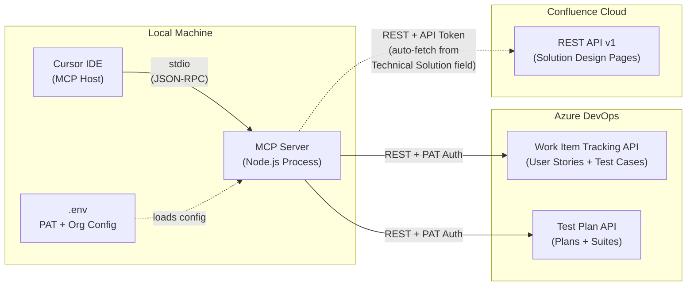
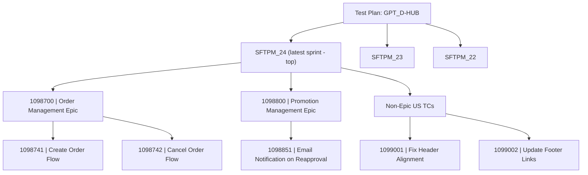
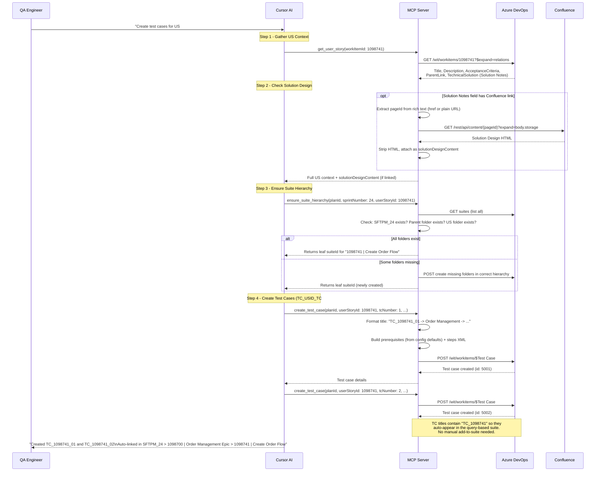
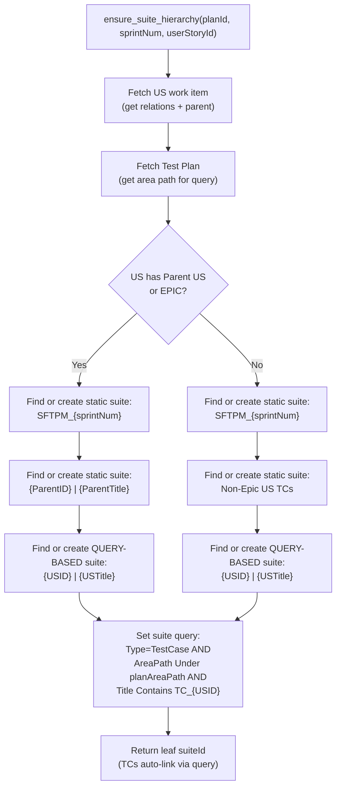

# ADO MCP Server for QA Test Case Management

**Documentation index:** [docs/README.md](README.md) | **Changelog:** [docs/changelog.md](changelog.md)

---

## Scope: POC (Phase 1) vs Future (Phase 2+)

**POC -- what we build now:**

- Fetch User Story context (description, acceptance criteria) from ADO to inform test case creation
- Standard test case format/template enforced during creation
- Smart suite management: check if suite exists before creating a new one
- Core CRUD for test plans, suites, and test cases
- Confluence page reading (optional -- separate Atlassian auth)
- Automatic Solution Design enrichment: `get_user_story` reads the "Technical Solution" ADO field, extracts the Confluence page ID, and fetches the Solution Design content automatically

**Future phases (after successful dry run):**

- Bulk test case generation from multiple User Stories
- Test run execution and result reporting
- Linking test cases back to requirements
- Shared parameters and configurations

---

## Architecture Overview



---

## Test Suite Folder Structure Convention

The MCP server enforces the team's ADO test suite hierarchy. Two test plans exist (e.g., `GPT_D-HUB`). Within each plan, suites are organized as:



**Naming rules:**

- Sprint folder: `SFTPM_<SprintNumber>` (static suite)
- Parent US / EPIC folder: `<ParentUS_ID> | <ParentUS_Title>` (static suite)
- US folder: `<US_ID> | <US_Title>` (**query-based suite** -- test cases auto-link via query)
- Independent US folder: `Non-Epic US TCs` (static suite, one per sprint)

**Query-based suite configuration (US-level leaf folders):**

The US-level suite is created as a query-based suite. The query automatically pulls in all test cases whose title contains `TC_<USID>`. No manual add-to-suite step is needed -- as soon as a test case is created with the correct `TC_<USID>_##` title, it appears in the matching suite.

Query definition (3 clauses, matching ADO's "Flat list of work items"):

```
Work Item Type   In Group   Microsoft.TestCaseCategory
AND Area Path    Under      <Test Plan Area Path>
AND Title        Contains   TC_<USID>
```

For example, for US 1245456 under the GPT_D-HUB plan:

```
Work Item Type   In Group   Microsoft.TestCaseCategory
AND Area Path    Under      TPM Product Ecosystem\Salesforce_TPM_Global Product\Salesforce_TPM_DHub_SF
AND Title        Contains   TC_1245456
```

**Resolution logic (built into `ensure_suite_hierarchy` and `ensure_suite_hierarchy_for_us`):**

1. Fetch the User Story by ID
2. **`ensure_suite_hierarchy_for_us`** (User Story ID only): Derives plan from US AreaPath via `testPlanMapping` (e.g. DHub → GPT_D-HUB, EHub → GPT_E-HUB) and sprint from Iteration (e.g. SFTPM_24 → 24)
3. Walk US relations to find Parent US or EPIC link
4. If parent exists: resolve or create `SFTPM_X > ParentID | ParentTitle > USID | USTitle`
5. If no parent: resolve or create `SFTPM_X > Non-Epic US TCs > USID | USTitle`
6. At each level, check if the folder already exists before creating (no duplicates)
7. If existing suite has wrong naming format, update it to match convention
8. The leaf US folder is always a query-based suite with the `TC_<USID>` query above

---

## Primary Flow: Test Case Creation from User Story

This is the core QA workflow. The agent fetches the User Story context (description, acceptance criteria), resolves the correct suite hierarchy, then creates formatted test cases.



---

## Solution Design Usage

The **Solution Notes** field (ADO API: `Custom.TechnicalSolution`) is a rich text area that may contain descriptive text plus one or more Confluence links. The system extracts the first Confluence URL from HTML anchors (`<a href="...">`) or plain URLs and fetches the Solution Design page automatically when `get_user_story` is called.

**Usage rules** (defined in `conventions.config.json` under `solutionDesign.usageRules`):

| Use For | Ignore |
|---|---|
| Business process and functionality context | Code snippets, Apex, JavaScript, LWC, triggers |
| New fields (Object.Field__c) introduced in the solution | Implementation or deployment details |
| New configurations, settings, or feature flags | Test steps (belong in Steps section) |
| Pre-requisite conditions in technical format (Object.Field = Value) | |
| Admin validation: verify fields/settings accessible to System Administrator | |

**Admin validation pattern:** For each new field or config introduced in the Solution Design, create a test case to verify the System Administrator can access and see it in the system. The template is configurable via `adminValidationTemplate`.

**Extraction hints:** Look for new custom fields (__c suffix), picklist values, page layouts, Lightning actions, configuration tables, setup requirements, and permission/PSG changes. Output pre-requisites in technical format per `preConditionFormat`.

---

## Conventions Configuration (`conventions.config.json`)

All naming patterns, formats, and labels are externalized into a single JSON config file at the project root. This makes it easy to adjust conventions without touching code. The file is loaded at server startup and validated with a Zod schema -- any misconfiguration fails fast with a clear error.

```json
{
  "testCaseTitle": {
    "prefix": "TC",
    "separator": " -> ",
    "numberPadding": 2,
    "template": "{prefix}_{usId}_{tcNumber}{separator}{featureTags}{separator}{summary}"
  },

  "prerequisites": {
    "heading": "Prerequisites for Test:",
    "sections": [
      { "key": "personas",       "label": "Persona",           "required": true  },
      { "key": "preConditions",  "label": "Pre-requisite",     "required": true  },
      { "key": "toBeTested",     "label": "TO BE TESTED FOR",  "required": false },
      { "key": "testData",       "label": "Test Data",         "required": false }
    ]
  },

  "prerequisiteDefaults": {
    "personas": {
      "SystemAdministrator": {
        "label": "System Administrator",
        "profile": "System Admin",
        "user": "\"ADMIN User\" User",
        "tpmRoles": "ADMIN",
        "psg": "TPM Global ADMIN Users"
      },
      "KAM": {
        "label": "Key Account Manager (KAM) User",
        "profile": "TPM_User_Profile",
        "tpmRoles": "KAM",
        "psg": "TPM Global KAM Users PSG"
      }
    },
    "commonPreConditions": [
      "Context.BusinessUnit IN [Primary, Secondary]",
      "FeatureConfig.RequiredFields != NULL",
      "FeatureConfig.ValidationEnabled = TRUE",
      "WorkflowRule.TargetStatus = Approved",
      "Entity.TemplateMapping != NULL",
      "Validation field set is available"
    ],
    "toBeTested": null,
    "testData": "N/A"
  },

  "suiteStructure": {
    "sprintPrefix": "SFTPM_",
    "parentUsSeparator": " | ",
    "parentUsTemplate": "{id}{separator}{title}",
    "usTemplate": "{id}{separator}{title}",
    "nonEpicFolderName": "Non-Epic US TCs",
    "testPlanMapping": [
      { "planId": 1066479, "areaPathContains": ["DHub", "D-HUB"] },
      { "planId": 1066480, "areaPathContains": ["EHub", "E-HUB"] }
    ]
  },

  "testCaseDefaults": {
    "state": "Design",
    "priority": 2
  }
}
```

**How defaults are applied at runtime:**

- **Persona**: The consistent part across all test cases comes from the active project's configured defaults. The current project config includes System Administrator, ADMIN User, and KAM, but the drafting methodology should treat these as project-configured defaults rather than universal assumptions.
- **Pre-requisite**: **Always unique per user story.** Never from config. The AI/draft must generate pre-conditions from the User Story and Solution Design every time. Use technical format per `preConditionFormat` (Object.Field = Value). `commonPreConditions` in config is unused; pre-conditions come only from the draft.
- **TO BE TESTED FOR**: Optional. Omitted from the output entirely when `null` / not provided. Only rendered when the caller supplies specific validation scenarios.
- **Test Data**: Optional. Defaults to `"N/A"` from config. Only overridden when the test case needs specific data.

**Default personas** (added automatically when none specified): come from `prerequisiteDefaults.personas`. In the current project that is System Administrator, "ADMIN User" User, and Key Account Manager (KAM) User. To add a new persona (e.g., a Customer Manager role), add a new key to `prerequisiteDefaults.personas` with `label`, `profile`, `tpmRoles`, `psg` (and optional `user`). Order in the JSON determines display order. No code changes needed.

---

## Standard Test Case Format

Every test case follows the team's naming convention and structure. The `create_test_case` tool enforces this using patterns from `conventions.config.json`.

### Title Convention

```
TC_<USID>_<TC#> -> <Feature Tag> -> [Sub-Feature ->] <Use Case Summary>
```

Examples:

- `TC_1098741_01 -> Order Management -> Create Order -> Verify order is created with valid payload`
- `TC_1098741_02 -> Promotion Management -> Email Notification -> Pending Reapproval -> Verify Email notification is sent to all Customer Managers related to account users on daily batch run`

The `<TC#>` is zero-padded (01, 02, ... 10, 11). The tool auto-increments by querying existing test cases for the given US ID, or accepts an explicit number.

**Title limit:** ADO Work Item Title has a 256-character limit. Titles exceeding this are truncated with ellipsis. Configure via `testCaseTitle.maxLength` in conventions.config.json. See `docs/test-case-writing-style-reference.md` for full styling rules.

### Prerequisites Section

Stored in the test case Description field (HTML). Section headings, default values, and which sections are optional are all driven by `conventions.config.json`. The tool merges config defaults with any overrides provided per test case.

**Rendered example (Persona from config; Pre-requisite from draft, unique per story):**

```
Persona:
System Administrator
  Profile = System Admin
  "ADMIN User" User
  TPM Roles = ADMIN
  Profile = TPM_User_Profile
  PSG = TPM Global ADMIN Users
Key Account Manager (KAM) User
  TPM Roles = KAM
  Profile = TPM_User_Profile
  PSG = TPM Global KAM Users PSG

Pre-requisite:
Promotion.Status = Adjusted
Tactic.Planned_Dollar_Per_Case__c != NULL OR Tactic.Planned_Percent_Per_Case__c != NULL
Lightning Action: "Save and Refresh" assigned to Promotion Page Layout

TO BE TESTED FOR:
N/A

Test Data:
N/A
```

**Behavior:**

- Persona: Always all three from config; no override
- Pre-requisite: Always from draft (unique per user story); never from config
- TO BE TESTED FOR is only rendered when provided; omitted entirely otherwise
- Test Data defaults to "N/A"; only overridden when caller supplies specific data

### Steps

Each step is an Action + Expected Result pair (converted to ADO XML internally).

### Area Path and Iteration Path Defaults

- **Area Path**: Inherited from the **Test Plan** (not the User Story). The test plan's area path is used for all test cases created within it. Current value: `TPM Product Ecosystem\Salesforce_TPM_Global Product\Salesforce_TPM_DHub_SF`. Can be overridden per test case if needed.
- **Iteration Path**: Inherited from the **User Story**. Keeps test cases aligned with the sprint the US belongs to.

Neither field needs to be provided by the caller in typical usage -- they are resolved automatically.

**When creating test cases** (via `createTestCase` / `push_tc_draft_to_ado`): Area Path and Iteration Path are always taken from the User Story fetched live from ADO, not from the draft's parsed values. This avoids TF401347 ("Invalid tree name given for work item") when draft parsing differs slightly (encoding, whitespace, etc.) from what ADO expects.

### Full Field Mapping

```
ADO Field                                  | Source
-------------------------------------------|------------------------------------------
System.Title                               | TC_<USID>_<TC#> -> Feature -> Summary
Custom.PrerequisiteforTest*               | Prerequisites (Persona + Pre-requisite HTML). See prerequisiteFieldRef in config.
System.AreaPath                            | From User Story (live from ADO) when creating; avoids TF401347
System.IterationPath                       | From User Story (live from ADO) when creating
Microsoft.VSTS.Common.Priority             | 1-4 (provided or default from config)
System.State                               | From config (default: "Design")
Microsoft.VSTS.TCM.Steps                   | XML built from steps[] array
System.AssignedTo                          | Optional
Relations: Tested By                       | Auto-linked to userStoryId
```

*Prerequisite field is configurable via `prerequisiteFieldRef` in conventions.config.json (default: `Custom.PrerequisiteforTest`). Falls back to `System.Description` if not set. HTML formatting uses ADO-compatible tags (`<div>`, `<strong>`, `<ul>`, `<ol>`, `<li>`). See `docs/prerequisite-formatting-instruction.md` for details.

**Formatting is shared across all paths:** `push_tc_draft_to_ado` (via `createTestCase`), `update_test_case`, and any future `create_test_case` tool all use the same `buildPrerequisitesHtml` and `buildStepsXml` helpers. Prerequisites and steps formatting (bold, lists, persona sub-bullets, TO BE TESTED FOR expansion) is applied consistently.

### Tool Input Schema

```typescript
{
  planId: 456,                          // optional in drafts; auto-derived from US AreaPath during push. Required when creating test cases directly.
  userStoryId: 1098741,                 // required: links to US + inherits iteration path
  tcNumber: 2,                          // optional: auto-increments if omitted
  featureTags: ["Promotion Management", "Email Notification", "Pending Reapproval"],
  useCaseSummary: "Verify Email notification is sent to all Customer Managers...",
  priority: 2,                          // optional: defaults to config value (2)

  prerequisites: {                      // all optional
    personas: null,                     // Always all three from config (no override). Persona is the only consistent part.

    preConditions: ["..."],             // REQUIRED per user story; always unique. Generate from US + Solution Design.
                                        // Technical format: Object.Field = Value per preConditionFormat

    toBeTested: [                       // optional: omitted from output when null
      "At least one ZREP is added",
      "At least one Tactic is added",
      "Consolidated Required fields missing validation"
    ],

    testData: null                      // null = defaults to "N/A" from config
                                        // or override: "Account with 3+ Customer Managers linked"
  },

  steps: [
    { action: "Login as Admin and navigate to Promotions", expectedResult: "Promotions list displayed" },
    { action: "Set promotion status to 'Pending Reapproval'", expectedResult: "Status updated successfully" },
    { action: "Trigger daily batch run", expectedResult: "Batch completes without errors" },
    { action: "Check email inbox of all linked Customer Managers", expectedResult: "Notification email received by all CMs" }
  ],
  areaPath: null,                       // optional override; null = use test plan's area path
  iterationPath: null,                  // optional override; null = use US's iteration path
  assignedTo: "kavita.badgujar"         // optional
}
```

The tool composes the title automatically:
`TC_1098741_02 -> Promotion Management -> Email Notification -> Pending Reapproval -> Verify Email notification is sent to all Customer Managers...`

---

## Tech Stack

- **Runtime**: Node.js 18+
- **Language**: TypeScript 5.x
- **MCP SDK**: `@modelcontextprotocol/sdk` v1.x (stable)
- **Transport**: stdio (local subprocess)
- **Validation**: `zod` for tool input schemas
- **HTTP Client**: Built-in `fetch` (Node 18+)
- **Config**: `dotenv` for PAT and org configuration

## Project Structure

```
ADO TestForge MCP/
├── src/
│   ├── index.ts                  # Entry point, MCP server setup + stdio transport
│   ├── config.ts                 # Loads + validates conventions.config.json with Zod
│   ├── tools/
│   │   ├── work-items.ts         # get_user_story, list_test_cases_linked_to_user_story, list_work_item_fields
│   │   ├── test-plans.ts         # Test plan tools (create, list, get)
│   │   ├── test-suites.ts        # Suite tools (ensure_suite_hierarchy, find_or_create, list, get)
│   │   ├── test-cases.ts         # Test case tools (list, get, update, delete, add to suite)
│   │   ├── tc-drafts.ts         # Test case draft tools (save, list, get, push to ADO)
│   │   ├── confluence.ts         # Confluence page reader (standalone tool, optional)
│   │   └── index.ts              # Tool registration barrel
│   ├── helpers/
│   │   ├── confluence-url.ts     # Extracts Confluence page ID from URL/HTML in Technical Solution field
│   │   ├── steps-builder.ts      # Converts step arrays to ADO XML format
│   │   ├── tc-title-builder.ts   # Builds titles from conventions config template
│   │   ├── prerequisites.ts      # Formats prerequisites from conventions config labels
│   │   └── suite-structure.ts    # Folder naming from conventions config + resolution logic
│   ├── ado-client.ts             # Azure DevOps REST API client with PAT auth
│   ├── confluence-client.ts      # Confluence REST API client (optional)
│   └── types.ts                  # Shared TypeScript types / interfaces
├── conventions.config.json       # All naming patterns, formats, labels (editable)
├── docs/
│   └── implementation.md         # This document
├── .env.example                  # Template for PAT + Confluence configuration
├── .gitignore
├── package.json
├── tsconfig.json
└── README.md
```

---

## MCP Tools -- Full Inventory

### Work Item Context

- **`get_user_story`** -- Fetch a User Story by ID with all QA-relevant fields + Solution Design from Confluence
  - API: `GET /wit/workitems/{id}?$expand=relations` (fetches all fields including `Custom.TechnicalSolution`)
  - Returns: title, description (HTML), acceptance criteria (HTML), area path, iteration path, state, **parent work item ID + title** (EPIC or Parent US), all relations, **solutionDesignUrl**, **solutionDesignContent**
  - Auto-enrichment: If the "Technical Solution" field (UI label: "Solution Notes") contains a Confluence URL and Confluence credentials are configured, the tool automatically extracts the page ID, fetches the page content, and returns it as `solutionDesignContent`
  - Purpose: Provides full context for test case generation (including Solution Design) AND determines suite folder placement (parent vs non-epic)
- **`list_test_cases_linked_to_user_story`** -- Get test case work item IDs linked to a User Story via Tests/Tested By relation
  - API: `GET /wit/workitems/{userStoryId}?$expand=relations`
  - Returns: `{ userStoryId, testCaseIds: number[], count }`
  - Purpose: Use before cloning test cases from one US to another
- **`list_work_item_fields`** -- List all work item field definitions in the ADO project
  - API: `GET /_apis/wit/fields`
  - Returns: reference names (e.g. Custom.PrerequisiteforTest, System.Title), type, readOnly
  - Purpose: Verify field names before updating work items; optional `expand` for ExtensionFields

### Test Plan Management

Test plans already exist (e.g., `GPT_D-HUB`). The `planId` is provided as input to other tools. These tools are for lookup/reference, not primary workflow:

- **`list_test_plans`** -- List all test plans in the project (to find the planId)
  - API: `GET /_apis/testplan/plans`
- **`get_test_plan`** -- Get a specific test plan by ID (to read its area path, etc.)
  - API: `GET /_apis/testplan/plans/{planId}`
- **`create_test_plan`** -- Create a new test plan (future use, not needed for POC)
  - API: `POST /_apis/testplan/plans`

### Test Suite Management (with hierarchy awareness)

- **`ensure_suite_hierarchy_for_us`** -- Preferred. Takes only userStoryId. Derives plan and sprint from US AreaPath and Iteration via `testPlanMapping`. Creates if missing; updates naming if wrong format.
- **`ensure_suite_hierarchy`** -- Lower-level. Given planId, sprint number, and userStoryId, it builds the full folder path:
  1. Fetches the US to determine if it has a Parent US / EPIC
  2. Ensures `SFTPM_<sprint>` folder exists (static suite)
  3. If parent exists: ensures `<ParentID> | <ParentTitle>` folder under sprint (static suite)
  4. If no parent: ensures `Non-Epic US TCs` folder under sprint (static suite)
  5. Creates the leaf `<USID> | <USTitle>` as a **query-based suite** with this query:
     - `Work Item Type In Group Microsoft.TestCaseCategory`
     - `AND Area Path Under <planAreaPath>`
     - `AND Title Contains TC_<USID>`
  6. At each level, searches existing suites first -- only creates if missing
  7. Returns the leaf suite ID (test cases auto-appear here via the query -- no manual add needed)
- **`find_or_create_test_suite`** -- Lower-level tool. Checks if a suite with a given name exists under a parent suite; creates one only if not found
  - API: `GET /_apis/testplan/Plans/{planId}/suites` then conditionally `POST`
  - Returns: `{ created: boolean, suite: {...} }`
- **`list_test_suites`** -- List all suites in a plan
  - API: `GET /_apis/testplan/Plans/{planId}/suites`
- **`get_test_suite`** -- Get suite details
  - API: `GET /_apis/testplan/Plans/{planId}/suites/{suiteId}`
- **`create_test_suite`** -- Create a new suite under a parent (find-or-create; returns existing if found)
  - API: `GET` suites then conditionally `POST /_apis/testplan/Plans/{planId}/suites`
- **`update_test_suite`** -- Update suite properties (name, parent, query string)
  - API: `PATCH /_apis/testplan/Plans/{planId}/suites/{suiteId}`
- **`delete_test_suite`** -- Delete a test suite (test cases remain; only suite association removed)
  - API: `DELETE /_apis/testplan/Plans/{planId}/suites/{suiteId}`

### Test Case Management (with TC_ format + prerequisites)

- **`create_test_case`** -- Create a test case following the `TC_USID_TC#N` convention
  - API: `POST /_apis/wit/workitems/$Test Case` (JSON Patch format)
  - Title built from `conventions.config.json` template: `TC_<USID>_<##> -> <FeatureTags> -> <Summary>`
  - Description contains formatted prerequisites (section labels from conventions config)
  - Steps converted to ADO XML
  - Auto-links to User Story via "Tests / Tested By" relation
  - **Area Path**: defaults to the Test Plan's area path (not the US); overridable
  - **Iteration Path**: inherited from the User Story; overridable
  - `tcNumber` auto-increments if omitted (queries existing TCs for that US)
  - Default state and priority come from conventions config
- **`list_test_cases`** -- List test cases in a suite
  - API: `GET /_apis/testplan/Plans/{planId}/Suites/{suiteId}/TestCase`
- **`get_test_case`** -- Get a test case work item by ID
  - API: `GET /_apis/wit/workitems/{id}`
- **`update_test_case`** -- Update one or more fields (partial or full). Pass only fields to change for partial update; pass all fields for full replace. Fields: title, description, prerequisites, steps, priority, state, assignedTo, areaPath, iterationPath.
  - API: `PATCH /_apis/wit/workitems/{id}` (JSON Patch format)
- **`add_test_cases_to_suite`** -- Add existing test case IDs to a static suite (not needed for query-based suites where auto-linking handles it; kept for edge cases)
  - API: `POST /_apis/testplan/Plans/{planId}/Suites/{suiteId}/TestCase`
- **`delete_test_case`** -- Delete a test case work item by ID
  - API: `DELETE /_apis/wit/workitems/{id}`
  - By default: soft delete (moved to Recycle Bin, restorable). Use `destroy=true` to permanently delete (not recommended)

### Test Case Drafts (draft → review → push)

- **`save_tc_draft`** -- Save a test case draft to markdown only. JSON is created only when pushing to ADO. `planId` is **optional** -- if not provided, it will be auto-derived from the User Story's AreaPath during push using `testPlanMapping` in conventions.config.json. Pass `workspaceRoot` (open folder) or `draftsPath` (user-specified). Drafts go to `workspaceRoot/tc-drafts/` or exact `draftsPath`. Creates folder if missing. No hardcoded default. Adds **Drafted By** (OS username) to the header. Optional: `functionalityProcessFlow` (mermaid/process diagram), `testCoverageInsights` (classified coverage scenarios with P/N, F/NF, priority — auto-computes coverage summary). Returns structured fields: `fileName`, `absolutePath`, `workspaceRelativePath`, `fileUrl` (generated via `pathToFileURL` for reliable clickability). Sibling links (Solution Design Summary, QA Cheat Sheet) are included in generated markdown only when the target file exists on disk.
- **`save_tc_clone_preview`** -- Save a clone-and-enhance preview to `tc-drafts/Clone_US_{sourceId}_to_US_{targetId}_preview.md`. Pass `sourceUserStoryId`, `targetUserStoryId`, `markdown`, and `workspaceRoot` or `draftsPath`. Use after analyzing source TCs and target US + Solution Design. User reviews and responds APPROVED / MODIFY / CANCEL.
- **`list_tc_drafts`** -- List saved drafts (reads .md files). Pass `workspaceRoot` or `draftsPath`.
- **`get_tc_draft`** -- Get a draft by user story ID (markdown only). Pass `workspaceRoot` or `draftsPath`.
- **`push_tc_draft_to_ado`** -- Push an approved draft to ADO. If draft has no `planId`, it automatically calls `ensureSuiteHierarchyForUs` to derive the plan ID from the User Story's AreaPath (via `testPlanMapping` in config), creates the suite hierarchy, then creates test cases. Parses markdown, creates test cases, links to US, then generates JSON with correct mappings. Pass `workspaceRoot` or `draftsPath`. Set `repush: true` when draft was revised after initial push to **update** existing test cases (formatting re-applied). JSON is created only at push time to avoid drift during revisions.

Flow: `draft_test_cases` prompt → AI applies `.cursor/skills/draft-test-cases-salesforce-tpm/SKILL.md` (QA architect methodology) → AI calls `save_tc_draft` → user reviews (revisions) → `create_test_cases` prompt → user confirms → `push_tc_draft_to_ado`, or `create_test_cases` calls `create_test_case` directly.

**Clone and Enhance Flow:** `clone_and_enhance_test_cases` prompt → AI calls `list_test_cases_linked_to_user_story`(source) → `get_test_case` for each → `get_user_story`(target) → classifies each TC (Clone As-Is / Minor Update / Enhanced) → `save_tc_clone_preview` → user reviews → on APPROVED: `ensure_suite_hierarchy_for_us`(target) → `save_tc_draft` with transformed TCs → `push_tc_draft_to_ado`. Never creates in ADO without explicit APPROVED.

**Draft Test Cases Skill:** `.cursor/skills/draft-test-cases-salesforce-tpm/SKILL.md` defines an implementation-generic QA architect methodology: analyze US + Confluence Solution Design, extract business behavior (not implementation), derive project-specific terminology from the source material, validate coverage matrix (scope/config variations, trigger fields, status scenarios, configuration logic, backward compatibility), add Functionality Process Flow and Test Coverage Insights at draft start, and generate complete test cases.

**Distribution packaging:** `build-dist.mjs` copies the full `.cursor/skills` directory tree into `dist-package`, including nested assets inside skill folders, so deployed skills remain complete in the Google Drive distribution.

**TO BE TESTED FOR Skill:** `.cursor/skills/to-be-tested-for-executor-friendly/SKILL.md` guides writing the TO BE TESTED FOR section so QA executors understand it without reading the solution design. Use plain descriptions (e.g., "Rate change → Pending Reapproval"), not Flow 1/2/3 references.

**Update Prerequisites Skill:** `.cursor/skills/update-test-case-prerequisites/SKILL.md` guides updating test case prerequisites via `update_test_case`: always pass structured `{ personas?, preConditions, toBeTested, testData }`, source from draft (not ADO HTML), restart MCP after formatting changes.

### Confluence (Optional)

- **`get_confluence_page`** -- Read a Confluence page by ID (standalone, for manual lookups)
  - API: `GET /rest/api/content/{pageId}?expand=body.storage`
  - Auth: Atlassian email + API token (Basic Auth)
  - Returns: Page title + body content (stripped HTML to readable text)
  - Enabled only when `confluence_base_url`, `confluence_email`, and `confluence_api_token` are set in `~/.ado-testforge-mcp/credentials.json`

**Note:** In most workflows, you don't need to call `get_confluence_page` directly. The `get_user_story` tool auto-fetches Solution Design content from the "Technical Solution" field when a Confluence URL is present.

---

## ADO Client Design (`src/ado-client.ts`)

```typescript
class AdoClient {
  private baseUrl: string;
  private authHeader: string;

  constructor(org: string, project: string, pat: string) {
    this.baseUrl = `https://dev.azure.com/${org}/${project}`;
    this.authHeader = `Basic ${Buffer.from(':' + pat).toString('base64')}`;
  }

  async get<T>(path: string, apiVersion?: string, queryParams?: Record<string, string>): Promise<T> { /* ... */ }
  async post<T>(path: string, body: unknown, contentType?: string, apiVersion?: string): Promise<T> { /* ... */ }
  async patch<T>(path: string, body: unknown, contentType?: string, apiVersion?: string): Promise<T> { /* ... */ }
  async delete<T>(path: string, apiVersion?: string, queryParams?: Record<string, string>): Promise<T> { /* ... */ }
}
```

Key responsibilities:

- PAT-based auth header on every request
- API version parameter (defaults: `7.1` for testplan, `7.0` for wit)
- `application/json-patch+json` content type for work item create/update
- Error mapping: 401 -> "Invalid PAT", 403 -> "Insufficient PAT scope", 404 -> "Resource not found"

## Confluence Client Design (`src/confluence-client.ts`) -- Optional

```typescript
class ConfluenceClient {
  private baseUrl: string;  // e.g., https://yoursite.atlassian.net/wiki
  private authHeader: string;

  constructor(baseUrl: string, email: string, apiToken: string) {
    this.baseUrl = baseUrl;
    this.authHeader = `Basic ${Buffer.from(email + ':' + apiToken).toString('base64')}`;
  }

  async getPageContent(pageId: string): Promise<{ title: string; body: string }> { /* ... */ }
}
```

Enabled only when all three credential fields are present: `confluence_base_url`, `confluence_email`, `confluence_api_token` in `~/.ado-testforge-mcp/credentials.json`.

**Required Atlassian permissions:** The user account needs "Can view" on the Confluence space(s) containing Solution Design pages. API tokens inherit the user's permissions -- no granular scope configuration needed.

### Confluence URL Parser (`src/helpers/confluence-url.ts`)

Extracts Confluence page IDs from the "Technical Solution" ADO field. The field value may be:
- A plain URL: `https://yoursite.atlassian.net/wiki/spaces/SPACE/pages/123456789/Page+Title`
- An HTML anchor: `<a href="https://...">Solution Design</a>`
- A query-param URL: `https://yoursite.atlassian.net/wiki/pages/viewpage.action?pageId=123456789`

The parser handles all three formats and returns the numeric page ID.

---

## Credentials Configuration (`~/.ado-testforge-mcp/credentials.json`)

```json
{
  "ado_pat": "your-personal-access-token",
  "ado_org": "your-organization-name",
  "ado_project": "your-project-name",
  "confluence_base_url": "https://yoursite.atlassian.net/wiki",
  "confluence_email": "your.email@company.com",
  "confluence_api_token": "your-confluence-api-token"
}
```

**ADO PAT Required Scopes**: `vso.work_write`, `vso.test_write`

**Confluence API Token**: No scopes to configure -- inherits user's Confluence permissions. User needs "Can view" on relevant spaces. Create at [https://id.atlassian.com/manage-profile/security/api-tokens](https://id.atlassian.com/manage-profile/security/api-tokens).

---

## Cursor MCP Configuration

Add to `.cursor/mcp.json`:

```json
{
  "mcpServers": {
    "ado-testforge": {
      "command": "npx",
      "args": ["tsx", "src/index.ts"],
      "cwd": "/Users/kavita.badgujar/ADO TestForge MCP",
      "env": {
        "ADO_PAT": "your-pat",
        "ADO_ORG": "your-org",
        "ADO_PROJECT": "your-project"
      }
    }
  }
}
```

---

## Key Implementation Details

### Test Steps XML Builder (`src/helpers/steps-builder.ts`)

ADO stores test steps as XML in `Microsoft.VSTS.TCM.Steps`. The helper converts a simple array to ADO format. Before XML escaping, `formatStepContent()` (from `format-html.ts`) is applied to Action and Expected Result: converts `**bold**` to `<strong>`, "A. X B. Y" to `<ol><li>`, newlines to `<br>`.

```typescript
// Input
[
  { action: "Open login page", expectedResult: "Login page displayed" },
  { action: "Enter credentials", expectedResult: "Fields accept input" }
]

// Output XML
// <steps id="0" last="2">
//   <step id="1" type="ActionStep">
//     <parameterizedString>Open login page</parameterizedString>
//     <parameterizedString>Login page displayed</parameterizedString>
//   </step>
//   <step id="2" type="ActionStep">
//     <parameterizedString>Enter credentials</parameterizedString>
//     <parameterizedString>Fields accept input</parameterizedString>
//   </step>
// </steps>
```

### TC Title Builder (`src/helpers/tc-title-builder.ts`)

Composes the title string from parts:

```typescript
function buildTcTitle(usId: number, tcNumber: number, featureTags: string[], summary: string): string {
  const paddedNum = String(tcNumber).padStart(2, '0');
  const tagChain = featureTags.join(' -> ');
  return `TC_${usId}_${paddedNum} -> ${tagChain} -> ${summary}`;
}
// Result: "TC_1098741_02 -> Promotion Management -> Email Notification -> Pending Reapproval -> Verify Email..."
```

### Prerequisites Formatter (`src/helpers/prerequisites.ts`)

Converts the structured prerequisites input into ADO-compatible HTML for the Prerequisite for Test field. Uses `<div>`, `<strong>`, `<ul>`, `<ol>`, `<li>` and applies `formatContentForHtml()`: escapes HTML, converts `**bold**` to `<strong>`, newlines to `<br>`, "A./B." and "- " list patterns. Pre-requisite renders as `<ol>`, TO BE TESTED FOR as `<ul>`. Persona uses nested sub-bullets. Table compatibility and future format: see `docs/prerequisite-field-table-compatibility.md`. See `docs/prerequisite-formatting-instruction.md`.

```html
<div><strong>Persona:</strong></div><ul><li>System Administrator<br/>TPM Roles = —<br/>Profile = System Admin<br/>PSG = —</li><li>"ADMIN User" User<br/>TPM Roles = ADMIN<br/>Profile = TPM_User_Profile<br/>PSG = TPM Global ADMIN Users</li></ul>
<div><strong>Pre-requisite:</strong></div><ol><li>Promotion.Status = Adjusted</li><li>Tactic.Planned_Dollar_Per_Case__c != NULL</li></ol>
<div><strong>Test Data:</strong></div><div>N/A</div>
```

### User Story to Test Case Linking

When `userStoryId` is provided to `create_test_case`, the tool:

1. Fetches the User Story via `get_user_story` internally
2. Inherits `areaPath` (from test plan) and `iterationPath` (from US) if not explicitly provided
3. Adds a "Tests / Tested By" relation link in the work item creation payload:

```json
{
  "op": "add",
  "path": "/relations/-",
  "value": {
    "rel": "Microsoft.VSTS.Common.TestedBy-Reverse",
    "url": "https://dev.azure.com/{org}/{project}/_apis/wit/workitems/{userStoryId}"
  }
}
```

### Suite Hierarchy Resolution (`src/helpers/suite-structure.ts`)

The `ensure_suite_hierarchy` tool uses this helper to build the correct folder path. The full resolution algorithm:



At each "find or create" step:

1. List child suites of the current parent suite
2. Match by name (case-insensitive)
3. If found: use existing suite ID, move to next level
4. If not found: create it and move on

Suite types by level:

- Sprint folder, Parent US folder, Non-Epic folder: **static** suites
- US leaf folder: **query-based** suite with `Title Contains TC_<USID>` -- test cases auto-appear here, no manual add needed

### Error Handling Strategy

- Validate all inputs via Zod schemas before making API calls
- Catch ADO API errors and return readable messages (not raw HTTP responses)
- Handle common errors: 401 (invalid PAT), 403 (insufficient scope), 404 (project/plan not found)
- Confluence errors are non-fatal (tool returns a message suggesting manual check)

### Build and Run

```bash
npm install
npx tsx src/index.ts   # Runs via stdio, launched by Cursor
```

---

## File Link Generation (`src/helpers/file-links.ts`)

All file URLs returned by MCP tools use Node's `pathToFileURL()` for reliable clickability in Cursor — never manual string concatenation. This handles workspace paths containing spaces, `#`, `%`, parentheses, and other special characters.

### Utility Functions

| Function | Purpose |
|---|---|
| `toFileUrl(absolutePath)` | Convert filesystem path to `file:///` URL via `pathToFileURL` |
| `buildFileReference(absolutePath, workspaceRoot?)` | Build structured `{ fileName, absolutePath, workspaceRelativePath, fileUrl }` |
| `safeRelativeMarkdownLink(from, target, label)` | Generate relative markdown link only if target exists on disk; returns `null` otherwise |
| `formatSavedFileResponse(ref, extras?)` | Format the MCP response text with clickable link + path |
| `logFileLink(context, ref, targets?)` | Log link details to stderr at save time |

### Rules

- **Tool responses:** Always return `fileUrl` built from `pathToFileURL`. Also include `absolutePath` and `workspaceRelativePath` as fallbacks.
- **Generated markdown:** Use relative links (`./sibling.md`) for sibling files. Only emit links to files that **actually exist** on disk. Omit the link (not a broken link) when the target is missing.
- **Logging:** All draft saves log the resolved absolute path, file URL, and relative link targets to stderr for debugging.

### Tests

Run `npm test` to execute the regression suite covering:
- Paths with spaces, `#`, `%`, `(`, `)`
- Workspace-relative path computation
- Sibling file existence checks
- Missing target file handling
- Markdown formatter link integration

---

## Implementation Todos

| # | Task | Status |
|---|------|--------|
| 1 | Initialize Node.js project with package.json, tsconfig.json, .gitignore, and install dependencies | Pending |
| 2 | Implement ADO REST API client (`src/ado-client.ts`) with PAT auth, request helper, error handling | Pending |
| 3 | Implement Confluence REST API client (`src/confluence-client.ts`) -- trial/optional | Pending |
| 4 | Define shared TypeScript types/interfaces (`src/types.ts`) | Pending |
| 5 | Create conventions config file (`conventions.config.json`) with all configurable patterns | Pending |
| 6 | Implement work item tools (`src/tools/work-items.ts`): `get_user_story` | Pending |
| 7 | Implement test plan tools (`src/tools/test-plans.ts`): list, get, create | Pending |
| 8 | Implement suite folder structure helpers (`src/helpers/suite-structure.ts`) | Pending |
| 9 | Implement test suite tools (`src/tools/test-suites.ts`): `ensure_suite_hierarchy`, find_or_create, list, get | Pending |
| 10 | Implement test case tools (`src/tools/test-cases.ts`): create (TC_ format + prerequisites), list, get, update | Pending |
| 11 | Implement Confluence tools (`src/tools/confluence.ts`): `get_confluence_page` -- trial/optional | Pending |
| 12 | Create MCP server entry point (`src/index.ts`) with tool registration + stdio transport | Pending |
| 13 | Create `.env.example` and `.cursor/mcp.json` configuration | Pending |
| 14 | Write this implementation document | Done |
