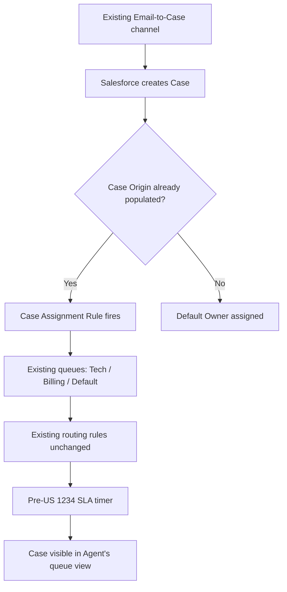

# Test Cases: US #1234 — Case Creation and Assignment from Email/Web — PART 3

| | |
|---|---|
| **Status** | DRAFT |
| **Version** | 1 |
| **Last Updated** | 2026-05-17 |
| **Drafted By** | qa-architect |
| **Plan ID** | 5500 |
| **Suite Type** | Regression |

---

## Functionality Process Flow

_Regression coverage focuses on previously-shipped behaviour adjacent to the changes in US #1234 — not the brand-new flow itself. The flowchart shows the upstream/downstream surfaces this story may have regressed._

---

## Test Coverage Insights

Coverage Summary:
- Total Scenarios: 3
- Covered: 3
- Coverage: **100%**
- Distribution: 2P / 1N | 3F / 0NF

| ID | Scenario | Covered | P/N | F/NF | Priority | Notes |
|---|---|---|---|---|---|---|
| 1 | Pre-existing Email-to-Case continues to create cases | ✅ | 🟢 P | 🔵 F | 🔴 High | Smoke regression on the unchanged channel |
| 2 | Existing Tech-Support routing rule still picks up the case | ✅ | 🟢 P | 🔵 F | 🔴 High | Routing logic must not regress with new Category logic |
| 3 | Closing a Case still requires Resolution (existing validation) | ✅ | 🔴 N | 🔵 F | 🟡 Medium | Validation must not be loosened by US 1234 changes |

---

## Story Summary

| Field | Value |
|---|---|
| **US ID** | 1234 |
| **Title** | Case Creation and Assignment from Email/Web — PART 3 |
| **State** | Active |
| **Area Path** | ServiceCloud\CaseManagement |
| **Iteration** | ServiceCloud\Sprint 14 |
| **Parent** | #1100 — Case Management Refactor — Epic |

---

## Common Prerequisites

These apply to **all test cases** below unless a specific TC states otherwise.

### Pre-requisite

| # | Condition |
|---|---|
| 1 | Salesforce org has the existing Email-to-Case channel enabled and reachable |
| 2 | Existing Case Assignment Rules are active (Tech Support / Billing / Default queues) |
| 3 | Closure validation rule "Resolution required when Status = Closed" is deployed |

### Test Data

| Data | Value |
|---|---|
| Verified support mailbox | support@example.com |
| Existing seed Cases | None referenced by ADO IDs |

---

## Test Case 1

**TC_1234_REG_01 -> Email-to-Case -> Verify as Service Agent -> Existing channel still creates a Case**

| | |
|---|---|
| **Priority** | 1 |
| **Use Case** | Existing channel still creates a Case |

**Additional Pre-requisite (TC-specific):**

| # | Condition |
|---|---|
| 1 | Customer is NOT already a Salesforce Contact (tests the auto-create path) |

**Steps:**

| # | Action | Expected Result |
|---|---|---|
| 1 | Customer sends an email to the support mailbox | Email is received by the org's inbound handler within 60s |
| 2 | Wait for Email-to-Case to fire | A new Case appears in Salesforce with Origin = Email |
| 3 | Open the new Case as the Service Agent | Subject should = test subject, Description should = test body, Origin should = Email, Status should = New |
| 4 | Inspect Case Owner | Owner should be a queue (not Unassigned) per existing routing rules |

---

## Test Case 2

**TC_1234_REG_02 -> Routing -> Verify as Service Agent -> Tech Support routing still fires**

| | |
|---|---|
| **Priority** | 1 |
| **Use Case** | Tech Support routing still fires |

**Additional Pre-requisite (TC-specific):**

| # | Condition |
|---|---|
| 1 | Case Assignment Rule exists with active criteria: Category = Technical -> Tech Support queue |

**Steps:**

| # | Action | Expected Result |
|---|---|---|
| 1 | Submit a new Case via the existing Web-to-Case form with Category = Technical | Case should be created with Category = Technical |
| 2 | Wait for Case Assignment to fire | Case Owner should = Tech Support queue (not Default, not Unassigned) |
| 3 | Open the Tech Support queue list view as a member of that queue | The new Case should appear in the queue's list view |
| 4 | Verify history audit | Owner-change entry should show automated assignment, source = Assignment Rule |

---

## Test Case 3

**TC_1234_REG_03 -> Closure Validation -> Verify as Service Agent -> Resolution still required**

| | |
|---|---|
| **Priority** | 2 |
| **Use Case** | Resolution still required on closure |

**Additional Pre-requisite (TC-specific):**

| # | Condition |
|---|---|
| 1 | An open Case is owned by the agent with Status = Working |

**Steps:**

| # | Action | Expected Result |
|---|---|---|
| 1 | Open the seeded Case as its assigned agent | Case detail page should load; Status should = Working |
| 2 | Change Status to Closed without entering a Resolution | Validation error should appear |
| 3 | Confirm the exact validation message verbiage | Error should = "Required field Resolution" (not paraphrased) |
| 4 | Cancel the change and verify the Case state | Status should remain Working; no field changes should be saved |
| 5 | Re-attempt closure with a non-empty Resolution | Save should succeed; Case Status should = Closed; Resolution should persist |

---

## Review Notes

| | |
|---|---|
| **Reviewer** | |
| **Date Reviewed** | |

**Feedback:**

_Add your review comments here. The AI will revise the regression pack based on your feedback._

- 
- 
